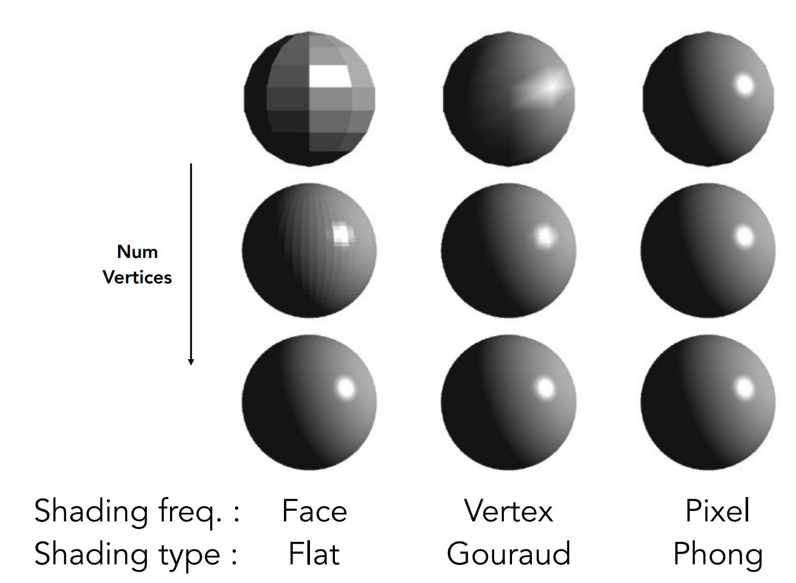
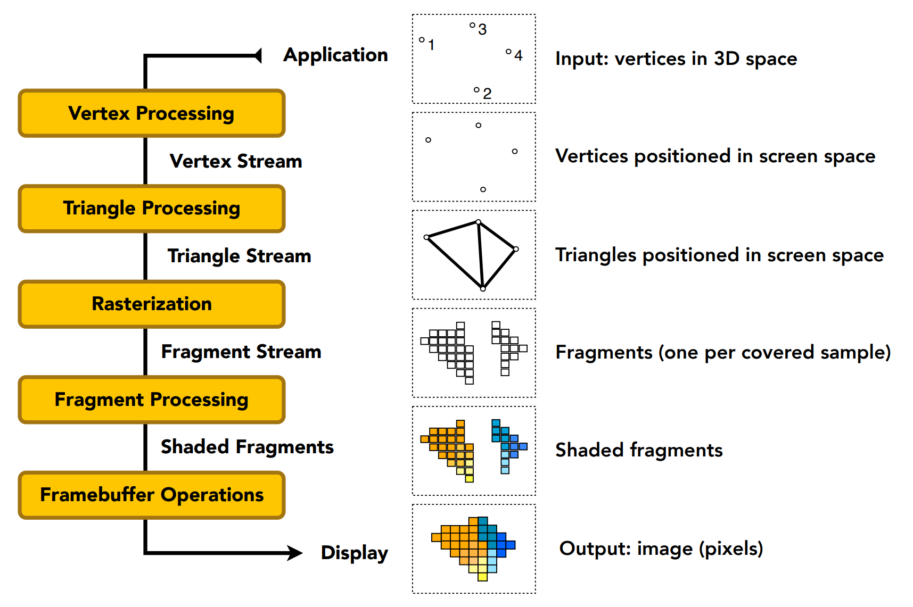

# GAMES101 Lecture 08 - Shading 2 (Shading, Pipeline and Texture Mapping)

[GAMES101_Lecture_08.pdf](https://sites.cs.ucsb.edu/~lingqi/teaching/resources/GAMES101_Lecture_08.pdf)

## I. Shading

*For the Blinn-Phong Reflectance Model, refer to* `Lecture07.md`.

### Shading Frequencies

- **Flat Shading**: Triangle face is flat.
  - One normal vector for each triangle
- **Gouraud Shading**: *Interpolate **colors*** from vertices across each triangle.
  - Each vertex has a normal vector
- **Phong Shading**: *Interpolate **normal vectors*** across each triangle.
  - Compute full shading model at each pixel.

*Shading methods can be applied in different stages in pipeline. E.g., the Gouraud Shading method can be applied in Vertex Processing.*

#### Defining Per-Vertex Normal Vectors

- **Simple Scheme**: average surrounding face normals. *Possibly weighted.*
  
  $$
  N_v = \frac{\sum_i N_i}{\lVert \sum_i N_i \rVert}
  $$

#### Defining Per-Pixel Normal Vectors

- **Barycentric Interpolation**: 

## II. Graphics Pipeline

### Shader Programs

- Program vertex and fragment processing stages
- Describe operation on a **single vertex (or fragment)**
  - Vertex Shader
  - Fragment/Pixel Shader

- [ShaderToy.com for testing shaders online](http://shadertoy.com)

### GPU: Heterogeneous, Multi-Core Processor

*Specialized processors of executing graphics pipeline computations.*

## III. Texture Mapping

*Refer to* `Lecture09.md`.
