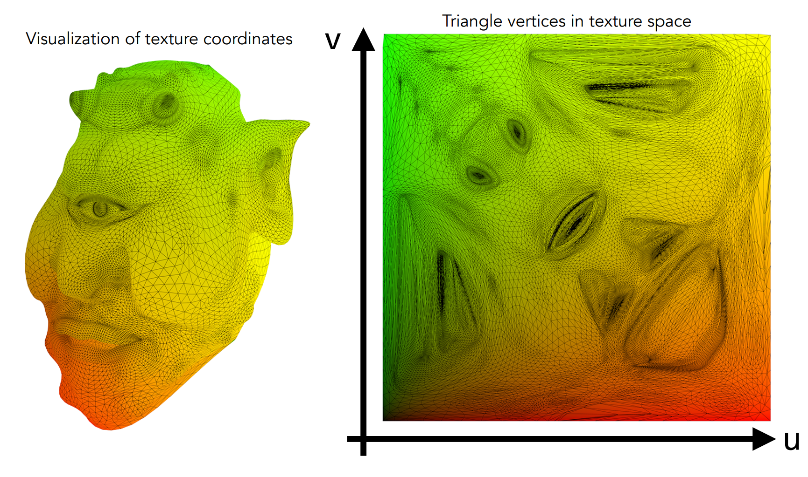
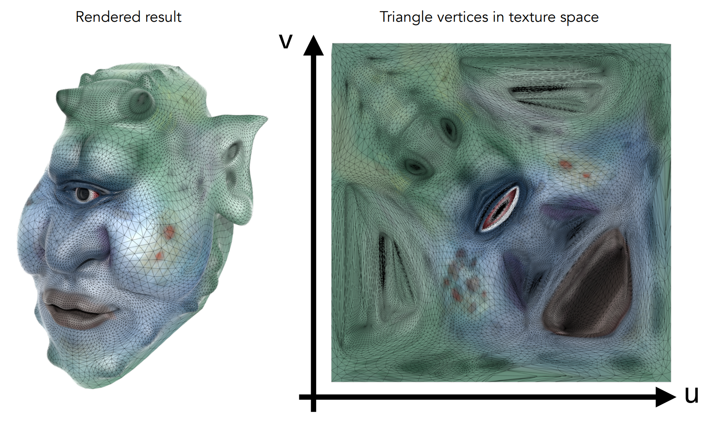
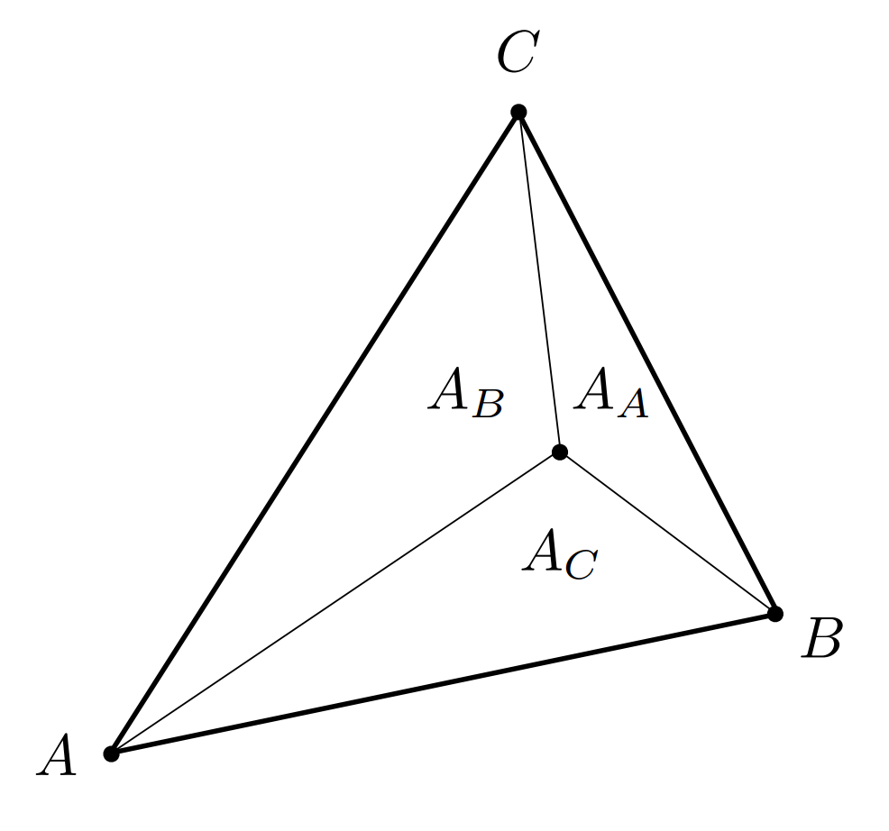
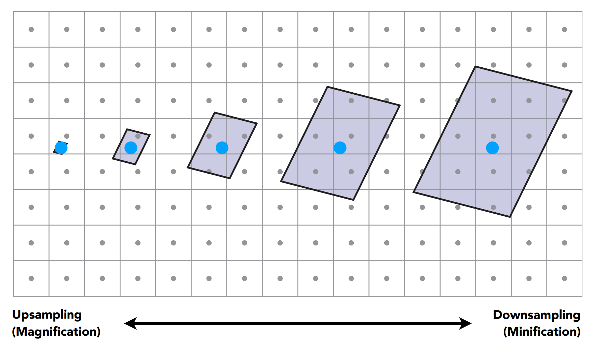
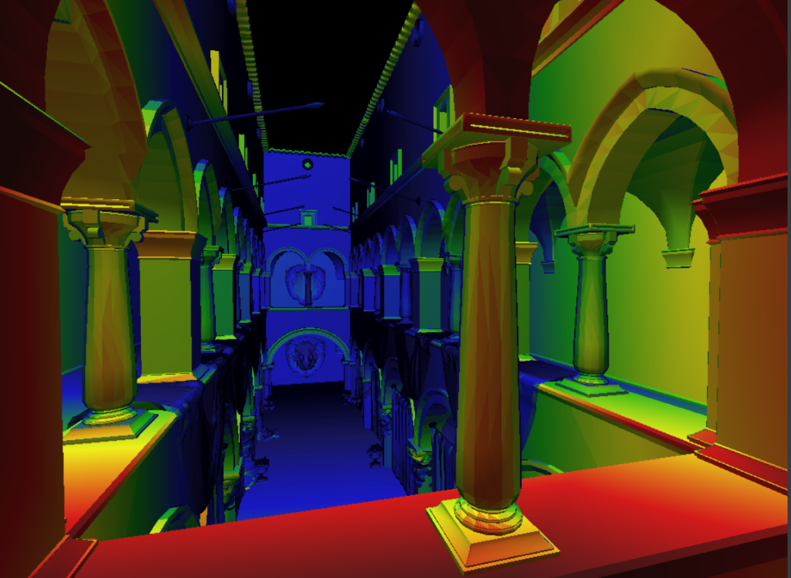
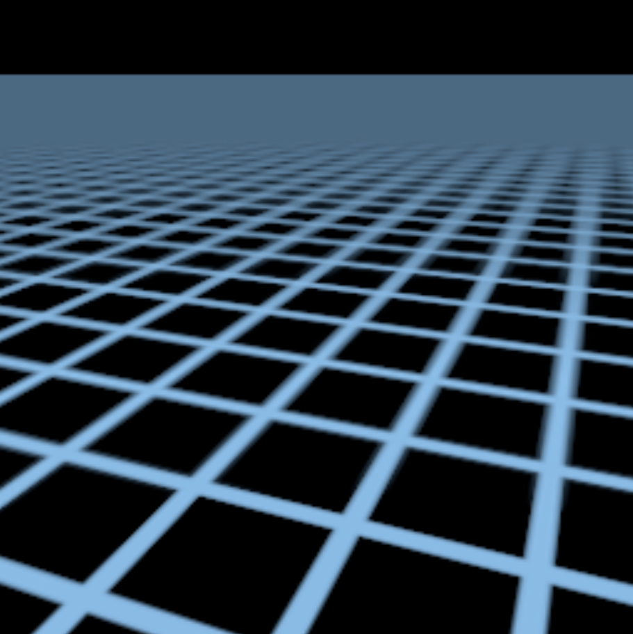
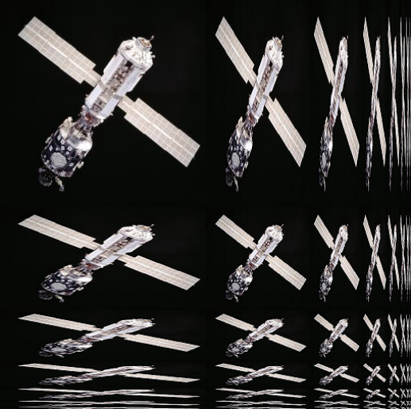
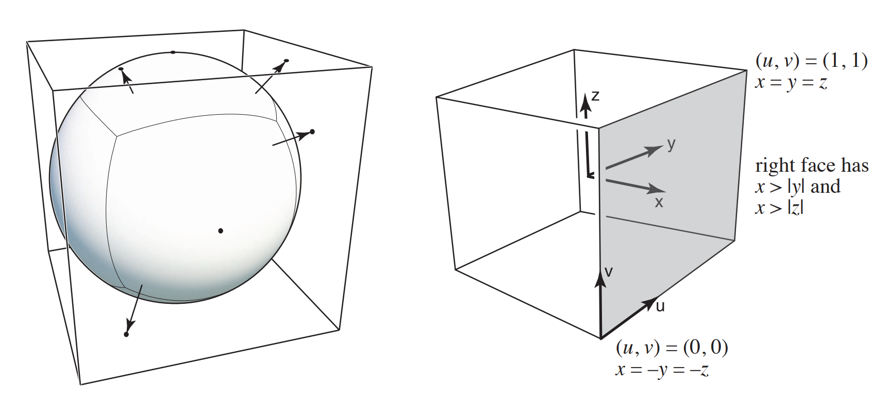
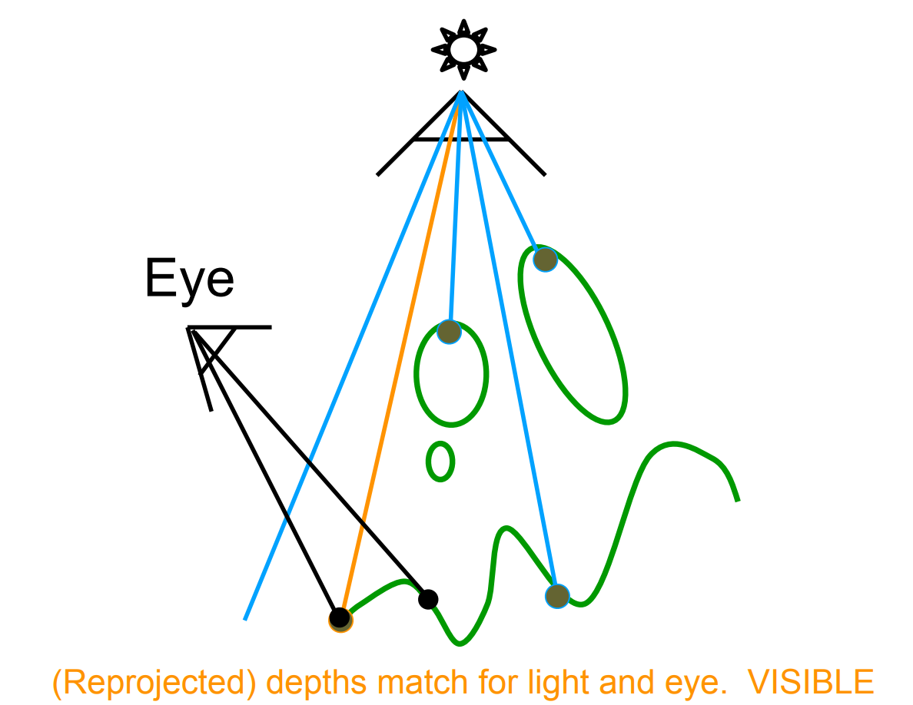

# GAMES101 Lecture 09 - Shading 3 (Texture Mapping and Shadow Mapping)

[GAMES101_Lecture_09.pdf](https://sites.cs.ucsb.edu/~lingqi/teaching/resources/GAMES101_Lecture_09.pdf)

*Shadow mapping is from Lecture 12. For convenience it is integrated into this lecture note.*

## I. Texture Mapping

- Parameterization

  

  

- **Tile-able Texture**

  

## II. Interpolation - Barycentric Coordinates

Why do we want to interpolate?

- Specify values at vertices
- Obtain **smoothly varying values** across triangles

What do we want to interpolate?

- Texture Coordinates, colors, normal vectors...

### Barycentric Coordinates

Assume the origin $O$. Inside the plane where a triangle $ABC$ resides, for any point $P$ we have $\overrightarrow{OP} = \alpha\overrightarrow{OA} + \beta\overrightarrow{OB} + \gamma\overrightarrow{OC}$, where $\alpha + \beta + \gamma = 1$.

- If all three coordinates are *non-negative*, then the point is inside the triangle.

#### Computing the Barycentric Coordinates

- **Geometric Viewpoint**: Proportional Areas

  

  Then: 

  $$
  \alpha = \frac{A_A}{A_A + A_B + A_C}
  $$

  $$
  \beta = \frac{A_B}{A_A + A_B + A_C}
  $$

  $$
  \gamma = \frac{A_C}{A_A + A_B + A_C}
  $$

  

- **Formula**: 

  $$
  \alpha = \frac{-(x - x_B)(y_C - y_B) + (y - y_B)(x_C - x_B)}{-(x_A - x_B)(y_C - y_B) + (y_A - y_B)(x_C - x_B)}
  $$

  $$
  \beta = \frac{-(x - x_C)(y_A - y_C) + (y - y_C)(x_A - x_C)}{-(x_B - x_C)(y_A - y_C) + (y_B - y_C)(x_A - x_C)}
  $$

  $$
  \gamma = 1 - \alpha - \beta
  $$

**Barycentric coordinates are not invariant under projection!**

## III. Applying Textures

### Simple Texture Mapping: Diffuse Color

For each rasterized screen sample, determine its $(u, v)$ coordinate by (possibly) interpolating.

### Texture Magnification

- **Texel**: A pixel on a texture.

#### Insufficient texture resolution

- **Linear Interpolation**: 
  
  $$
  \text{lerp}(x, v_0, v_1) = v_0 + x(v_1 - v_0)
  $$

- **Bilinear Interpolation**: Pick the **nearest 4 texels**. Do two linear interpolations to get two intermediate values, then do one linear interpolation to get the final value.

- **Bicubic Interpolation**: Pick the **nearest 16 texels**. Do four cubic interpolations to get four intermediate values, then one cubic interpolation to get the final value.

#### Texture Too Large

- **Mipmap**: Allowing ***fast, approximate, square*** range queries.

  - Texture mapping in multiple levels, each the one-fourth of the previous level until the texture becomes 1x1.

  - Calculating Mipmap Level $D$: Estimate texture footprint using texture coordinates of neighboring screen samples:

    $$
    D = \log_2L
    $$

    $$
    L = \max\left(\sqrt{\left(\frac{du}{dx}\right)^2 + \left(\frac{dv}{dx}\right)^2}, \sqrt{\left(\frac{du}{dy}\right)^2 + \left(\frac{dv}{dy}\right)^2} \right)
    $$

    

  - Visualization: $D$ rounded to nearest integer level:

    

    *Trilinear Filtering*:

    - Do two bilinear interpolation on two adjacent Mipmap levels. Then one linear interpolation to get result on a non-integer level.

    

  - **Overblur**: 

- **Anisotropic Filtering**

  - *Ripmaps and summed area tables*: 

    

    Can look up **axis-aligned rectangular zones**.

  - *EWA Filtering*:

    - Use ellipse-shaped regions
    - Multiple lookups
    - Weighted average
    - Mipmap hierarchy still helps
    - Handle irregular footprints

### Applications of Textures

In modern GPUS, textures = memory + range query (filtering)

- General method to bring data to fragment calculations

Applications:

- **Environment Lighting**

  - *Environment Map*: Describe light sources from the *environment*.

    - Directions only

    - **Spherical** Environment Map

      - *Prone to distortion (Top and bottom)*

    - **Cube** Map

      

- **Store Microgeometry**

  - *Bump/Normal Mapping*: Adding surface detail without adding more triangles

    - Compute the gradient to find out the tangent plane, and then

    - Calculate the **new surface normal**.

      - In 3D, first compute

        $$
        \frac{dp}{du} = c_1 [h(u + 1) - h(u)]
        $$

        $$
        \frac{dp}{dv} = c_2 [h(v + 1) - h(v)]
        $$

        The perturbed normal is then

        $$
        n = \frac{(-dp/du, -dp/dv, 1)}{\lVert (-dp/du, -dp/dv, 1) \rVert}
        $$

        in **local coordinate**.

  - *Displacement Mapping*: **Move the vertices instead**.

  - *Ambient Occlusion Texture Map*: Record the status of ambient occlusions on the object.

- **Procedural Textures**

- **Solid Modeling**

  - *3D Procedural Noise*: Create noise in 3D space and convert into 3D textures.
    - **Perlin Noise**: A procedural texture primitive, a type of gradient noise used by visual effects artists to increase the appearance of realism in computer graphics. All of its visual details are the same size. [From Wikipedia](https://en.wikipedia.org/wiki/Perlin_noise).

- **Volume Rendering**

  - *3D Textures*

- ...

## IV. Shadow Mapping

*From* `Lecture 12.md`.

- An **image-space** algorithm.
  - **No** knowledge of scene's geometry during shadow computation
  - Must deal with aliasing artifacts.

- **Key idea**: the points NOT in shadow must be **seen** 

  - both **by the light**, and

  - **by the camera**.

- Classic shadow map:

  - Can only deal with point/directional light sources.

    

### Procedure

- **Pass 1: Render from Light**:

  - Get the depth image from light source

- **Pass 2A: Render from Eye:**

  - Get the depth image from camera

- **Pass 2B: Project to Light**:

  - **For each sampled point from Pass 2A**:

    - If the depth of that point, when projected back to the light source, doesn't match the depth value in the shadow map, it means that the point has been blocked from receiving light.

  - ***Visible Sample:***

    

  - ***Invisible Sample***:

    

### Problems

- Precision of the underlying floating-point arithmetic
  - Scale, bias, tolerance...
- Resolution of the shadow mapping (from the view of light source)
- **Hard shadows** (point lights only)
  - In comparison to soft shadows (light sources with volume)

## Appendix A: Famous Models

- Utah Teapot
- Stanford Bunny
- Stanford Dragon
- Cornell Box
  - Used to verify global illumination implementation.

## Appendix B: Normal Mapping and TBN Matrix

Reference: [Normal-Mapping]([LearnOpenGL - Normal Mapping](https://learnopengl.com/Advanced-Lighting/Normal-Mapping))

### Tangent Space

Normal vectors in a normal map are expressed in tangent space where normals always point roughly in the positive $z$ direction. Tangent space is a space that's local to the surface of a triangle: the normals are relative to the local reference frame of the individual triangles. Think of it as the local space of the normal map's vectors; they're all defined pointing in the positive z direction regardless of the final transformed direction. Using a specific matrix we can then transform normal vectors from this *local* tangent space to world or view coordinates, orienting them along the final mapped surface's direction.

**The TBN Matrix** is computed to transform normals from the tangent space to a different space such that they're aligned with the surface's normal direction.

-  **TBN Matrix**: Tangent, Bitangent and Normal Vector.

  

  - *The tangent vector and the bitangent vector align with the direction in which we define a surface's texture coordinates.*
  - *Multiply the acquired normal vector from the normal map, by the TBN matrix, transforms the vector into the global coordinates.*

