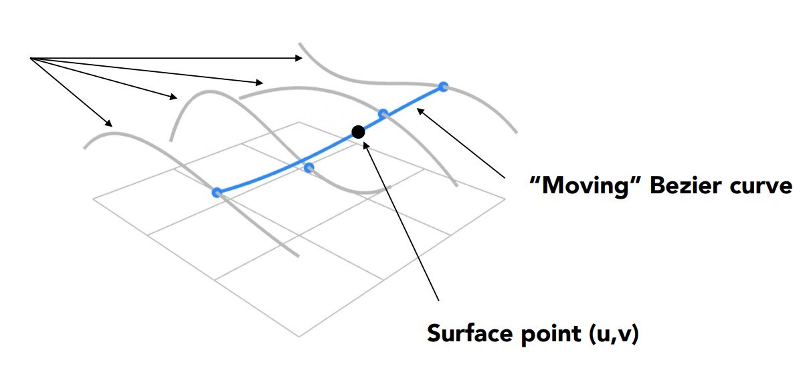

# GAMES101 Lecture 11 - Geometry 2 (Curves and Surfaces)

[GAMES101_Lecture_11.pdf](https://sites.cs.ucsb.edu/~lingqi/teaching/resources/GAMES101_Lecture_11.pdf)

## I. Explicit Representations of Geometry

*Refer to* `Lecture10.md`.

## II. Curves

### Bézier Curve

- **Evaluating Bézier Curves**: *de Casteljau Algorithm*

  - Intuitive Procedure:

    - Repeat linear interpolation on adjacent points for parameter $t \in [0, 1]$ until there is only one point left.
    - On each iteration, reduce the number of points to be evaluated by 1.

    

  - Algebraic Formula:

    *Bernstein form of a Bézier curve of order* $n$:

    $$
    \textbf{b}^n (t) = \textbf{b}^n_t (t) = \sum_{j = 0}^{n} \textbf{b}_j B^n_j (t)
    $$

    where the Bernstein polynomial $B^n_j$ is

    $$
    B^n_i (t) = {n \choose i} t^i (1 - t)^{n - i}
    $$
    
    Similar to the binomial expansion.

- **Properties**: 

  - *Endpoint interpolation*: Endpoints must be on the curve
  - *Tangent to end segments*: **In the cubic case**, $\textbf{b}'(0) = 3(\textbf{b}_1 - \textbf{b}_0)$, and $\textbf{b}'(1) = 3(\textbf{b}_3 - \textbf{b}_2)$
  - *Affine transformation property*: The curve can be transformed by transforming control points
  - *Convex hull property*: The curve is within convex hull of control points

### Piecewise Bézier Curves

- **Piecewise Cubic Bézier**: the most common technique
  - *Continuity*:
    - $C^0$ continuity: $\textbf{a}_n = \textbf{b}_0$ 

    - $C^1$ continuity: $\textbf{a}_n = \textbf{b}_0 = \frac{1}{2} (\textbf{a}_{n-1} + \textbf{b}_1)$

    - ...

### Splines (样条)

- **Spline**: A continuous curve constructed so as to pass through a given set of points and have a certain number of continuous derivatives.
  - A curve under control
- **B-Spline**: Short for basis splines.
  - Require more information than Bézier curves
  - Superset of the Bézier curves
  - Locality

## III. Surfaces

### Bézier Surfaces

- Created by interpolating Bézier curves on two axes.

  

### Mesh Operations: Geometry Processing

*Refer to* `Lecture11.md`.

## Note: Bézier curve and Anti-aliasing

