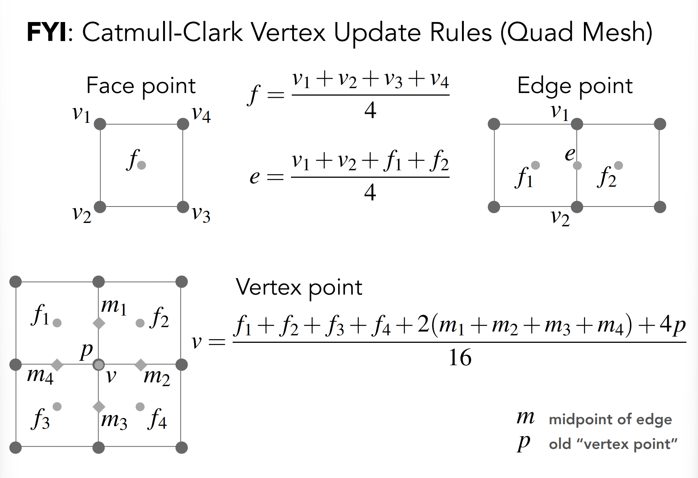
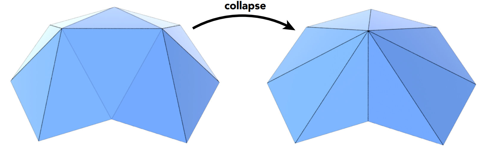

# GAMES101 Lecture 12 - Geometry 3

[GAMES101_Lecture_12.pdf](https://sites.cs.ucsb.edu/~lingqi/teaching/resources/GAMES101_Lecture_12.pdf)

## Turing Award Winners (in CG)

~~Make Computer Graphics great again~~

- *Ed Catmull*
- *Pat Hanradan*

### I. Mesh Operations: Geometry Processing

- **Mesh Subdivision** (Upsampling): Increase resolution.

  - **Loop Subdivision**: New/old vertices updated differently

    - Procedure:

      - **1. Insert new vertices**: Split each triangle into four.

        

      - **2. Update positions of vertices**

        - For new vertices:

          Update the position to:
    
          $$
          \frac{3}{8} (A + B) + \frac{1}{8} (C + D)
          $$
    
          
    
        - For old vertices:
    
          Let $n$ be the degree of the vertex, and $p_i, i>0$ be the old vertices surround the current vertex $p_0$. Then the new position is:
          
          $$
          (1 - nu)p_0 + \sum_{i > 0} up_i, \text{where $u = 3/16$ if $n=3$, and $3/(8n)$ otherwise}
          $$
          
          
    
    
    
  - **Catmull-Clark Subdivision** (General Mesh)

    - *Extraordinary vertex*: vertex that has $\text{degree} != 4$

    - *Non-quad face*

    - Procedure:

      - **1. Add new vertices**

        - Add vertex at the center of each face
        - Add midpoint on each edge
        - Connect all new vertices

      - **2. Update the Mesh**

        - face point, edge point, vertex point...

          

          

- **Mesh Simplification** (Downsampling): Decrease resolution; Try to preserve shape/appearance.

  - **Edge Collapsing**: Contract two vertices into one.

    

  - **Quadric Error Metrics**: New vertex should minimize its **sum of square distance** (L2 distance) to previously related triangle planes. 

  - (**Garland & Heckbert 1997**):

    - Approximate distance to surface as sum of distances to planes containing triangles
    - Iteratively collapse edge **with smallest score**

- **Mesh Regularization**: Improve the quality of the mesh; Try to make the shape of each triangle regularized.

## II. Shadow Mapping

*Refer to* `Lecture09.md`.

