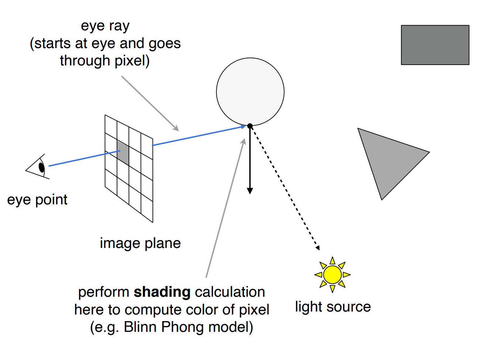
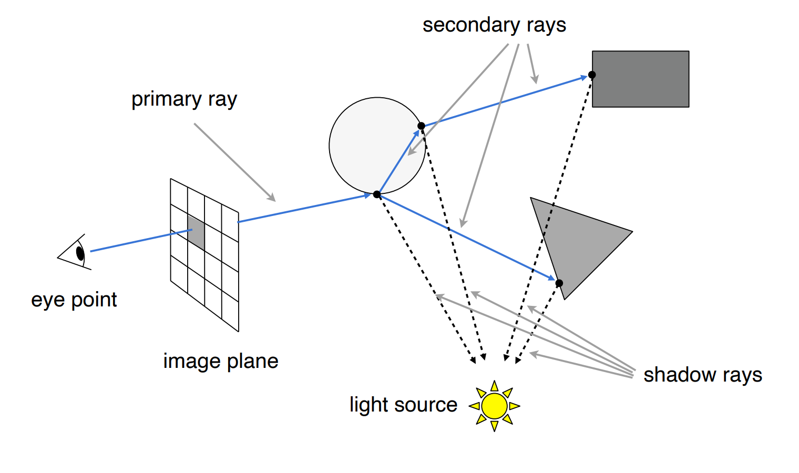

# GAMES101 Lecture 13 - Ray Tracing 1 (Whitted-Style Ray Tracing)

[GAMES101_Lecture_13.pdf](https://sites.cs.ucsb.edu/~lingqi/teaching/resources/GAMES101_Lecture_13.pdf)

## I. Why Ray Tracing?

- Rasterization couldn't handle **global** effects well
  - (Soft) shadows
  - Especially when the light sources **bounce more than once**
    - *Glossy reflection*
    - *Indirect Illumination*
- Rasterization is fast, but quality is **relatively low**
- Ray tracing is accurate, but is **very slow**
  - Rasterization: *real-time*
  - Ray tracing: *offline*
  - ~10K CPU core hours to render **one frame** in production

## II. Basic Ray-Tracing Algorithms

Three assumptions:

- Light travels in straight lines *(physically wrong)*
- Light rays do not "collide" with each other if they cross *(physically wrong)*
- Light rays travel from the light sources to the eye (but the physics is invariant under path reversal - *reciprocity*)

### Ray Casting

- **Pinhole Camera Model**
- **Point Light Source**
- Start an *eye ray* at the eye and goes through pixel.
  - Collide with the first object, and then
  - (**Local**) Perform **shading** calculation to compute color of pixel
- Directly project to the light source after the eye ray has **collide** with an object.
  - *Then the light bounces only **once***.

### Recursive (Whitted-Style) Ray Tracing

*"An improved illumination model for shaded display."* - T. Whitted, CACM 1980

Simulates the recursive bouncing of light rays.

- Taking both **Reflection** and **Refraction** into consideration

- Different rays:

  

  - *Primary Ray*: Starts at the eye
  - *Secondary Ray*: Generated upon collision of primary ray
  - *Shadow Ray*: Directly connected from the intersection to the light source.

### Ray-Surface Intersection

- **Ray Equation**: A ray is defined by its origin $\textbf{o}$ and a direction vector $\textbf{d}$:
  
  $$
  \textbf{r}(t) = \textbf{o} + t\textbf{d} \quad 0\leq t \le \infty
  $$
  
- **Intersections**:

  - **Implicit Surface**: Solve for *real*, *positive* roots.
    
    $$
    \textbf{p} : f(\textbf{p}) = 0 \quad f(\textbf{o} + t\textbf{d}) = 0
    $$
    
  - **Triangle Mesh**
  
    - **Naïve Procedure:**
  
      1. Ray-plane intersection
         
         $$
         (\textbf{p} - \textbf{p}') \cdot \textbf{N} = (\textbf{o} + t\textbf{d} - \textbf{p}') \cdot \textbf{N} = 0
         $$

         Solving the equation gives

         $$
         t = \frac{(\textbf{p}' - \textbf{o}) \cdot N}{\textbf{d} \cdot \textbf{N}}.
         $$

         **Remember to check whether $ 0 \leq t \le \infty$**.
  
      2. Test if the point is inside the triangle
  
         
  
    - **Möller Trumbore Algorithm:** A faster approach by examining the barycentric coordinate.
      
      $$
      \textbf{o} + t\textbf{d} = (1 - b_1 - b_2)\textbf{p}_0 + b_1 \textbf{p}_1 + b_2 \textbf{p}_2
      $$

      Solving the equation gives:

      $$
      \begin{bmatrix}
      t \\
      b_1 \\
      b_2 \\
      \end{bmatrix}
      =
      \frac{1}{\textbf{S}_1 \cdot \textbf{E}_1}
      \begin{bmatrix}
      \textbf{S}_2 \cdot \textbf{E}_2 \\
      \textbf{S}_1 \cdot \textbf{S} \\
      \textbf{S}_2 \cdot \textbf{D} \\
      \end{bmatrix}
      $$
      
      where
      
    $$
      \textbf{E}_1 = \textbf{p}_1 - \textbf{p}_0
    $$
    
    $$
      \textbf{E}_2 = \textbf{p}_2 - \textbf{p}_0
    $$
    
    $$
      \textbf{S} = \textbf{o} - \textbf{p}_0
    $$
    
    $$
      \textbf{S}_1 = \textbf{d} \times \textbf{E}_2
    $$
    
    $$
      \textbf{S}_2 = \textbf{S} \times \textbf{E}_1
    $$
    
    *See Cramer's rule.*
    
  - *Inside/outside test: Fire a ray from a given point. Even number of intersections if the point is outside.*

### Accelerating Ray-Surface Intersection

#### Performance Challenges

Simple ray-scene intersection

- Exhaustively test ray-intersection with **every triangle**
- Find the closest hit (i.e. minimum $t$)

#### Bounding Volumes

Build a larger volume for testing the potential intersection quickly.

- **Feature**:

  - Object is fully contained in the volume.

  - If the ray doesn't hit the volume, then it won't hit the object

  - Test BVol first, then test the object if BVol is hit.

- *Can be in any shape as long as it speeds up the test.*

#### Ray-Intersection With Box

- **Axis-Aligned Bounding Box (AABB)**

  - For the 3D box, $t_\text{enter} = \max{\{t_\text{min}\}}$, $t_{\text{exit}} = \min{\{t_{\text{max}}\}}$.
  - If $t_{\text{enter}} <= t_{\text{exit}}$ and $t_\text{exit} > 0$, then there is an intersection.
    - Equality for BBoxes that contains an axis-aligned plane only

- **Why Axis-Aligned?**

  - General Plane:
    
    $$
    t = \frac{(\textbf{p}' - \textbf{o}) \cdot \textbf{N}}{\textbf{d} \cdot \textbf{N}}
    $$

    3 subtractions, 6 multiplications, 1 division

  - Slabs perpendicular to $x$ axis:

    $$
    t = \frac{\textbf{p}'_x - \textbf{o}_x}{\textbf{d}_x}
    $$

    1 subtraction, 1 division