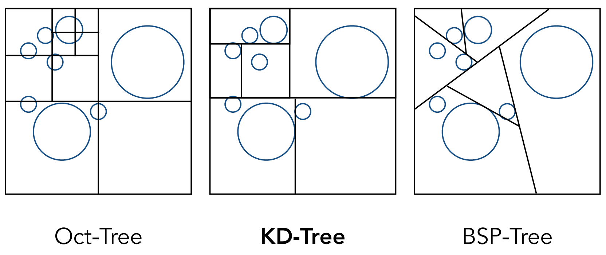
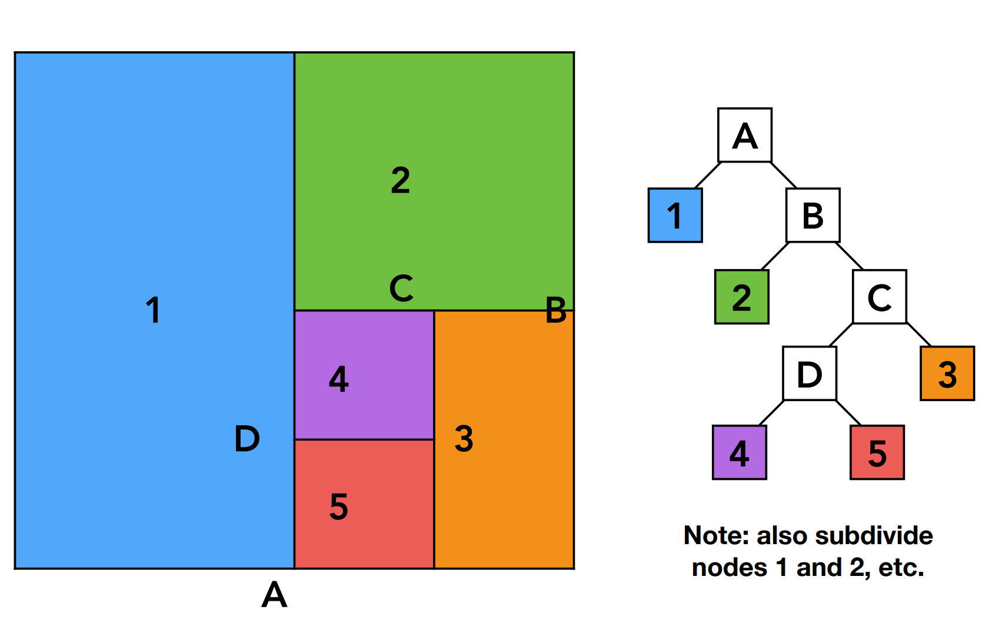
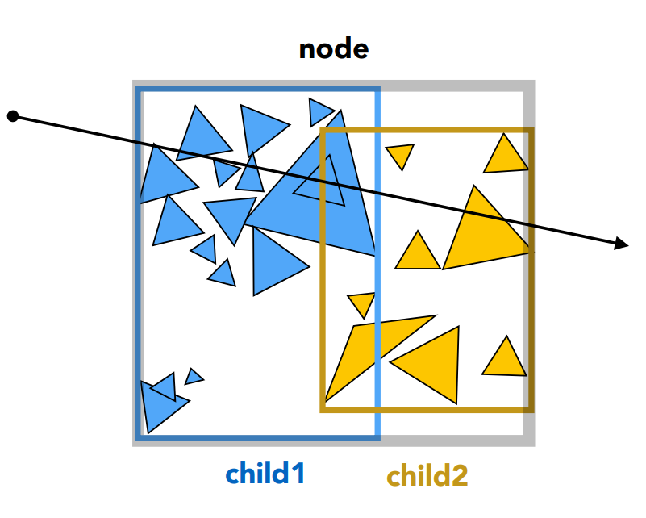
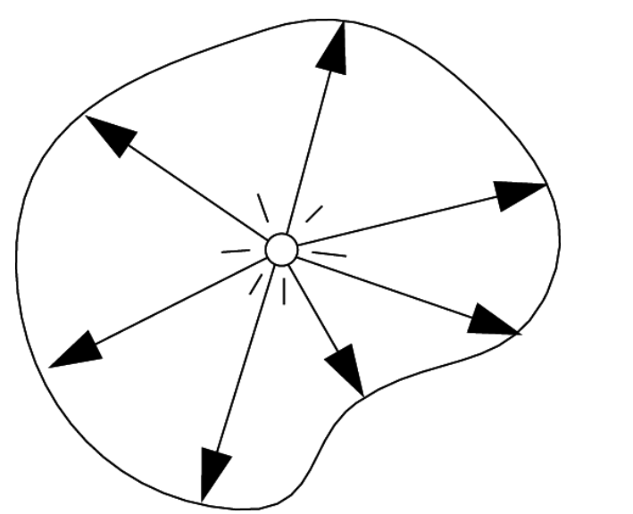
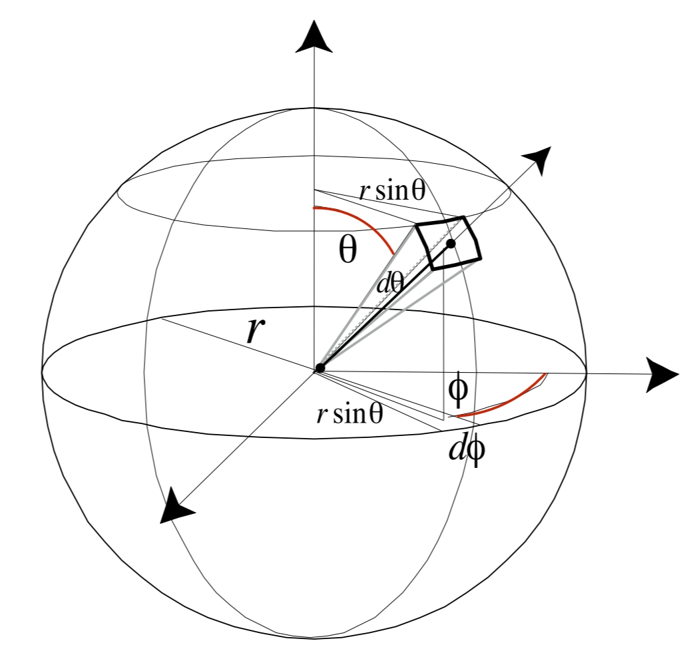
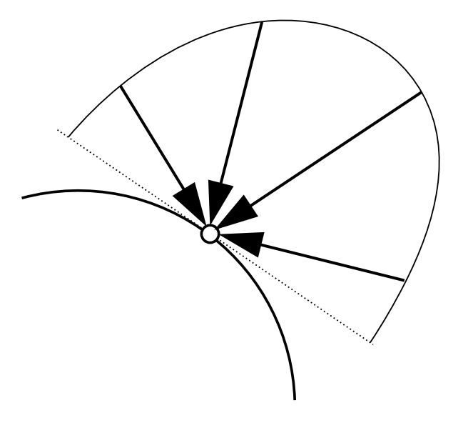
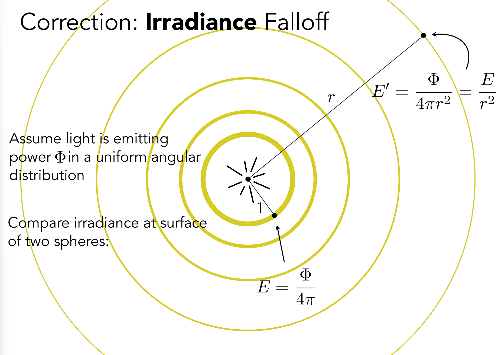
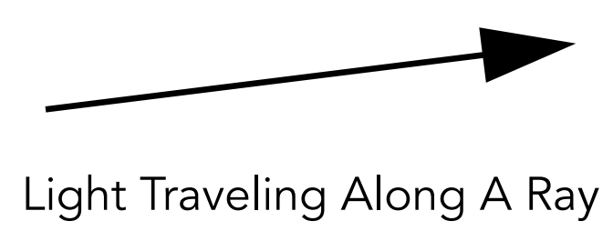

# GAMES101 Lecture 14 - Ray Tracing 2 (Acceleration and Radiometry)

[GAMES101_Lecture_14.pdf](https://sites.cs.ucsb.edu/~lingqi/teaching/resources/GAMES101_Lecture_14.pdf)

## I. Spatial Partitions

### Trivial Partitions

#### Uniform Spatial Partitions (Grid)

- **Preprocessing - Build Acceleration Grid**
  - Find bounding box
  - Create grid
  - Store each object in overlapping cells

- **Grid Resolution Heuristic**

  - $\text{\#cells} = C * \text{\#objects}$

  - $ C \approx 27$ in 3D

- *When do they work well*: When objects are approximately **evenly distributed in size and space** in the scene.

- *When do they fail*: **"Teapot in a stadium"** problem


### Tree-Shaped Partitions



#### Oct-Tree

*Recursively divide the current octant into **8 sub-octants** until the current working space is empty or the number of objects contained reaches certain minimum.*

- **Cons**:
  - Too many branches


#### BSP-Tree (Binary Space Partitioning)

*Recursively divide the space using a hyperplane.*


#### KD-Tree



*Recursively divide the space along **alternating** axes ($x \to y \to z$ loop) using a hyperplane, creating a binary tree structure.*

*Separations don't have to be **even***.


**Data Structure:**

- **Internal Nodes**:
  - Store:
    - *Split axis*
    - *Split position*
    - *Children*
    - ***No objects are stored***
- **Leaf Nodes**:
  - Store:
    - *List of objects contained*


**Traversing a KD-Tree**: If the ray has intersected with the current node, recursively check all its child nodes.

- If the current node is a leaf node, test intersection with all contained objects.


### General Problems

- *Inside a partition, there may be an triangle which passes through this partition but has none of its vertices inside this partition.*
- *An object may be contained inside multiple partitions, leading to **memory inefficiency***.
  - Ideally we want each object stored in a **single** node only.


## II. Object Partitions

### Bounding Volume Hierarchy (BVH)

**Summary**: 

- Find bounding box
- Recursively split set of objects into two subsets
- **Recompute** the bounding box of the subsets
- Stop when necessary
- Store objects in each leaf node


**How to subdivide a node**? *Make the split as separated and evenly-sized as possible.*

- Choose a dimension to split
- **Heuristic #1**: Always choose the **longest** axis in the current node
  - To make the partitions more evenly-spaced
- **Heuristic #2**: Split node at location of **median** object
  - To make the tree **balanced**, resulting in less depth of the hierarchy
  - This can be done in $O(n)$ on average using randomized algorithms, and strictly in $O(n)$ using a type of deterministic algorithm at the cost of a significantly higher constant factor.

*Heuristics are of great research interest.*


**Termination criteria**?

- Heuristic: Stop when the number of elements contained in the current node reaches certain minimum.


**Data Structure:**

- **Internal Nodes**:
  - Store:
    - Bounding box
    - *Children*
    - ***No objects are stored***
- **Leaf Nodes**:
  - Store:
    - Bounding box
    - *List of objects contained*

*All objects are in subtrees.*


**Traversing a BVH**:

```pseudocode
Intersect(Ray ray, BVH node) {
	if (ray misses node.bbox) return;
	
	if (node is a leaf node) {
		test intersection with all objects;
		return the closest intersection;
	}
	
	hit1 = Intersect(ray, node.child1);
	hit2 = Intersect(ray, node.child2);
	
	return the closer of hit1, hit2;
}
```




### Spatial vs Object Partitions

- **Spatial Partition**
  - Partition space into **non-overlapping** regions
  - An object can be contained in multiple regions
- **Object Partition**
  - Partition set of objects into **disjoint subsets**
  - Bounding boxes for each set may overlap in space


## III. Basic Radiometry

**Motivations and stuff to learn**: *Describe the light in a precise manner*.

- Measure system and units for illumination
- **Accurately measure** the spatial properties of light
  - Radiant Flux
  - Intensity
  - Irradiance
  - Radiance
- Perform lighting calculations **in a physically correct manner**.
- *Still based on **Geometric Optics***.


### Radiant Energy and Flux (Power)

***Definition***: **Radiant energy** is the energy of electromagnetic radiation. It is measured in units of joules, and denoted by the symbol

$$
Q \quad[\text{J $=$ Joule}]
$$

***Definition***: **Radiant flux** (power) is the energy emitted, reflected, transmitted or received, *per unit time*.

$$
\Phi \equiv \dv{Q}{t} \quad \text{[W = Watt] [lm = lumen]}
$$


### Radiant Intensity



***Definition***: The **radiant (luminous) intensity** is the power *per unit solid angle* emitted by a point light source.

$$
I(\omega) \equiv \dv{\Phi}{\omega}
\quad
\text{
	$\left[\frac{\text{W}}{\text{sr}}\right]$
	 
	$\left[\frac{\text{lm}}{\text{sr}} = \text{cd} = \text{candela} \right]$
}
$$

where *candela* is one of the seven SI base units.


### Angles, Solid Angles and Direction Vectors

***Definition***: **Angle** is the *ratio* of subtended arc length on a circle to the radius

$$
\theta = \frac{l}{r}
$$

A circle has $2\pi$ **radians**.

***Definition***: **Solid angle** is the ratio of subtended *area* on a sphere to the radius *squared*

$$
\Omega = \frac{A}{r^2}
$$

A sphere has $4\pi$ **steradians**.

*The area, when calculated, must be that of a part of the shell, or that projected to the shell.*


**Direction Vector**: **$\omega$** will be used to denote a **direction vector** of unit length.


### Differential Solid Angle



$$
\begin{align}
\dd{A} &= (r \dd{\theta}) (r \sin{\theta} \dd{\phi}) \\
&= r^2 \sin{\theta} \dd{\theta} \dd{\phi}
\end{align}
$$

$$
\dd{\omega} = \frac{\dd{A}}{r^2} = \sin{\theta} \dd{\theta} \dd{\phi}
$$


### Isotropic Point Source


An **isotropic point source** has an uniform intensity.

$$
\begin{align}
\Phi &= \int_{S^2} I \dd{\omega} \\
&= 4 \pi I
\end{align}
$$

$$
I = \frac{\Phi}{4\pi}
$$


### Irradiance



***Definition***: The **irradiance** is the power per unit area **incident** on a surface point.

$$
E(\textbf{x}) \equiv \dv{\Phi(\textbf{x})}{A} \cos{\theta}
\quad 
\text{$\left[\frac{\text{W}}{\text{m}^2} \right]$ 
$\left[\frac{\text{lm}}{\text{m}^2} = \text{lux}\right]$}
$$

where $\theta$ is the angle of incidence following **Lambert's Cosine Law**.


*Hint: Think of the $\cos{\theta}$ operation as adjusting the plane such that it sits perpendicular to the incident light.*


#### Correction: Irradiance Falloff




### Radiance



Radiance is the fundamental field quantity that describes the distribution of light in an environment.

- Radiance is the quantity associated **with a ray**
- Rendering is all about computing radiance


***Definition***: The **radiance (luminance)** is the power emitted reflected, transmitted or received by a surface, **per unit solid angle**, **per projected unit area**.

$$
L(\text{p}, \omega) \equiv \frac{\dd[2]\Phi(\text{p}, \omega)}{\dd{\omega} \dd{A} \cos{\theta}}
\quad
\text{
$\left[\frac{\text{W}}{\text{sr m}^2} \right] $ 
$\left[\frac{\text{cd}}{\text{m}^2} = \frac{\text{lm}}{\text{sr m}^2} = \text{nit} \right] $
}
$$

*where $\cos{\theta}$ accounts for projected surface area.*

- Irradiance per solid angle
- Intensity per **projected** unit area


#### Incident Radiance

**Incident radiance** is the irradiance per unit solid angle arriving at the surface. 

$$
L(\text{p}, \omega) = \dv{E(\text{p})}{\omega \cos{\theta}}
$$

The light arriving at the surface along a given ray.


#### Exiting Radiance

**Exiting surface** radiance is the intensity per unit projected area leaving the surface.

$$
L(\text{p}, \omega) \equiv \dv{I(\text{p}, \omega)}{A \cos{\theta}}
$$

*Hint: For the two formulas for incident/exiting radiance, considering taking them has differentials and multiply $L(\text{p}, \omega)$ by the denominator.*


#### Irradiance vs. Radiance


- **Irradiance**: Total power received by area $\dd{A}$
- **Radiance**: Power received by area $\dd{A}$ from **direction** $\dd{\omega}$

$$
\dd{E(\text{p}, \omega)} = L_i (\text{p}, \omega) \cos{\theta} \dd{\omega}
$$

$$
E(p) = \int_{H^2} L_i (\text{p}, \omega) \cos{\theta} \dd{\omega}
$$

*Unit hemisphere*: $H^2$


## Appendix A: Surface Area Heuristics (SAH)

*Reference:* [Bounding Volume Hierarchies (pbr-book.org)](https://pbr-book.org/3ed-2018/Primitives_and_Intersection_Acceleration/Bounding_Volume_Hierarchies#sec:sah)

The two primitive partitioning approaches described in the BVH section can work well for some distributions of primitives, but they often choose partitions that perform poorly in practice, leading to more nodes of the tree being visited by rays and hence unnecessary inefficient ray-primitive intersection computations at rendering time.

Most of the best algorithms (as of 2018) for building acceleration structures for ray-tracing are based on the "surface area heuristic" (SAH), which provides a **well-grounded cost model** for answer questions like

- "which of a number of partitions of primitives will lead to a better BVH for ray-primitive intersection tests?", or
- "which of a number of possible positions to split space in a spatial subdivision scheme will lead to a better acceleration structure?"


### Idea behind the SAH Cost Model

The SAH model estimates the **computational cost** of performing ray intersection tests, including the time spent on:

- **Traversing** nodes of the tree
- Ray-primitive **intersection tests** for a particular partitioning of primitives

By assuming the current working node is a leaf node regardless of the number of primitives it contains, we know that any ray that passes through this node will be tested against all of the overlapping primitives and will incur a cost of 

$$
\sum_{i = 1}^N t_\text{isect} (i)
$$

where 

- $N$ is the number of objects
- $t_\text{isect}$ is the time to compute a ray-object intersection with the $i$th primitive
  - We here assume that $t_\text{isect}$ is the same for all primitives
    - The error introduced doesn't *seem* to affect the performance very much

If we **split the region**, rays will incur the cost

$$
c(A, B) = t_\text{trav} + p_A \sum_{i = 1}^{N_A} t_\text{isect} (a_i) + p_B \sum_{i = 1}^{N_B} t_\text{isect} (b_i)
$$

where

- $t_\text{trav}$ is the time it takes to traverse the interior node and determine which of the children the ray passes through

- $p_A$ and $p_B$ are the probabilities that the ray passes through each of the child nodes (assuming binary subdivision)

  - They can be computed using ideas from geometric probability.

    For a convex volume $A$ contained in another convex volume $B$, the conditional probability that a **uniformly distributed random ray** passing through $B$ will also pass through $A$ is the ratio of their surface areas, $s_A$ and $s_B$:
    
    $$
    p(A|B) = \frac{s_A}{s_B}
    $$

- $a_i$ and $b_i$ are the indices of primitives in the two children nodes

- $N_A$ and $N_B$ are the number of primitives contained in two child nodes


The algorithm then optimize the partitioning with the goal of minimizing the total cost.

- Typically, a **greedy** algorithm is used that minimizes the cost for each single node of the hiearchy.


### The Bucket Algorithm

The bucket algorithm follows a very simple pattern.

- If the number of primitives in the current node is less than a threshold, do nothing
- Else:
  - Choose the axis to split. *May split the longest axis.*
  - Split the range on that axis into $N$ equally-sized regions.
  - Compute the cost if we split the node at those $N-1$ planes.
  - Which plane is the best to patition? Choose that and recursively build BVH.

In the book, $N=12$.


### Pros

- Probably the **most efficient** BVH split method


### Cons

- Many passes are taken over the scene primitives to compute the SAH costs at all of the levels of the tree

- Hard to **parallelize**
