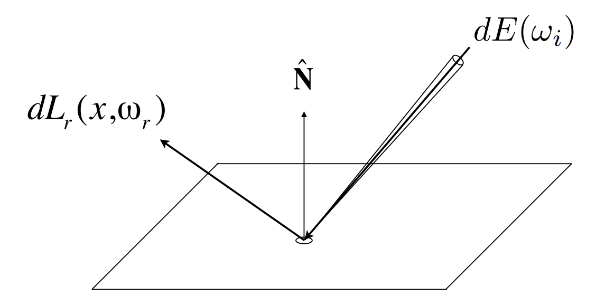
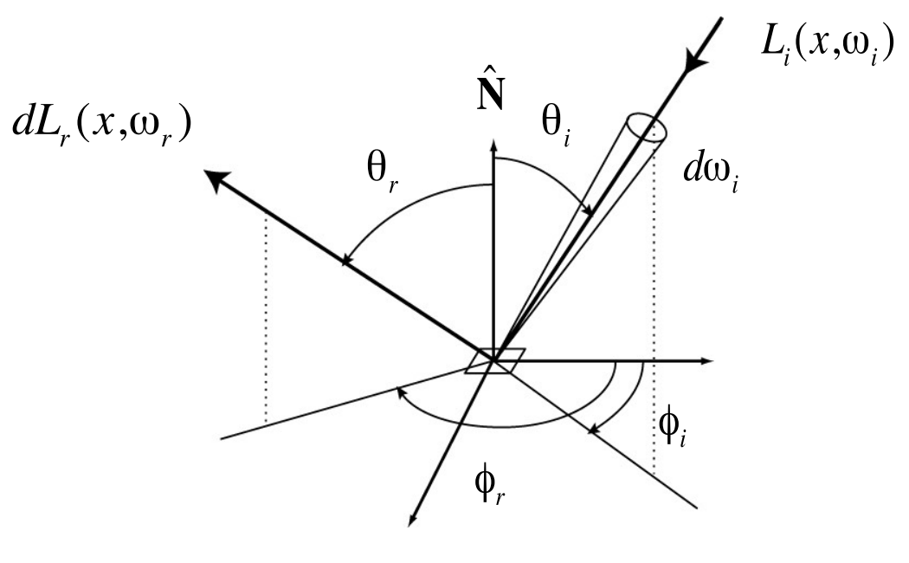
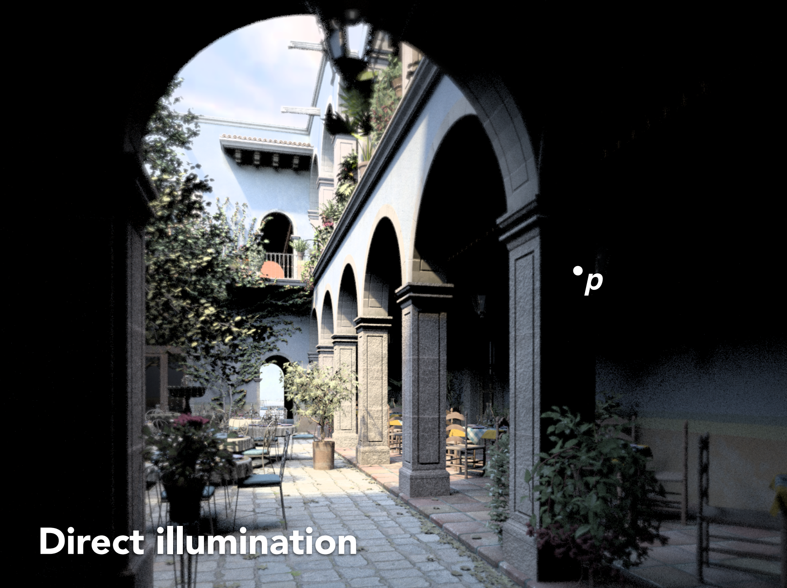
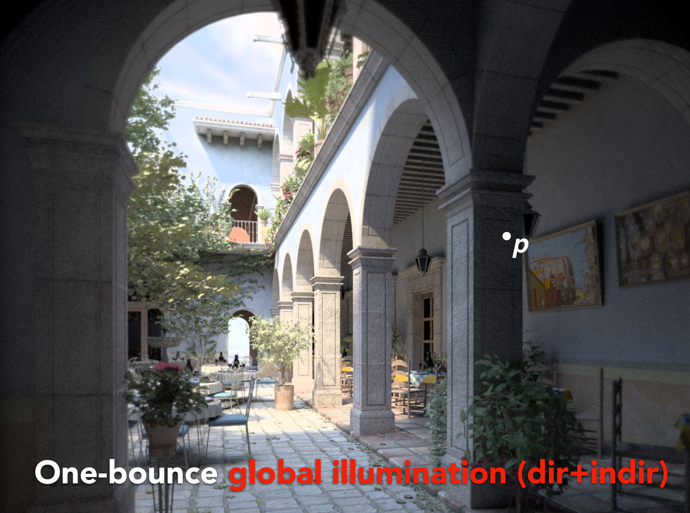
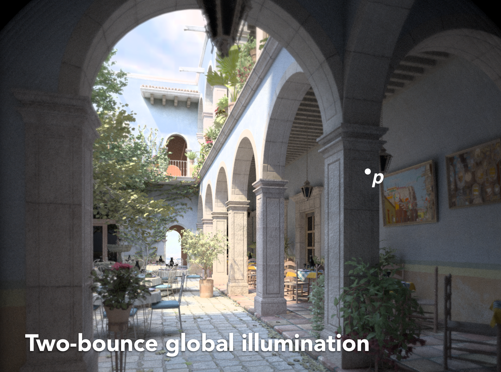
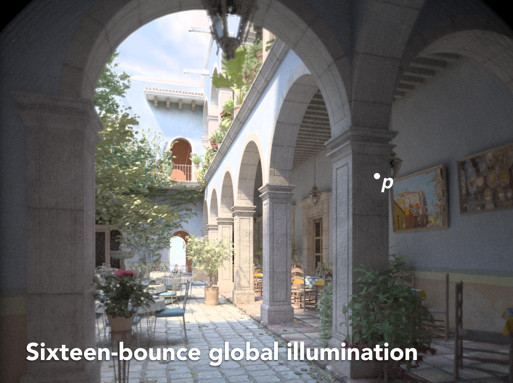

# GAMES101 Lecture 15 - Ray Tracing 3 (Light Transport and Global Illumination, with Review on Probability)

[GAMES101_Lecture_15.pdf](https://sites.cs.ucsb.edu/~lingqi/teaching/resources/GAMES101_Lecture_15.pdf)

## I. Radiometry Cont.

*Please refer to* `Lecture14.md`.

## II. Bidirectional Reflectance Distribution Function (BRDF)

### Reflection at a Point

Radiance from direction $\omega_i$ turns into the power $E$ that $\dd{A}$ receives. Then the power $E$ will be come the radiance to any other direction $\omega_{o}$.

- Differential radiance incoming:
  
  $$
  \dd{E(\omega_i)} = L(\omega_i) \cos{\theta_i} \dd{\omega_i}
  $$

- Differential radiance exiting due to $\dd{E(\omega_i)}$:
  
  $$
  \dd{L_r (\omega_r)}
  $$

### BRDF

The Bidirectional Reflectance **Distribution** Function (BRDF) describes how much light is reflected into each outgoing direction $\omega_r$ from each incoming direction $\omega_i$.

$$
f_r (\omega_i \to \omega_r) = \dv{L_r (\omega_r)}{E_i (\omega_i)}
= \frac{\dd{L_r (\omega_r)}}{L_i (\omega_i) \cos{\theta_i} \dd{\omega_i}}
\quad
\left[\frac{1}{\text{sr}} \right]
$$

**The Reflection Equation:**

$$
\begin{equation} \label{refleq} \tag{1}
L_r (\text{p}, \omega_r) 
= \int_{H^2} f_r(\text{p}, \omega_i \to \omega_r) L_i (\text{p}, \omega_i) \cos{\theta_i} \dd{\omega_i}
\end{equation}
$$

In this equation, what we do is essentially **summing up the contributions** to this particular outgoing direction $\omega_r$ from all other directions, by doing integration on the entire hemisphere. The differential part on the right side, is acquired by multiplying BRDF with the differential of the irradiance.

**Challenge: Recursive Equation**

- Incoming radiance depends on reflected radiance, at another point in the scene

## III. The Rendering Equation

### The Rendering Equation

Adding **an emission term** on equation $\ref{refleq}$ gives the **rendering equation**:

$$
\begin{equation} \label{rendeq} \tag{2}
L_o (\text{p}, \omega_o) = 
L_e (\text{p}, \omega_o) + 
\int_{\Omega_{+}} L_i (\text{p}, \omega_i) f_r(\text{p}, \omega_i, \omega_o)
(\textbf{n} \cdot \omega_i) \dd{\omega_i}
\end{equation}
$$

where $p$ is the point being considered, and $\Omega_{+}$ denotes the upper hemisphere.

- All directions are pointing **outwards**, e.g. $\omega_i$.
- Why can we directly do an integration? *From the linearity.*

### Transforming the Rendering Equation

#### Rendering Equation as Integral Equation

Equation $\ref{ref1}$ is a **Fredhold Integral Equation** of second kind (extensively studied numerically) with **canonical form**:

$$
\begin{equation} \label{fredhold} \tag{3}
l(u) = e(u) + \int l(v) \underbrace{K(u, v)}_{\text{Kernel of the Equation}} \dd{v}
\end{equation}
$$

#### Linear Operator Equation

Equation $\ref{fredhold}$ can be further transformed by applying the **Light Transport Operator**.

$$
L = E + KL
$$

which can be then **discretized** to a simple matrix equation, where:

- $L$, $E$ are vectors, and 
- $K$ is the light transport matrix.

*P.S. WTF? **TODO**: Needs further explanation.*

#### Simplifying the Linear Operator Equation

$$
\begin{align}
L &= E + KL \\
IL - KL &= E \\
(I - K)L &= E \\
L &= (I - K)^{-1} E \\
L &= (I + K + K^2 + K^3 + \cdots) E \quad \text{(Applying the binomial theorem)} \\
L &= E + KE + K^2E + K^3E + \cdots \\
\end{align}
$$

Those expanded terms has physical meanings:

- $E$ - Emission directly from light sources
- $KE$ - Direct illumination on surfaces
- $K^2E$ - Indirect illumination, **one** bounce
- $K^3E$ - **Two** bounces
- ...

#### Ray Tracing and Rasterization

**Shading in rasterization** is equivalent to solving the rendering equation using **zero** bounces.

$$
L = E + KE
$$

| Type                               | Effect                               |
| ---------------------------------- | ------------------------------------ |
| Direct Illumination                |  |
| One-bounce global illumination     |  |
| Two-bounce global illumination     |  |
| Four-bounce global illumination    |  |
| Eight-bounce global illumination   |  |
| Sixteen-bounce global illumination |  |

- Why the lantern is light/dark in some rendered results?
  - Light cannot escape the lantern only after several bounces (so that it reaches an illuminated surface)
- Is the result guaranteed to converge if an infinity number of passes can be calculated?

## Appendix A: Review on Probability

- **Random Variable**

- **Probability Density/Distribution Function, PDF**

- Expected Value

- **Function of a Random Variable**
  
  $$
  E[Y] = 
  E[f(x)] = 
  \int f(x)p(x) \dd{x}
  $$
  

