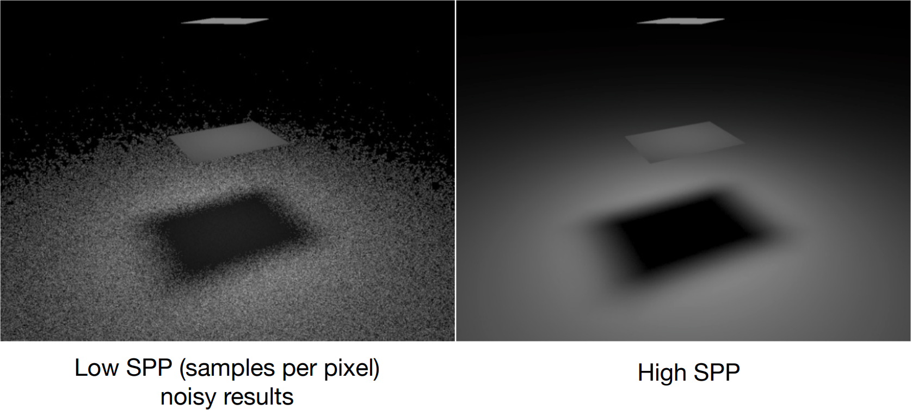

# GAMES101 Lecture 16 - Ray Tracing 4 (Monte Carlo Path Tracing)

[GAMES101_Lecture_16.pdf](https://sites.cs.ucsb.edu/~lingqi/teaching/resources/GAMES101_Lecture_16.pdf)

## I. Monte Carlo Integration

In the previous lecture we have described the light transport using **the rendering equation**:

$$
\begin{equation} \label{rendeq} \tag{1}
L_o (\text{p}, \omega_o) = 
L_e (\text{p}, \omega_o) + 
\int_{\Omega_{+}} L_i (\text{p}, \omega_i) f_r(\text{p}, \omega_i, \omega_o)
(\textbf{n} \cdot \omega_i) \dd{\omega_i}
\end{equation}
$$

and we list it here as a reference.


## Monte Carlo Integration

- **Why**: When we want to solve an integral, but it can be too difficult to solve *analytically*.
- **What & How**: Estimate the integral of a function by averaging random samples of the function's value.


***Definition***: The **Monte Carlo estimator** for the definite integral $\int_{a}^{b} f(x) \dd{x}$ of given function $f(x)$ is

$$
\begin{equation} \label{mcest} \tag{2}
\int f(x) \dd{x}
=
F_N
= \frac{1}{N} \sum_{i = 1}^{N} \frac{f(X_i)}{p(X_i)}
\end{equation}
$$

where $X_i \sim p(x)$ is a random variable.

- The more samples, the less variance $\text{Var}$
- Sample on $x$ and integrate on $x$.

Later on we will be using the Monte Carlo estimator to estimate the result of rendering equation, as a direct numerical calculation would be difficult.


**Uniform random variable**: for a random variable that has a constant probability to take an value on the interval $[a, b]$, the probability is $C = \frac{1}{b - a}$.


***Definition***: The **Basic Monte Carlo estimator** $\int_{a}^{b} f(x) \dd{x}$ is

$$
\begin{equation} \label{bmcest} \tag{3}
F_N = \frac{b - a}{N} \sum_{i = 1}^{n} f(X_i)
\end{equation}
$$


## II. Path Tracing

### Motivation: Problems in Whitted-Style Ray Tracing

In summary, Whitted-style ray tracing:

- Always perform **specular** reflections/refractions
  - *Where should the ray be reflected for glossy materials?*
    - Incorrect implementation for **glossy** reflections, since the reflections in this case doesn't strictly follow the directions for specular reflections.
- Stop bouncing at **diffuse** surfaces
  - *No reflections between diffuse materials*.
    - **Color-bleeding** from global illumination.

Overall, **physically wrong**.


### Path Tracing - Solving with Monte Carlo Estimator

As mentioned in the previous note `Lecture15.md`, the rendering equation consists of two separated parts:

- the **self-emission** part, and
- the **reflection** part.

The **reflection** part is just an integration of differential irradiance over the entire hemisphere, hence we can solve it using Monte Carlo integration.

To compute the radiance $L_o$ at point $\text{p}$ towards to camera, from equation $\ref{rendeq}$ we have (ignoring the self-emission part)

$$
L_o (\text{p}, \omega_o) = 
\int_{\Omega_+}
Li (\text{p}, \omega_i) f_r (\text{p}, \omega_i, \omega_o) (\textbf{n} \cdot \omega_i) \dd{\omega_i}
$$

Fancy as it is, it's still just an integration over directions. 

We are sampling on the entire hemisphere, by applying equation $\ref{mcest}$ we have

$$
\begin{align}
L_o (x, \omega_o) &= 
\int_{\Omega_+}
Li (x, \omega_i) f_r (x, \omega_i, \omega_o) (\textbf{n} \cdot \omega_i) \dd{\omega_i} \\

&\approx \label{pt} \tag{4}
\frac{1}{N} \sum_{i = 1}^{N}
\frac{Li (x, \omega_i) f_r (x, \omega_i, \omega_o) (\textbf{n} \cdot \omega_i)}{p(\omega_i)} \\
\end{align}
$$

Note that here we have changed the notation to avoid confusion. Here:

- $x$ is the point the shading is being computed at,
- $p(\omega_i)$ represents the probability the direction $\omega_i$ is chosen, and
- and the PDF is $(1/2\pi)$, if the sample is taken on the entire hemisphere with equal probability.


We then have a version of algorithm:

```pseudocode
shade(p, wo)
	Randomly choose N directions wi~pdf
	Lo = 0.0
	for each wi
		Trace a ray r(p, wi)
		if ray r hits the light
			Lo += (1 / N) * L_i * f_r * cosine / pdf(wi)
		elseif ray r hits an object at point q
			Lo += (1 / N) * shade(q, -wi) * f_r * cosine / pdf(wi)
	return Lo
```


This creates a **correct** shading algorithm. However, it is **not computationally feasible**, and **incomputable** in most cases.

- If $N > 1$, it will result in **ray explosion**, i.e., as the recursion goes deeper the number of rays exponentially increases.

- In most cases, it will **recurse forever**.
  
  $$
  \#\text{rays} = N^{\text{\#bounces}}
  $$


As this is not the solution for computing the result, we will offer a computable solution hereafter.


#### Path Tracing

***Definition:*** If $N = 1$ in equation $\ref{pt}$, then it is called **path tracing**.

Multiple samples will be made when computing for each pixel to estimate the correct result. The larger the number of samples are created, the more accurate the result will be.


#### Distributed Ray Tracing

***Definition***: If $N > 1$ in equation $\ref{pt}$, then it is called **distributed ray tracing**.


#### Ray Generation

In path tracing, **multiple paths** will be traced through each pixel, and the result will be the average radiance.

- Otherwise the result will be noisy

```pseudocode
ray_generation(camPos, pixel)
	Uniformly choose N sample positions within the pixel
	pixel_radiance = 0.0
	for each sample in the pixel
		Shoot a ray at r(campos, cam_to_sample)
		if ray r hits the scene at p
			pixel_radiance += 1 / N * shade(p, sample_to_cam)
	return pixel_radiance
```


#### Stop Recursing Forever - Russian Roulette

The shading algorithm previously mentioned will *recurse forever* in some cases. The solution is to apply a technique called **Russian Roulette**.

```pseudocode
shade(p, wo)
    //=================================
	Manually specify a probability P_RR
	Randomly select ksi in a uniform distribution in [0, 1]
	If (ksi > P_RR) return 0.0;
	//=================================
	
	Randomly choose ONE direction wi~pdf(w)
	Trace a ray r(p, wi)
	if ray r hits the light
		return L_i * f_r * cosine / pdf (wi) / P_RR
	elseif ray r hits an object at q
		return shade(q, -wi) * f_r * cosine / pdf(wi) / P_RR
```

**What's the difference?**

- By introducing the probability $P_{RR}$ to shade, where a uniform random variable is sampled at each iteration and compared to this threshold value $P_{RR}$, we introduce an exponential probability distribution that renders it increasingly improbable for the recursion to extend beyond a certain depth as it increases.

- **Unbiased estimator**: Introducing the probability to shade doesn't affect the estimation much, as the **expected value** remains the same:
  
  $$
  E = P_{RR} * \text{shade}(p, wo) + (1 - P_{RR}) * \vec{0} = L_o
  $$
  
  However, the **variance** is large.
  
- Since the recursion follows the geometric distribution, the **expected** number of recursion is
  
  $$
  E[N] = \frac{1}{1 - p}
  $$

- In contrast, if you **directly cutoff the bounce after certain number of recursions**, the result is wrong, since the law of energy conservation isn't satisfied.

This version of path tracing is

- **correct**, but
- **inefficient:**
  - A lot of rays are *wasted* if we uniformly sample the hemisphere at the shading point.




### Sampling the Light

Since we sample on the light, can we directly do integration on the light? The answer is **yes**.


The target is to **make the rendering equation as an integral of** $\dd{A}$, where $\dd{A}$ is the differential area on the light source. We could convert $\dd{\omega}$ appeared in equation $\ref{rendeq}$ by the definition of solid angle - that is, the projected area on the unit sphere. Hence, we have

$$
\dd{\omega} = \frac{\dd{A} \cos{\theta'}}{\lVert x' - x\rVert^2}
$$

notice that $\theta'$ represents the angle between $\overrightarrow{xx'}$ and $\textbf{n}'$, the surface normal of the light source.

Rewrite the rendering equation in this way gives

$$
\begin{align}
L_o (x, \omega_o) &=
\int_{\Omega_+} L_i (x, \omega_i) f_r (x, \omega_i, \omega_o) \cos{\theta} \dd{\omega_i} \\
&=
\int_{A} L_i (x, \omega_i) f_r (x, \omega_i, \omega_o)
\frac{\cos{\theta} \cos{\theta'}}{\lVert x' - x \rVert^2} \dd{A} \\
\end{align}
$$

where the interval for integration covers all light sources instead, and $p = 1/A$. 


### The Final Version

Now we consider the radiance coming from two parts:

1. light source (direct, no **RR**)

2. other **reflectors** (indirect, **RR**).

*RR: Russian Roulette*.


The **final** version:

> $\text{shade}(p, \omega_o)$
>
> ​	// Contribution from the light source
>
> ​	**Uniformly** sample the light at $x'$ where $p_{\text{light}} = 1 / A$
>
> ​	Shoot a ray from $x$ to $x'$
>
> ​	**if** the light isn't blocked in the middle **then**
>
> ​		$L_{\text{direct}} = L_i * f_r * cos{\theta} * \cos{\theta'} / \lVert x' - x \rVert^2 / p_{\text{light}}$
>
> ​	
>
> ​	// Contribution from other reflectors
>
> ​	$ L_{\text{indirect}} = 0.0 $
>
> ​	*Test Russian Roulette with probability* $P_{RR}$
>
> ​	**Uniformly** sample the hemisphere toward $\omega_i$, $p_{\text{hemi}} = 1 / 2\pi$
>
> ​	Trace a ray $r(p, \omega_i)$
>
> ​	**if** the ray $r$ hits a **non-emitting** object at $q$ **then**
>
> ​		$L_{\text{indirect}} = \text{shade} (q, -\omega_i) * f_r * \cos{\theta} / p_{\text{hemi}} / P_{RR}$
>
> 
>
> ​	**return** $L_{\text{direct}} + L_{\text{indirect}}$


### Correctness

The final version is almost $100\%$ correct, a.k.a. **PHOTO-REALISTIC**.


### Whitted-style Ray Tracing vs. Modern Concepts

- Previous
  - Ray-tracing equivalent to Whitted-style ray tracing
- Modern (Prof.'s Definition)
  - **The general solution of light transport**, including
    - **Unidirectional & Bidirectional Path Tracing**
    - **Photon Mapping**
      - Photon mapping is a global illumination algorithm. It involves two main steps: photon emission and photon gathering. In the emission phase, photons are traced from light sources and stored in a photon map. In the gathering phase, these photons are used to estimate the indirect illumination at each point in the scene. Photon mapping is effective for simulating caustic effects and complex indirect lighting.
    - **Metropolis Light Transport**
      - A global illumination algorithm that uses a Markov Chain Monte Carlo (MCMC) method to sample light paths. It applies a random mutation process to generate new light paths, and a selection process based on the Metropolis-Hastings algorithm to accept or reject these paths. MLT is particularly useful for solving difficult light transport problems with complex lighting scenarios and is known for its ability to converge to accurate solutions.
    - **VCM/UPBP**


### Things we haven't covered

- **Uniformly sampling the hemisphere**
  - How? Sampling
- **Monte Carlo integration allows arbitrary pdfs**
  - What's the best choice? Importance sampling
- **Do random numbers matter**?
  - Low discrepancy sequences
- **Multiple Importance Sampling**
  - Sample the hemisphere and the light both
- **The radiance of a pixel is the average of radiance on all paths passing through it**
  - Why? (Pixel reconstruction filter)
- **Is the radiance of a pixel the color of a pixel**?
  - **No.** **Gamma correction**, curves, color space

