# GAMES101 Lecture 17 - Materials and Appearances

[GAMES101_Lecture_17.pdf](https://sites.cs.ucsb.edu/~lingqi/teaching/resources/GAMES101_Lecture_17.pdf)

## I. Materials and Apperances

Textures and appearances are closely related:

- Under different lighting conditions textures appears to be different.

Some of the features from natural materials:

- **Water**
- **Scattering**
- **Hair/Fur**
- **Clothes**
- **Subsurface Scattering** (SSS)
- ...

The term **material** is equivalent to **BSDF**.

**Bidirectional Scattering Distribution Function, BSDF**

- The generalization of BRDF and BTDF (**Bidirectional Transmittance Distribution Function**), which takes both refraction and reflection into consideration.

### Diffuse/Lambertian Material

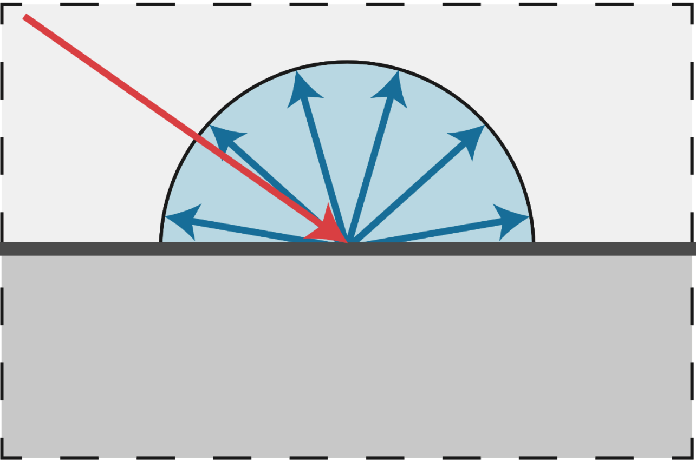

From [Mitsuba render, Wenzel Jakob, 2010

Light is **equally** reflected in each output direction.

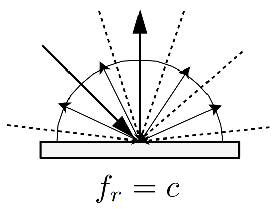

Suppose the incident lighting is **uniform in radiance**, and without self-emission we have:

$$
\begin{align}
L_o (\omega_o) &=
\int_{H^2} f_r L_i (\omega_i) \cos{\theta_i} \dd{\omega_i} \\
&=
f_r L_i \int_{H^2} \cos{\theta_i} \dd{\omega_i} 
\quad \text{(since $\dd{\omega_i} = \dd{A} = \sin{\theta}\dd{\theta}\dd{\phi} $)}
\\
&=
\pi f_r L_i \\

\end{align}
$$

If the material absorbs no light, then $f_r = 1/\pi$.

On lambertian material we have

$$
f_r = \frac{\rho}{\pi}, \quad 0 \leq \rho \leq 1
$$

in which $\rho$ is called **albedo**, or color.

### Glossy Material

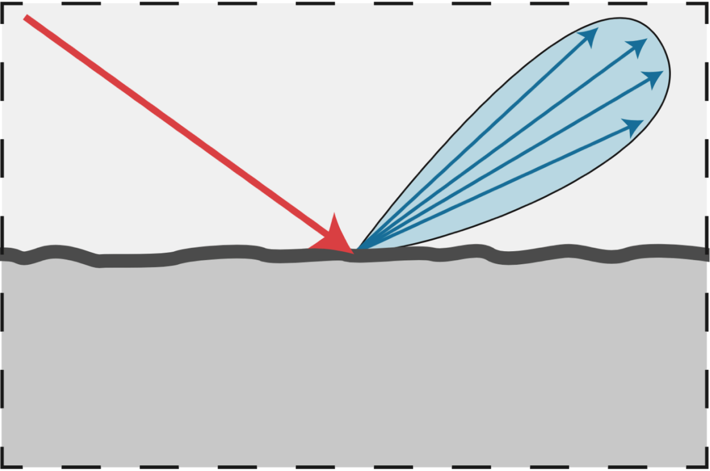

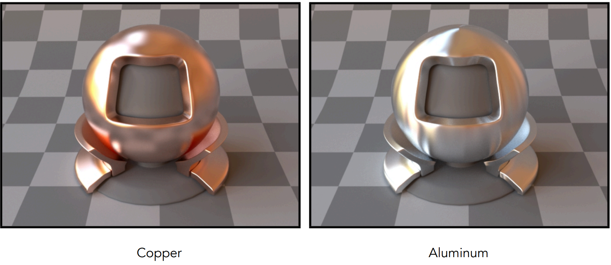

From [Mitsuba render, Wenzel Jakob, 2010

### Ideal Reflective/Refractive Material

From [Mitsuba render, Wenzel Jakob, 2010

- Part of the spectrum is absorbed by the underlying material.

### Perfect Specular Reflection

From PBRT

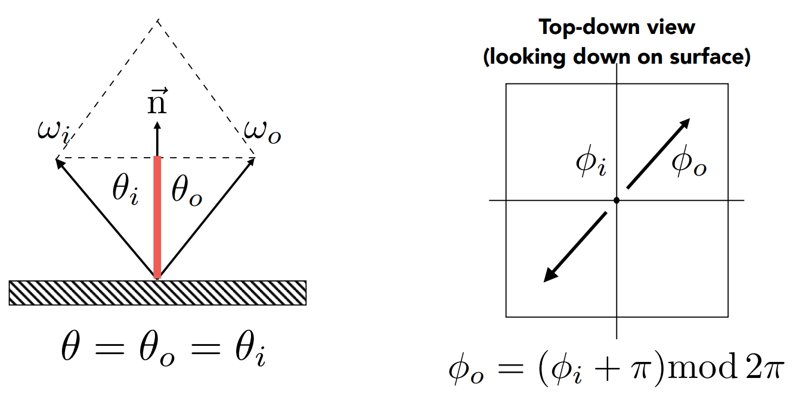

$$
\omega_o + \omega_i = 2 \cos{\theta} ~ \vec{n} = 2(\omega_i \cdot \vec{n}) \vec{n}
$$

$$
\omega_o = - \omega_i + 2 (\omega_i \cdot \vec{n}) \vec{n}
$$

$\theta$ and $\phi$ are obtained from the local coordinate system.

**BRDFs** for the perfect specular reflection are difficult to write.

- Related to the $\delta$ function

### Specular Refraction

Light refracts when it enters a new medium.

#### Snell's Law

Transmitted angle depends on

- **index of refraction (IOR)** for incident ray
- IOR for exiting ray

$$
\eta_i \sin{\theta_i} = \eta_t \sin{\theta_t}
$$

| Medium      | Vaccum | Air (sea level) | Water ($20 \degree \text{C}$) | Glass   | Diamond |
| ----------- | ------ | --------------- | ----------------------------- | ------- | ------- |
| $\eta^\ast$ | 1.0    | 1.00029         | 1.333                         | 1.5-1.6 | 2.42    |

*Index of frefraction is wavelength dependent. These are **averages***.

#### Law of Refraction

$$
\begin{align}
\eta_i \sin{\theta_i} 
&= 
\eta_t \sin{\theta_t} \\
\cos{\theta_t} 
&= 
\sqrt{1 - \sin^2 \theta_t} \\
&=
\sqrt{1 - \left(\frac{\eta_i}{\eta_t}\right)^2 \sin^2 \theta_i} \\
&=
\sqrt{1 - \left(\frac{\eta_i}{\eta_t}\right)^2 (1 - \cos^2 \theta_i)} \label{total_internal_reflection} \tag{1} \\ 
\end{align}
$$

***Definition***: **Total internal reflection**: When light is moving from a more optically dense medium to a less optically dense medium, i.e., 

$$
\frac{\eta_i}{\eta_t} > 1
$$

then light incident on boundary from large enough angle will not exit the medium. The critical angle can be computed from equation $\ref{total_internal_reflection}$ by substituting $\theta_t = \pi / 2$ into the equation.

- **Snell's Window/Circle**

  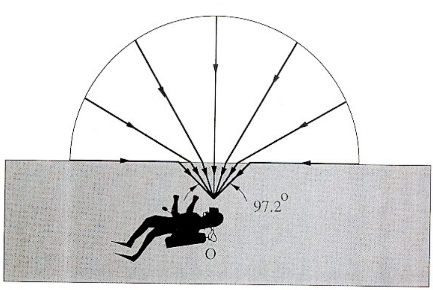

### Fresnel Reflection/Term

Reflectance depends on **incident angle** (and **polarization** of light).

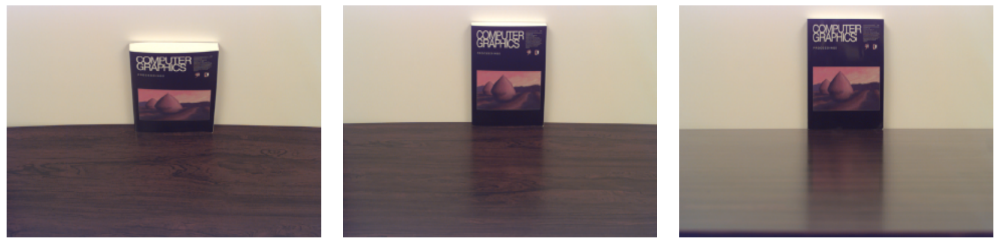

This example: reflectance increases with grazing angle [Lafortune et al. 1997]

#### Fresnel Term

- **Polarization**: The component of the electric field parallel to the incidence plane is termed *p-like* (parallel) and the component perpendicular to this plane is termed *s-like* (from *senkrecht*, German for perpendicular). (Wikipedia)

**Dielectric**, $\eta = 1.5$:

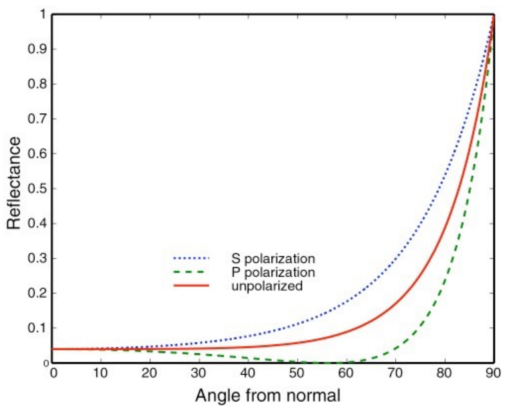

**Conductor**:

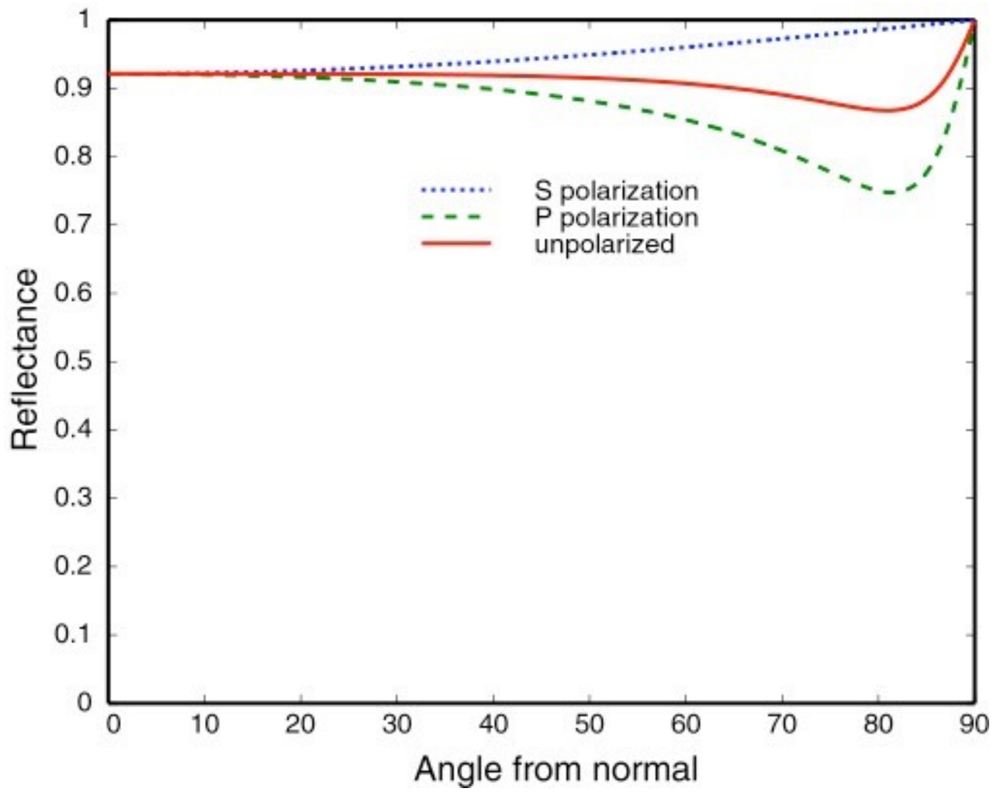

- **Conductors** have negative indices of refraction.

##### Formulae

**Accurate**: **polarization** taken into consideration

$n$ is related to $\eta$, the intrinsic property of the material.

$$
R_S 
= 
\abs{
    \frac{
    	n_1 \cos \theta_i - n_2 \cos \theta_t}
    	{n_1 \cos \theta_i  + n_2 \cos \theta_t
    }
}^2
=
\abs{
	\frac{
		n_1 \cos \theta_i - n_2 \sqrt{1 - \left( \frac{n_1}{n_2} \sin \theta_i \right)}
	}{
		n_1 \cos \theta_i + n_2 \sqrt{1 - \left( \frac{n_1}{n_2} \sin \theta_i \right)}
	}
}^2
$$

$$
R_P
= 
\abs{
    \frac{
    	n_1 \cos \theta_t - n_2 \cos \theta_i}
    	{n_1 \cos \theta_t  + n_2 \cos \theta_i
    }
}^2
=
\abs{
	\frac{
		n_1 \sqrt{1 - \left( \frac{n_1}{n_2} \sin \theta_i \right)} - n_2 \cos \theta_i
	}{
		n_1 \sqrt{1 - \left( \frac{n_1}{n_2} \sin \theta_i \right)} + n_2 \cos \theta_i
	}
}^2
$$

$$
R_\text{eff} = \frac{1}{2} (R_S + R_P)
$$

**Approximate**: Schlick's approximation
$$
R(\theta) = R_0 + (1 - R_0)(1 - \cos \theta)^5
$$

$$
R_0 = \left(\frac{n_1 - n_2}{n_1 + n_2} \right)^2
$$

### Microfacet Material

*State of art*.

#### Microfacet Theory

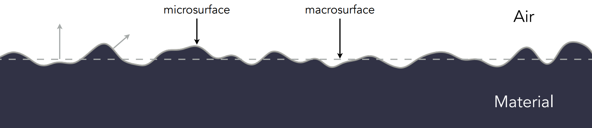

Rough surface:

- Macroscale: flat & rough
- Microscale: bumpy & **specular**

**Microfacet**: individual elements of surface act like *mirrors*

**Key**: The **distribution** of their **normals**. Each microfacet has its own normal.

- Concentrated <==> Glossy

  

  

- Spread <==> Diffuse

  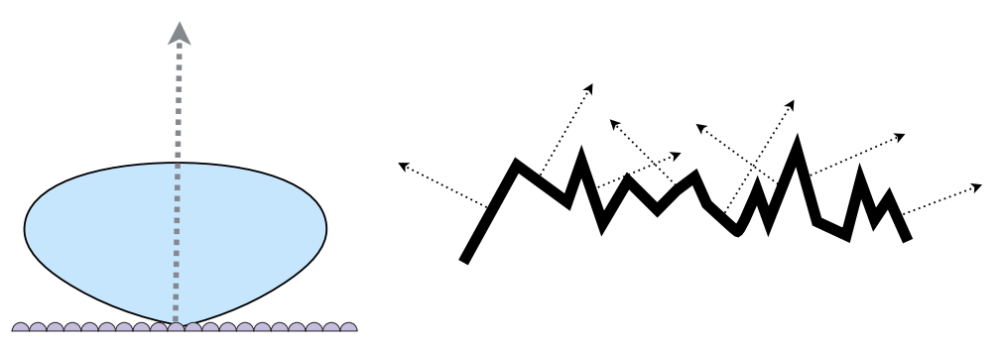

  

**Microfacet BRDF**:

$$
f(\omega_i, \omega_o) =
\frac{
	\text{F}(\omega_i, \textbf{h})
	\textbf{G}(\omega_i, \omega_o, \textbf{h}) 
	\textbf{D}(\textbf{h})
}{
	4 (\textbf{n}, \omega_i) (\textbf{n}, \omega_o)
}
$$

In which:

- $\text{F}$ is the Fresnel term
- $\textbf{G}$ is the shadowing-masking term
  - *Microfacets may **block** each other*.
  - *Happens often when lights are near the **grazing angle***.

- $\textbf{D}$ is the distribution of normals
  - *How many normals are there that match the direction of $\textbf{h}$*?

### Isotropic/Anisotropic Materials (BRDFs)

**Key**: **Directionality** of the underlying surface.

**Anisotropic**: Reflection depends on **azimuthal angle** $\phi$

$$
f_r(\theta_i, \phi_i; \theta_r, \phi_r) \neq f_r (\theta_i, \theta_r, \phi_r - \phi_i)
$$

- Results from **oriented microstructure** of the surface, e.g.
  - Brushed Metal
  - Nylon
  - Velvet

## II. Further on BRDFs

### Properties of BRDFs

- **Non-negativity**: On any point, $f_r$ is always non-negative.
  
  $$
  f_r (\omega_i, \omega_r) \geq 0
  $$

- **Linearity**: BRDFs can be directly summed.
  
  $$
  L_r (\text{p}, \omega_r)
  =
  \int_{H^2} f_r (\text{p}, \omega_i, \omega_r) L_i (\text{p}, \omega_i)
  \cos \theta_i
  \dd{\omega_i}
  $$

  The nature of integration make BRDFs addable.
  
  
  
- **Reciprocity Principle**
  
  $$
  f_r (\omega_r, \omega_i) = f_r (\omega_i, \omega_r)
  $$

  

- **Energy Conservation**
  
  $$
  \forall \omega_r,
  \quad
  \int_{H^2} f_r (\omega_i, \omega_r) \cos \theta_i \dd{\omega_i} \leq 1
  $$

- **Isotropic/Anisotropic**

  - If isotropic: $f_r (\theta_i, \phi_i; \theta_r, \phi_r) = f_r (\theta_i, \theta_r, \phi_r - \phi_i)$, which essentially means that **the dimension of BRDF is reduced by 1.**

    Then from reciprocity we have

    $$
    f_r (\theta_i, \theta_r, \phi_r - \phi_i) = f_r (\theta_r, \theta_i, \phi_i - \phi_r) = f_r (\theta_i, \theta_r, \abs{\phi_r - \phi_i})
    $$

  

### Measuring BRDFs

Target:

- Avoid need to develop/derive models
  - Automatically includes all of the scattering effects present
- Can accurately render with real-world materials
  - Useful for product design, special effects, ...

#### General Approach

- For each outgoing direction $\omega_o$
  - move light to illuminate surface with a thin beam from $\omega_o$
  - For each incoming direction $\omega_i$
    - move sensor to be at direction $\omega_i$ from surface
    - measure incident radiance

**Gonioreflectometer**:

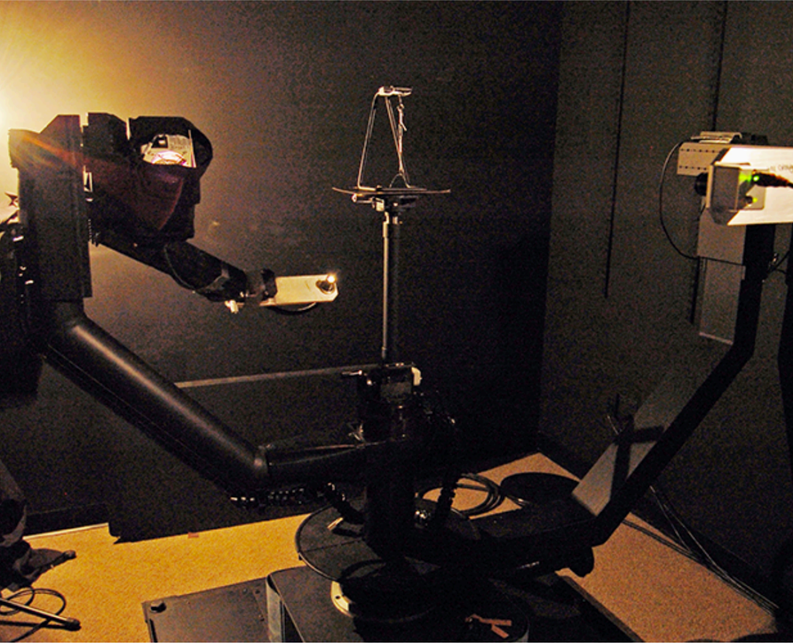

Spherical gantry at UCSD

#### Improving Efficiency

- Isotropic surfaces reduce dimensionality from 4D to 3D
- Reciprocity reduces # of measurements by half
- Clever optical systems

#### Challenges

- Accurate measurements at grazing angles
  - Important due to Fresnel effects
- Measuring with dens enough sampling to capture high frequency specularities
- Retro-reflection
- Spatially-varying reflectance
- ...

#### Representing Measured BRDFs

Desirable qualities:

- Compact representation
- Accurate representation of measured data
- Efficient evaluation for arbitrary pairs of directions
- Good distributions available for importance sampling

#### Tabular Representation

**MERL BRDF Database** [Matusik et al. 2004], $90 \times 90 \times 180$ measurements

Store regularly-spaced samples in $(\theta_i, \theta_o, \abs{\phi_i - \phi_o})$

- **Better**: reparameterize angles to better match specularities

- Generally need to resample measured values to table
- **Very high** storage requirements

## Appendix A: Microfacet Models

Reference: [Microfacet Models (pbr-book.org)](https://www.pbr-book.org/3ed-2018/Reflection_Models/Microfacet_Models)

### Introduction

Many geometric-optics-based approaches to modeling surface reflection and transmission are based on the idea that rough surfaces can be modeled as a collection of small *microfacets*. They are often modeled as heightfields, where the **distribution** of facet orientations is described statistically.

- **Microsurface** is used to describe microfacet surfaces
- **Macrosurface** is used to describe the underlying smooth surface (as represented by a `Shape`, or other `Object` in our framework for homework).

The microfacet-based BRDF models work by statistically modeling the scattering of light from a large collection of microfacets.

- If we assume that the differential area $\dd{A}$ is relatively large compared to the size of individual microfacets, then a large number of microfacets are illuminated, 
- and it is the **aggregate behavior** of these microfacets that determines the observed scattering.

The two main components of microfacet models are:

- A representation of the **distribution** of facets, and
- A **BRDF** for **individual microfacets**.
  - *Perfect Mirror Reflection*
    - most commonly used
  - *Specular Transmission*
    - useful for modeling many translucent materials
  - *The Oren-Nayar Model*
    - treats microfacets as Lambertian reflectors

Three important geometric effects to consider with Microfacet Reflection Models:

- **Masking**
  - Microfacet is occluded by another facet

- **Shadowing**
  - Microfacet may lie in the shadow of a neighboring microfacet

- **Interreflection**
  - Cause a microfacet to reflect more light than predicted by the amount of direct illumination and the low-level microfacet BRDF

### Oren-Nayar Diffuse Reflection

**Idea:** Real-world objects do not exhibit perfect Lambertian reflection.

- Rough surfaces generally appear brighter as the illumination direction approaches the viewing direction.

- Describe rough surfaces by **V-shaped** microfacets, which is

  - Described by a spherical Gaussian distribution with a single parameter $\sigma$, the standard deviation of the microfacet orientation angle

  - **Interreflections**: Only consider the neighboring microfacet

**Approximation:**

$$
f_r (\omega_i, \omega_o) = \frac{R}{\pi} (A + B \max(0, \cos(\phi_i, \phi_o)) \sin \alpha \tan \beta)
$$

where if $\sigma$ is in radians,

$$
A = 1 - \frac{\sigma^2}{2(\sigma^2 + 0.33)}
$$

$$
B = \frac{0.45 \sigma^2}{\sigma^2 + 0.09}
$$

$$
\alpha = \max(\theta_i, \theta_o)
$$

$$
\beta = \min(\theta_i, \theta_o)
$$

### Microfacet Distribution Functions

One important characteristics of a microfacet surface is represented by the distribution function $D(\omega_h)$, which gives the differential area of microfacets with the surface normal $\omega_h$. In `pbrt`, microfacet distribution functions are defined in the same BSDF coordinate system as BxDFs. As such, 

- a perfectly smooth surface could be describe by a delta distribution that was non-zero only when $\omega_h$ was equal to the surface normal: $D(\omega_h) = \delta (\omega_h - (0, 0, 1))$

Microfacet distribution functions must be

- **Normalized**: Given a differential area of the microsurface, $\dd{A}$, then the projected area of the microfacet faces above that area must be equal to $\dd{A}$.
  
  $$
  \int_{H^2 (\textbf{n})} D(\omega_h) \cos \theta_h \dd{\omega_h} = 1
  $$

  

#### Beckmann Distribution

A widely used microfacet distribution function based on a Gaussian distribution of microfacet slops is due to Beckmann and Spizzichino.

The traditional definition of the Beckmann-Spizzichino model is 

$$
D(\omega_h) = \frac{e^{-\tan^2\theta_h / \alpha^2}}{\pi \alpha^2 \cos^4 \theta_h}
$$

where if $\sigma$ is the RMS slope of the microfacets, then $\alpha = \sqrt{2}\sigma$.

- RMS: Root Mean Square

The **anisotropic** microfacet distribution function is

$$
D(\omega_h) = 
\frac{e^{-\tan^2\theta_h (\cos^2 \phi_h / \alpha_x^2 + \sin^2\phi_h / \alpha_y^2)}}
{\pi \alpha_x \alpha_y \cos^4 \theta_h}
$$

- Note that the original isotropic variant falls out when $\alpha_x = \alpha_y$

When programming, the algorithm directly translates the above equation, but pay special attention to the following issues:

- Infinity value of $\tan\theta$ corresponds to **viewing at perfectly grazing directions**, and is thus valid. Zero should be explicitly returned.

#### Trowbridge-Reitz Distribution

Anisotropic variant given by

$$
D(\omega_h)
=
\frac{1}
{
	\pi \alpha_x \alpha_y \cos^4\theta_h (1 + \tan^2\theta_h(\cos^2 \phi_h /\alpha_x^2 + \sin^2\phi_h / \alpha_y^2))^2
}
$$

In comparison to the Beckmann-Spizzichino model, 

- It has higher tails - it falls off to zero more slowly for directions far from the surface normal.
  - This characteristic matches the properties of many real-world surfaces well

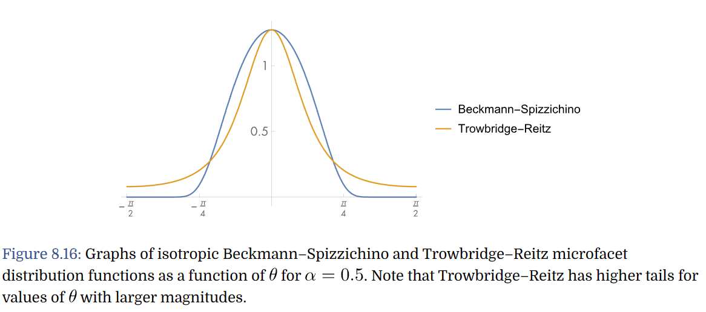

Usually, we specify $\alpha_x$ and $\alpha_y$ by **roughness**, which is between $[0, 1]$, and value close to zero correspond to near-perfect specular reflection.

### Masking and Shadowing

**Smith's Masking-Shadowing Function**: Some microfacets will be *invisible* from a given viewing or illumination direction because,

1. They are back-facing
2. Some of the forward-facing microfacet area will be hidden due to being shadowed by back-facing microfacets.

This is described by

$$
G_1(\omega, \omega_h)
$$

which gives the fraction of microfacets with normal $\omega_h$ that are visible from direction $\omega$.

- Note that $0 \leq G_1(\omega, \omega_h) \leq 1$.

**Normalization Constraint**: A differential area $\dd{A}$, as shown in Figure 8.17, has area $\dd{A} \cos\theta$ when viewed from a direction $\omega$ that makes an angle $\theta$ with the surface normal. The area of visible microfacets seen from this direction must also be equal to $\dd{A} \cos\theta$, which leads to a normalization constraint for $G_1$:

$$
\cos \theta = \int_{H^2(\textbf{n})} G_1 (\omega, \omega_h) \max(0, \omega \cdot \omega_h) D(\omega_h) \dd{\omega_h}
$$

**Compute $G_1$ using $\Lambda(\omega)$**: Because the microfacets form a heightfield, every back-facing microfacet shadows a forward-facing microfacet of equal projected area in the direction $\omega$. If $A^+(\omega)$ is the projected area of forward-facing microfacets as seen from the direction $\omega$ and $A^-(\omega)$ is the projected area of backward-facing microfacets, then $\cos\theta = A^+(\omega) - A^-(\omega)$.

We can thus alternatively write the masking-shadowing function as the **ratio** of visible microfacets area to total forward-facing microfacet area:

$$
G_1(\omega) = \frac{A^+(\omega) - A^-(\omega)}{A^+(\omega)}.
$$

Shadowing-masking functions are traditionally expressed in terms of an auxiliary function $\Lambda(\omega)$, which measures invisible masked microfacet area **per visible microfacet area**.

$$
\Lambda (\omega) = \frac{A^-(\omega)}{A^+(\omega) - A^-(\omega)}
= \frac{A^-(\omega)}{\cos\theta}
$$

After some algebra we have

$$
G_1(\omega) = \frac{1}{1 + \Lambda(\omega)}.
$$

**Specifying $\Lambda(\omega)$**: The microfacet distribution alone doesn't impose enough conditions to imply a specific $\Lambda(\omega)$ function.

- If we assume that there is no correlation between the heights of nearby points on the microsurface, then it's possible to find a unique $\Lambda(\omega)$ given $D(\omega_h)$.

  - For many microfacet models, a closed-form expression can be found.
  - Although this isn't true in reality, the resulting $\Lambda(\omega)$ functions turned out to be fairly accurate when compared to measure reflection from actual surfaces.

  - **Beckmann-Spizzichino**: Under the assumption of no such correlation, we have
    
    $$
    \Lambda(\omega) = \frac{1}{2} \left( \erf(a) - 1 + \frac{e^{-a^2}}{a\sqrt{\pi}} \right)
    $$

    where $\alpha = 1/(\alpha \tan\theta)$ and $\erf$ is the error function, $\erf(x) = 2/\sqrt{\pi}\int_{0}^{x}e^{-u^2}\dd{u}$.

    In `pbrt`, a rational polynomial approximation is used, to avoid calling `std::erf()` and `std::exp()` which are fairly expensive to evaluate.

**Computing the interpolated $\alpha$ for anisotropic distributions**: It is the easiest to compute $\Lambda(\omega)$ by taking their corresponding isotropic function and stretching the underlying surface according to the $\alpha_x$ and $\alpha_y$ values. Equivalently, one can compute an interpolated $\alpha$ value for the **direction of interest** and use that with the isotropic function.

$$
\alpha = \sqrt{\cos^2 \phi_h * \alpha_x^2 + \sin^2\phi_h * \alpha_y^2}
$$

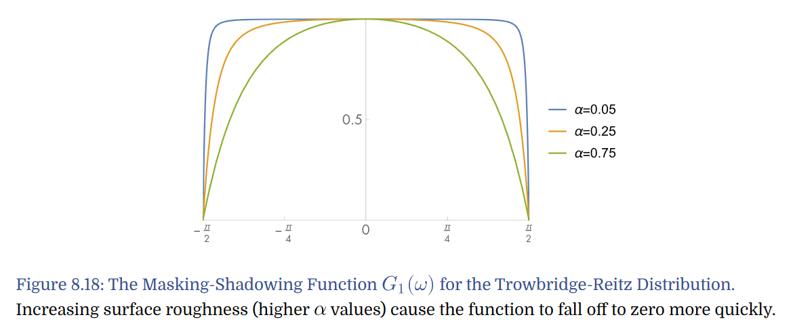

- The function is close to one over much of the domain, but *falls to zero at **grazing angles***.
- Increasing surface roughness causes the function to fall off more quickly.

**Computing $G(\omega_o, \omega_i)$**: This function gives the fraction of microfacets in a differential area that are visible from both directions $\omega_o$ and $\omega_i$. Defining $G$ requires some additional assumptions. For starters, 

-  If we **assume** that the probability of a microfacet being visible from both directions is the probability that it is visible from each direction independently, then we have
  
  $$
  G(\omega_o, \omega_i) = G_1(\omega_o)G_1(\omega_i).
  $$

  In practice, 

  - This often **underestimates** $G$.
  - The closer together the $\omega_o$ and $\omega_i$ are, the more correlation there is between $G_1(\omega_o)$ and $G_1(\omega_i)$.

- A **more accurate** model can be derived, **assuming** that microfacet visibility is more likely the higher up a given point on a microfacet is. This assumption leads to the model
  
  $$
  G(\omega_o, \omega_i) = \frac{1}{1 + \Lambda(\omega_o) + \Lambda(\omega_i)}.
  $$

### The Torrance-Sparrow Model

$$
f_r(\omega_o, \omega_i) = \frac{D(\omega_h) G(\omega_o, \omega_i) F_r(\omega_o)}{4 \cos\theta_o \cos\theta_i}
$$

For very detailed derivation, refer to the PBR book. Basically, we assume that individual microfacets are perfectly specular, and therefore only those that have the direction of their normals matched with the orientation of $\omega_h$ will reflect light.

