# GAMES101 Lecture 18 - Advanced Topics in Rendering

[GAMES101_Lecture_18.pdf](https://sites.cs.ucsb.edu/~lingqi/teaching/resources/GAMES101_Lecture_18.pdf)

## Outline

- Advanced light transport and materials
- **Mostly FYI**

## I. Advanced Light Transport

- **Unbiased** light transport methods
  - Bidirectional Path Tracing (BDPT)
  - Metropolis Light Transport (MLT)
- **Biased** light transport methods
  - Photon Mapping
  - Vertex Connection and Merging (VCM)
- Instant Radiosity (VPL or Many light methods)

### Biased vs. Unbiased Monte Carlo Estimators

- An **unbiased** Monte carlo technique does not have any systematic error
  - The expected value of an unbiased estimator will always be the correct value, regardless of the number of samples used
- Otherwise, **biased**
  - One special case, the expected value **converges** to the correct value as infinite #samples are used - **consistent**

### Unbiased Light Transport Methods

#### Bidirectional Path Tracing (BDPT)

- Trace **sub-paths** from **both** the camera and the light
- Connects endpoints from both sub-paths

##### Pros

- Suitable if the light transport is complex on the light's side
  - *Similar to precomputing for the light source*

##### Cons

- **Difficult** to implement & quite slow

#### Metropolis Light Transport (MLT)

- A **Markov Chain Monte Carlo** (MCMC) application
  - **Jumping** from the current sample to the next **with some PDF**
  - Application of MCMC leads to a series of generated samples whose distribution **exactly** matches the target function to be integrated, resulting in the **minimum variance**.
- Very good at **locally** exploring difficult light paths
- **Key idea**
  - Locally perturb an existing path to get a new path

##### Pros

- Works great with **difficult light paths**
  - **Specular-Diffuse-Specular** path, SDS path

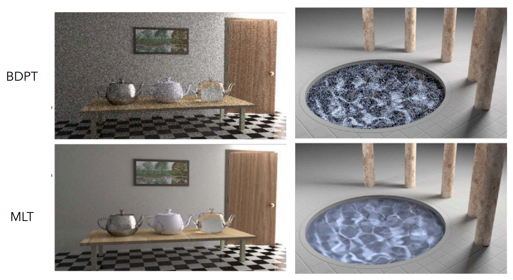

##### Cons

- Difficult to estimate the **convergence rate**
- Does not guarantee **equal convergence rate** per pixel, because MCMC is for local sampling
  - Usually produces "dirty" results

### Biased Light Transport Methods

#### Photon Mapping

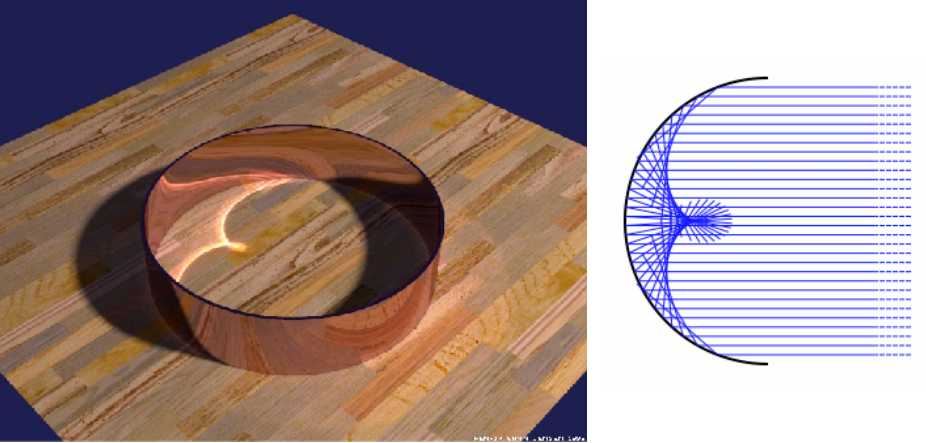

- A **biased** approach & A two-stage method
- Very good at handling **Specular-Diffuse-Specular** (SDS) paths and generating **caustics**
  - **Caustics** refer to the visible pattern caused by the focusing or concentration of light or other waves as they pass through or reflect off a curved or irregular surface. It is commonly observed as bright or dark patches, streaks, or rippling patterns in the vicinity of the surface.

##### Approach (Variations Apply)

**Stage 1 - Photon Tracing**

- Emitting photons from the light source, bouncing them around, then recording photons on diffuse surfaces

  

**Stage 2 - Photon Collection**

- Shoot sub-paths from the camera, bouncing them around, until they hit diffuse surfaces

**Calculation** - **Local Density Estimation**

- Idea: areas with **more photons** should be **brighter**
- For each shading point, find the nearest $N$ photons. Take the surface area they cover
  - K-Nearest Neighbour Clustering
- Compute the density of the photons

##### Why biased?

- Local density estimation isn't correct
  
  $$
  \dv{N}{A} \neq \frac{\Delta N}{\Delta A}
  $$

- But in the sense of limit, 

  - More photons emitted implies
    - the same $N$ photons covers a smaller $\Delta A$
      - $\Delta A$ is closer to $\dd{A}$

- **Biased, but consistent**

- Understanding biases in rendering:
  - Biased == Blurry
  - Consistent == Not blurry with infinite #samples

- Why not do a "const range" search for density estimation?
  - Results in inconsistency (**not converging**)

#### Vertex Connection and Merging (VCM)

- A combination of BDPT and Photon Mapping
- **Key idea**:
  - Utilize those unused sub-paths in BDPT if their endpoints **cannot be connected but can be merged**
  - Use photon mapping to handle the merging of nearby "photons"

- Adapted in the movie industry

### Instant Radiosity (IR)

- Also called **many-light approaches**
- **Key idea**:
  - -Lit surfaces can be treated as light sources

#### Approach

- Shoot light sub-paths and assume the endpoint of each sub-path is a **Virtual Point Light** (VPL)
  - They stop at diffuse surfaces
- Render the scene as usual using these VPLs

#### Pros

- **Fast** and *usually* gives good results on diffuse scenes

#### Cons

- Spikes will emerge when VPLs are close to shading points
  - Related to the **inverse quadratic term** ($1 / R^2$) when computing BSDF
- Cannot handle **glossy** materials

### Industrial Use

Industry often uses path-tracing.

## II. Advanced Apperance Modeling

### Outline

- Non-surface models
  - Participating Media
  - Hair/Fur/Fiber (BCSDF)
  - Granular Material
- Surface Models
  - Translucent Material (BSSRDF)
  - Cloth
  - Detailed Material (Non-statistical BRDF)
- Procedural Appearance

### Non-Surface Models

#### Participating Media

##### Examples

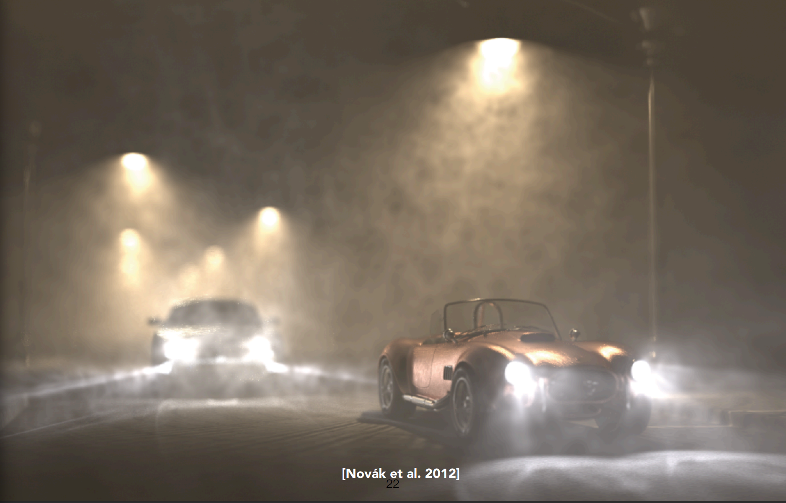

Fog

##### Definition

- At any point as ligh travels through a participating medium, it can be (partially) **absorbed** and **scattered**

  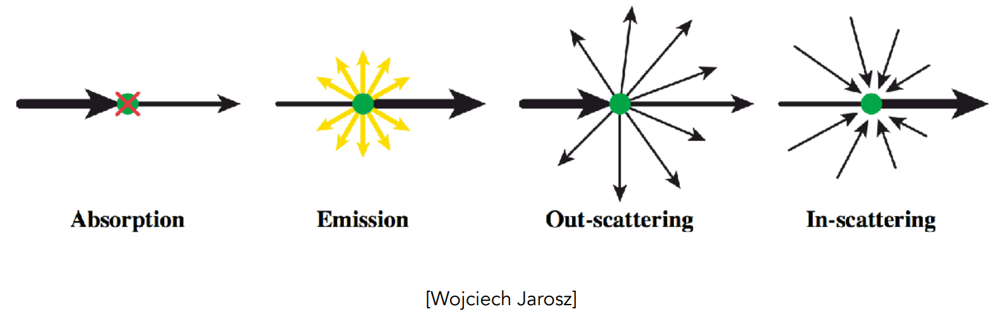

- Use **Phase Function** to describe the angular distribution of light scattering at any point $x$ within participating media

  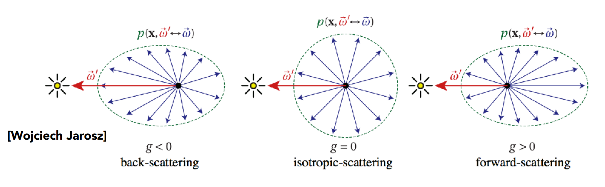

##### Rendering

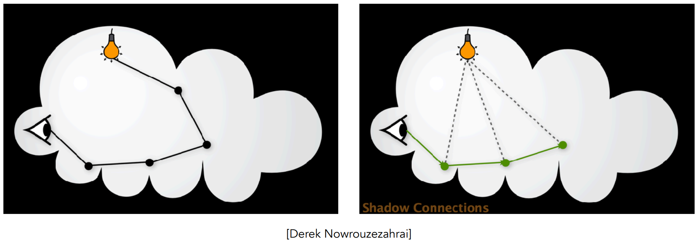

- Randomly choose a direction to bounce
- Randomly choose a distance to go straight
- At each "*shading point*", connect to the light

#### Hair/Fur/Fiber (BCSDF)

##### Hair Appearance

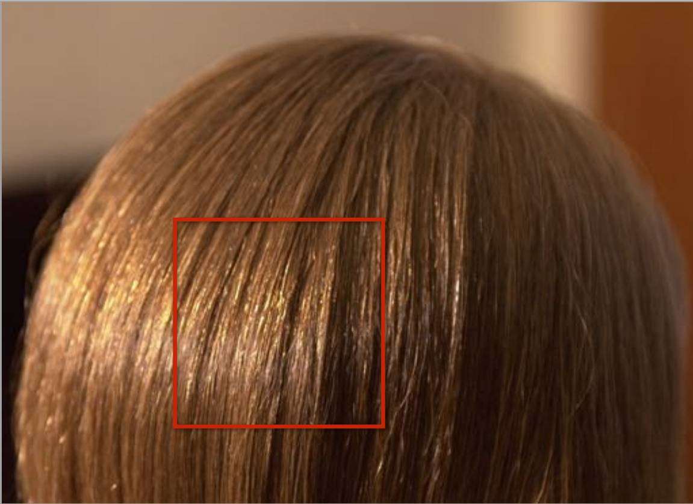

- Colored highlights
- Uncolored highlights

##### Kajiya-Kay Model

- Model the hair as a cylinder
- When light hits the cylinder, it is diffused

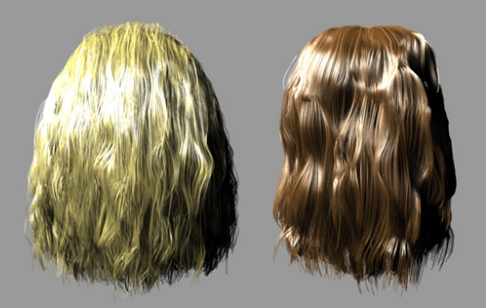

##### Marschner Model

- Glass-like cylinder

  - Outside: **Cuticle**
  - Inside: **Cortex**, colored, partial light absorbtion

  

- **3** types of light interactions: $R$, $TT$, $TRT$, where $R: \text{Reflection}$, $T: \text{Transmission}$

  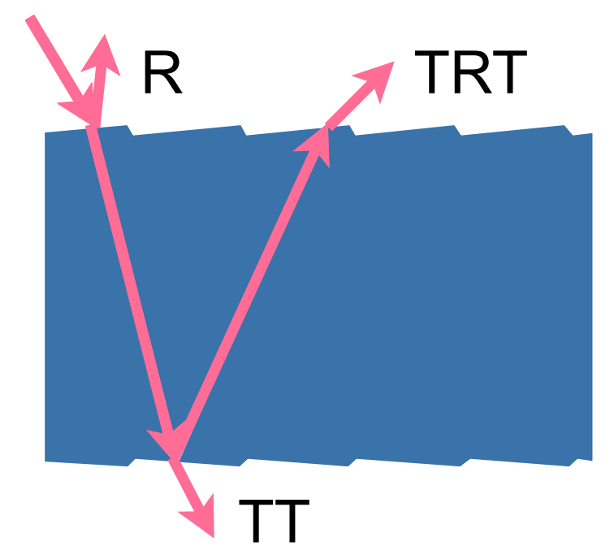

##### Fur Appearance

- Cannot realize the diffusive and saturated appearance if represented as human hair

##### Human Hair vs Animal Fuir

**Structural**:

- **Similarity**: Cuticle, Cortex, Medulla
- **Difference**:
  - Fur has its medulla significantly larger

**Importance of Medulla in Human Hair**

##### Double Cylinder Model

- $s$ - scattering

#### Granular Material

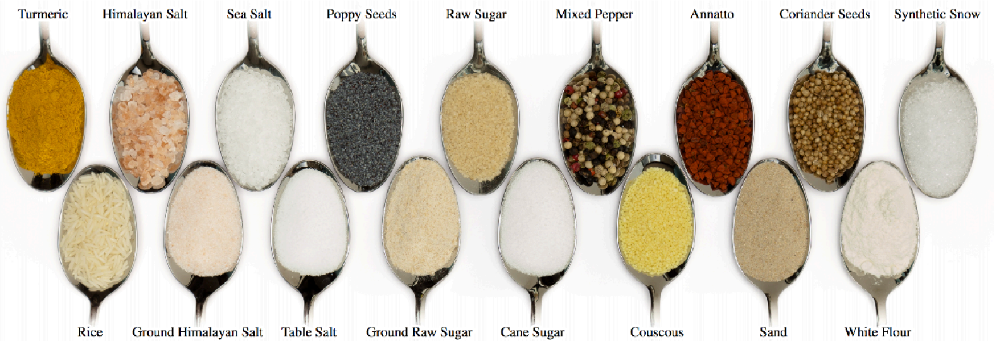

**Procedural Definition**

- Define basic units for construction

### Surface Models

#### Translucent Material

| Material  | Example                                                      |
| --------- | ------------------------------------------------------------ |
| Jade      |  |
| Jellyfish |  |

***Translucent***: Both scattering and absorption

#### Subsurface Scattering

**Subsurface Scattering**: Visual characteristics of many surfaces caused by light exiting at points different from which it enters at.

- **Violates** a fundamental assumption of the BRDF

##### Scattering Functions

**BSSRDF (Subsurface Scattering)**: generalization of BRDF; exitant radiance at one point due to incident differential irradiance at another point:

$$
S(x_i, \omega_i, x_o, \omega_o)
$$

- Generalization of rendering equation: integrating over all points on the surface and all directions
  
  $$
  L(x_o, \omega_o)
  =
  \int_{A}
  \int_{H^2}
  S(x_i, \omega_i, x_o, \omega_o)
  L_i (x_i, \omega_i)
  \cos \theta_i
  \dd{\omega_i}
  \dd{A}
  $$

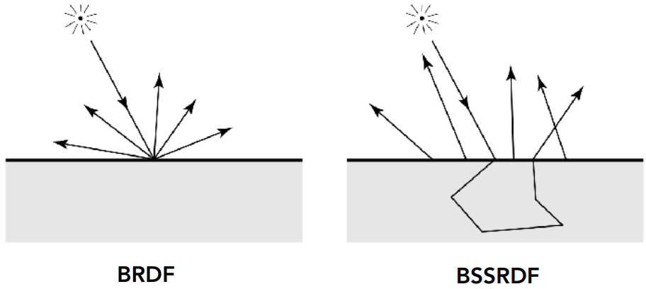

##### Dipole Approximation

- Apprximate light diffusion by introducting two point sources

#### Cloth

- A collection of twisted fibers

- Two levels of twist

  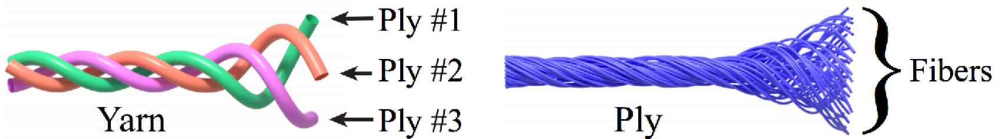

- Woven or knitted

  

##### Render as Surface

- Given the weaving pattern, calculate the overall behavior
- Cannot simulate materials such as velvet

##### Render as Participating Media

- Properties of individual fibers & their distribution -> ***scattering parameters***
- Render as a participating medium

##### Render as Actual Fibers

- Render every fiber **explicitly**

### Detailed Appearance

#### Motivation: Real world is more complicated

*Not always perfect.*

#### Microfacet BRDF

Surface = **Specular** microfacets + **statistical** normals

- Distribution of Normals should match that in the reality
  - **Normal Distribution Function, NDF**
- Path sampling is **difficult**
  - Hard to find a path that connects the camera and the light source

##### BRDF over A Pixel

- Compute normals inside the area where a pixel is projected to

#### Recent Trend: Wave Optics

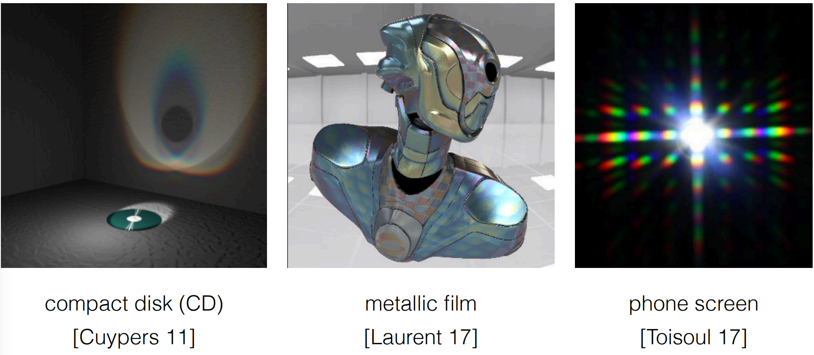

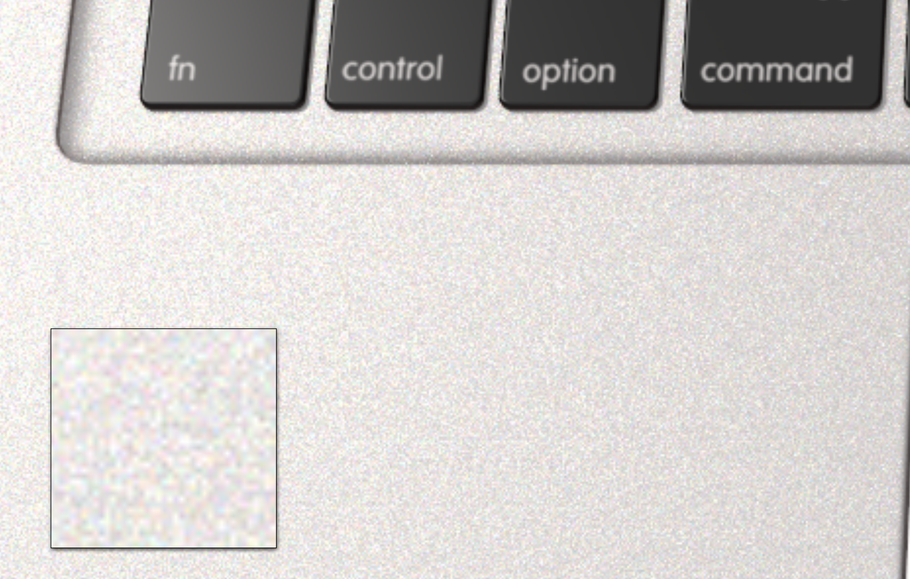

### Procedural Appearance

***Procedure***: When needed, just compute

- Define details without textures
  - Compute a noise function on the fly
  - 3D noise -> ***internal structure if cut or broken***

#### Perlin Noise

- Generate structures

