# GAMES101 Lecture 19 - Cameras, Lenses and Light Fields

[GAMES101_Lecture_19.pdf](https://sites.cs.ucsb.edu/~lingqi/teaching/resources/GAMES101_Lecture_19.pdf)

Imaging = Synthesis + Capture

## I. Cameras, Lenses

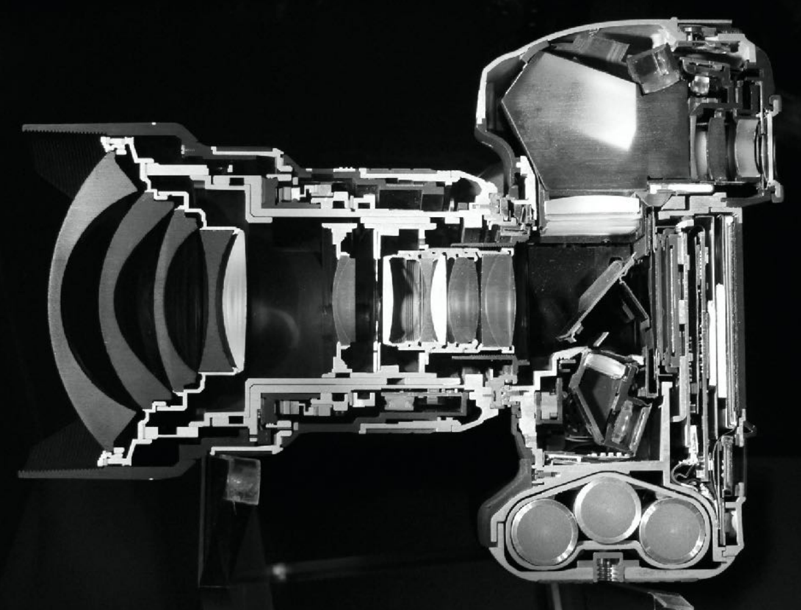

Cross-section of Nikon D3, 14-24mm F2.8 lens

- **Pinholes & Lenses** form images
- Shutter exposes sensor for precise duration
- Sensor accumulates irradiance during exposure
  - The sensor records irradiance, and therefore all pixel values would be similar
  - If the sensor records radiance, then we can form an image without lenses/pinholes by capturing light from programmed direction

### Pinhole Image Formation

- No depth of focus - captures the entire 3D scene sharply and without blur

### Field of View (FOV) and Focal Length

#### Field of View

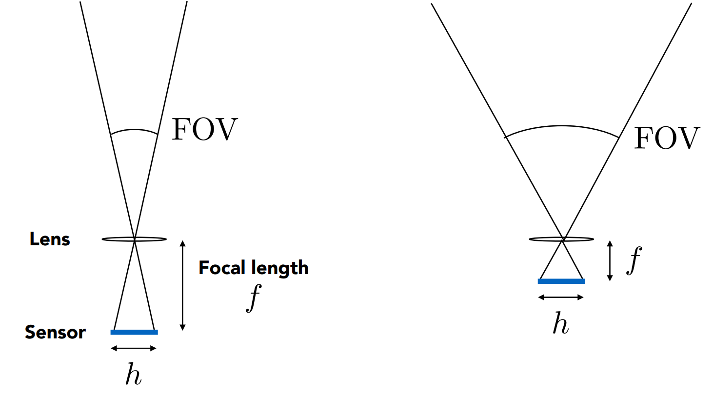

 Pinhole imaging 

- For a fixed sensor size $h$, decreasing the focal length increases the (vertical) field of view.
  
  $$
  \text{FOV} = 2 \arctan \left(\frac{h}{2f}\right)
  $$

#### Focal Length

- For historical reasons, it is common to refer to the angular field of view by focal length of a lens used on a 35mm-format film (36x24 mm)
  - When we say current **cell phones** have approximately 28mm "equivalent" focal length, this uses the above convention.
- Examples:
  - Focal length -> ***Diagonal FOV***
  - $17\text{mm} \to 104 \degree$, wide angle
  - $50\text{mm} \to 47 \degree$, normal lens
  - $200\text{mm} \to 12 \degree$, telephoto lens

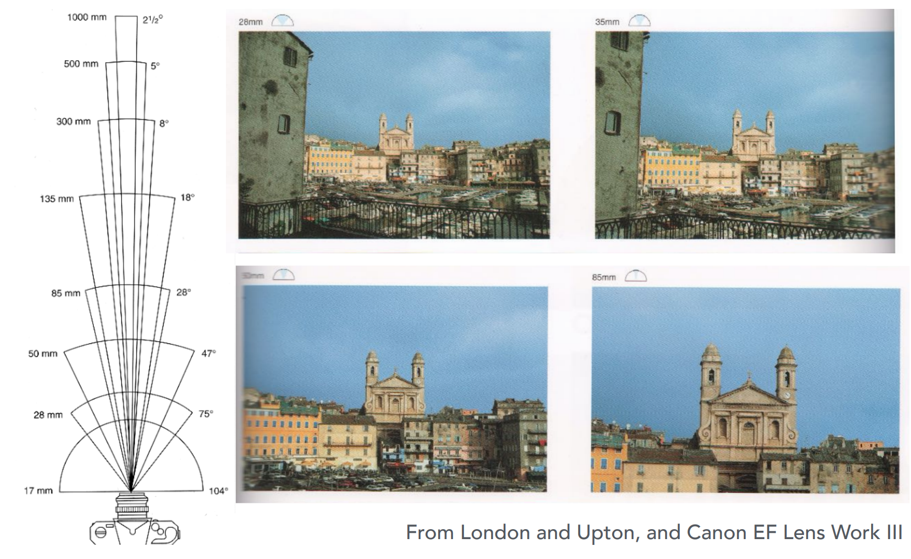

*Normally we fix the size of sensor for convenience, but in fact they should all be taken into consideration.*

#### Sensor Sizes

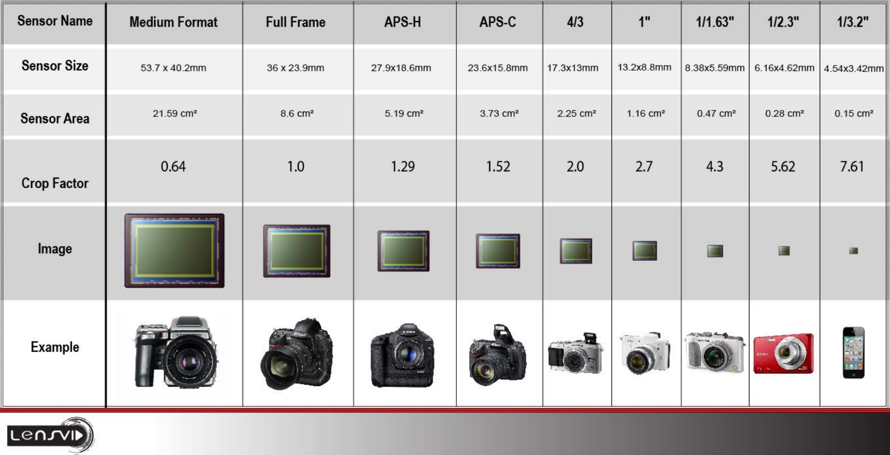

 Credit: <a>lensvid.com </a> 

### Exposure

***Definition***: Exposure is the product of time and irradiance.

$$
H = T \times E
$$

- $T$ - the exposure time
  - Controlled by shutter
- $E$ - Irradiance
  - Power of light falling on a unit area of sensor
  - Controlled by lens aperture and focal length

#### Exposure Control in Photography

- **Aperture size**
  - Change the f-stop by opening/closing the aperture (if camera has *iris control*)
- **Shutter speed**
  - Change the duration the sensor pixels integrate light
- **ISO gain**
  - Change the amplification (analog and/or digital) between sensor values and digital image values

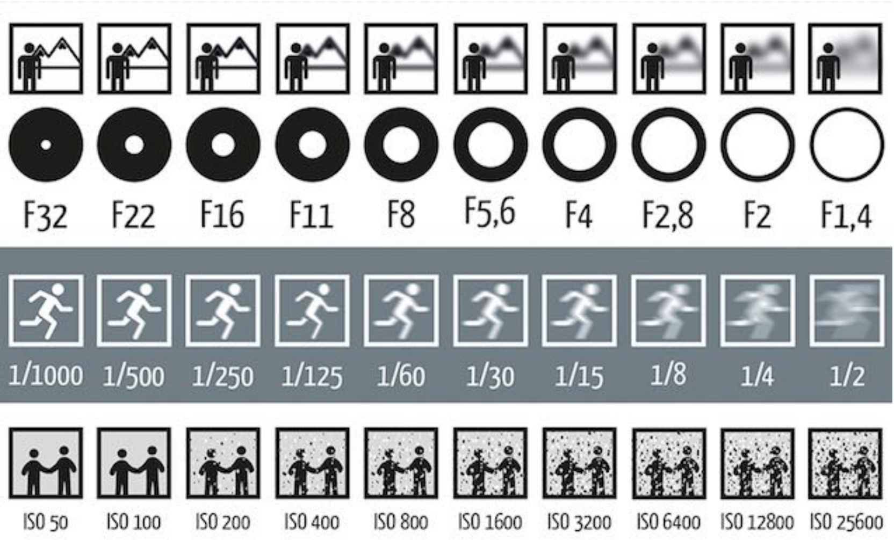

- From top to bottom: aperture size, shutter speed, ISO gain

#### ISO (Gain)

Third variable for exposure

**Film**: trade **sensitivity** for **grain**

**Digital**: trade **sensitivity** for **noise**

- Multiply signal before analog-to-digital conversion
- Linear effect (ISO 200 needs half the light as ISO 100)

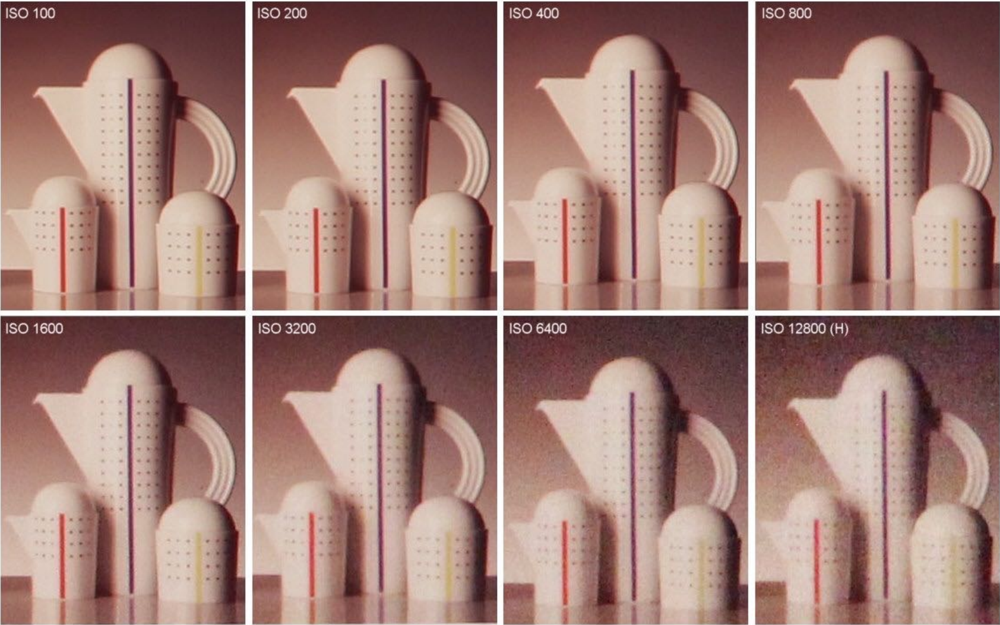

#### F-Number (F-Stop): Exposure Levels

- Written as F**N** or F/**N**, where $N$ is the f-number.

***Definition***: The f-number of a lens is defined as

$$
N = \frac{f}{A}
$$

which is the **focal length** $f$ divided by the **diameter of the aperture**.

- An f-stop of $2$ is sometimes written $f/2$, reflecting the fact that the absolute aperture diameter $A$ can be computed by dividing the focal length $f$ by the relative aperture $N$.

#### Shutter Speed

- **Motion Blur**: handshake, subject movement
  - Doubling shutter time doubles motion blur

- **Rolling shutter**: while the shutter is moving, different parts of photo is actually taken at different times

  - May also be caused during the imaging process, where the CMOS stores data linearly (doesn't capture every pixel simultaneously)

  

#### Constant Exposure: F-Stop vs Shutter Speed

| F-Stop      | 1.4   | 2.0       | 2.8   | 4.0      | 5.6  | 8.0      | 11.0 | 16.0    | 22.0 | 32.0  |
| ----------- | ----- | --------- | ----- | -------- | ---- | -------- | ---- | ------- | ---- | ----- |
| **Shutter** | 1/500 | **1/250** | 1/125 | **1/60** | 1/30 | **1/15** | 1/8  | **1/4** | 1/2  | **1** |

These combinations gives equivalent exposure.

- For moving objects, photographers must trade off **depth of field** and **motion blur**

#### Fast/Slow Photography - Applications

##### High-Speed Photography

Normal exposure = 

- extremely fast shutter speed, times
- large aperture and/or high ISO

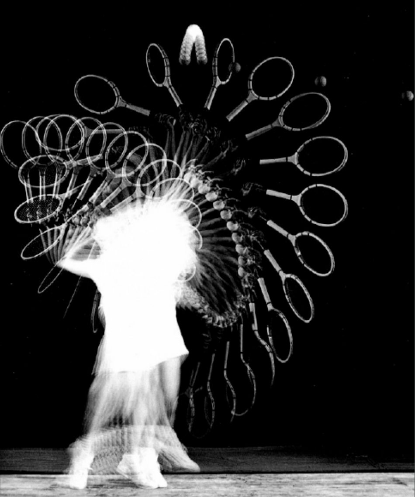

##### Long-Exposure Photography

### Thin Lens Approximation

Real lens designs are highly complex.

#### Real Lens - Aberrations

#### Ideal Thin Lens

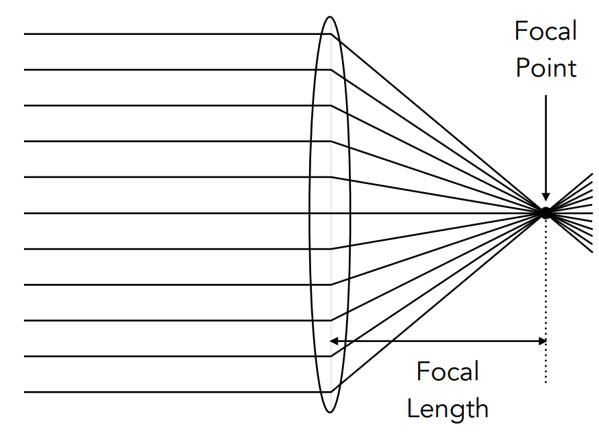

- All parallel rays entering a lens pass through the focal point of that lens
- All rays through a focal point will be in parallel after passing the lens
- Focal length can be arbitrarily changed (using a **zoom lens**)

##### The Thin Lens Equation

**Gaussian Thin Lens Equation**:

$$
\frac{1}{f} = \frac{1}{z_i} + \frac{1}{z_o}
$$

- $z_o$ - object distance
- $z_i$ - image distance
- $f$ - focal length

*For ideal lens only.*

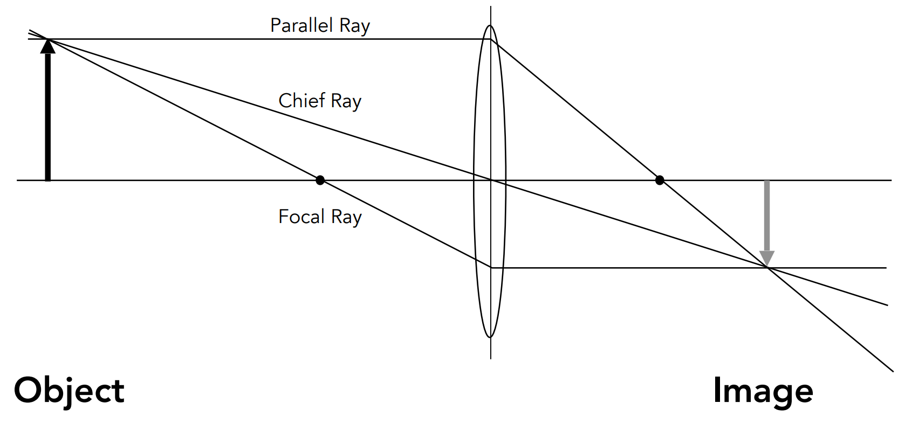

#### Defocus Blur

**Circle of Confusion, CoC**: an optical spot caused by a cone of light rays from a lens not coming to a perfect focus when imaging a point source.

- **Proportional** to the size of the **aperture**
  
  $$
  C = A\frac{d'}{z_i} = A\frac{\abs{z_s - z_i}}{z_i} = \frac{f}{N} \frac{\abs{z_s - z_i}}{z_i}
  $$
  

##### F-Numbers

View the **Exposure** section.

#### Ray Tracing Ideal Thin Lenses

##### Setup

- Choose sensor size, lens focal length $f$ and aperture size $A$
- Choose depth of subject of interest $z_o$
  - Compute corresponding depth of sensor $z_i$ from the equation (**focusing**)

##### Rendering

- For each pixel $x'$ on the sensor (**film** actually)
- Sample random points $x''$ on the lens plane
- Since the ray passing through the lens will hit $x'''$
  - Consider the virtual ray **connecting $x'$ and the center of lens**
- Estimate radiance on ray $x'' \to x'''$

#### Depth of Field

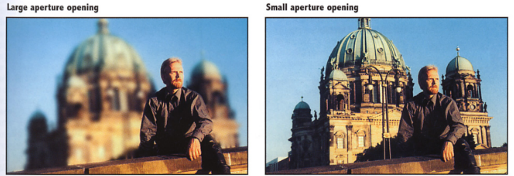

Set the CoC as the maximum permissible blur spot on the image plane

- Such that they will appear as a single pixel finally

**Depth of Field**: Depth range in a scene where the corresponding CoC is considered **small enough**

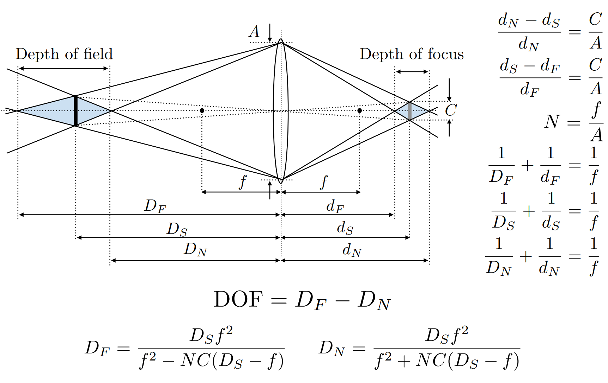

<a>http://graphics.stanford.edu/courses/cs178/applets/dof.html</a>

## II. Light Field/Lumigraph

### The Plenoptic Function

**Definition:** The **Plenoptic function** describes the intensity of light viewed from **any** point, to any direction, at any time:

$$
P(\theta, \phi, \lambda, t, \vec{x}),
$$

where $\theta$ and $\phi$ describes the spherical position, $\lambda$ is the wavelength of light, $t$ is the time and $\vec{x}$ is the viewing position.

- **Grayscale snapshot**: $P(\theta, \phi)$
- **Color snapshot**: $P(\theta, \phi, \lambda)$
- **Movie**: $P(\theta, \phi, \lambda, t)$
- **Holographic movie**: $P(\theta, \phi, \lambda, t, \vec{x})$

**Definition**: A **ray** is defined by

$$
P(\theta, \phi, \vec{x})
$$

where $\theta$ and $\phi$ describes the orientation, and $\vec{x}$ describes the origin of that ray.

### The Plenoptic Surface

Describe the **radiance information** of an object by 4D rays, which is represented by:

- a 2D **position** (surface coordinate), and
-  a 2D **direction** ($\theta$ and $\phi$)

#### View Synthesis

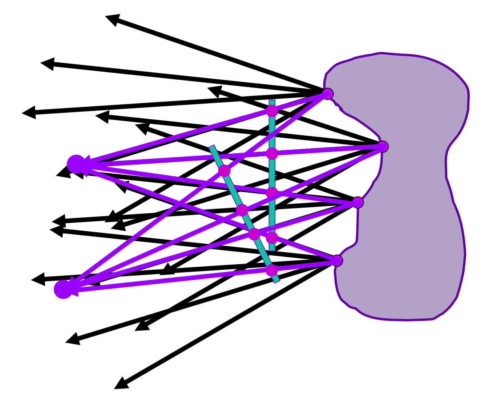

Place a camera at a certain direction, When looking to an object, we know all the radiance information of each ray we have casted, and thus we can **synthesize the view simply by**:

- Looking up the radiance information **through the plenoptic function**.

Furthermore, we may completely **ignore the shape** of the object, and solely record the light field.

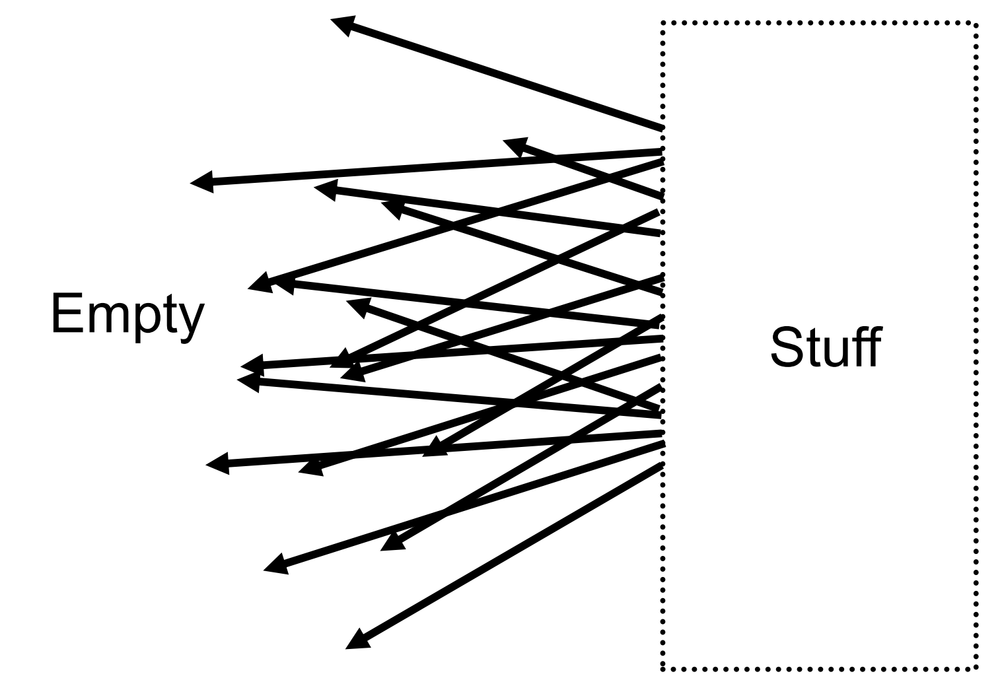

Outside the convex space

### Lumigraph

#### Parameterization

- 2D **Position**, 2D **Direction**:

  

- **2-Plane Parameterization**: 2D **Position**, 2D **Position**: $(s, t)$ and $(u, v)$

  

#### Recording the Lumigraph

*Assume we are viewing from left of the $uv$ plane.*

- Fix $(u, v)$, move $(s, t)$: move the viewing position.
- Fix $(s, t)$, move $(u, v)$: view the **same object** from **different directions**.

##### Camera array

##### Integral Imaging

Flies record lumigraph of the scene, or **radiance**.

- **Spatially-multiplexed** light field capture using lenslets.
  - Trade-off between spatial and angular resolution

### Light Field Camera

- **Prof. Ren Ng**: Founder of the company Lytro, who makes light field cameras.

- **Computational Refocusing**: virtually changing focal length, aperture, size, etc., **after** taking

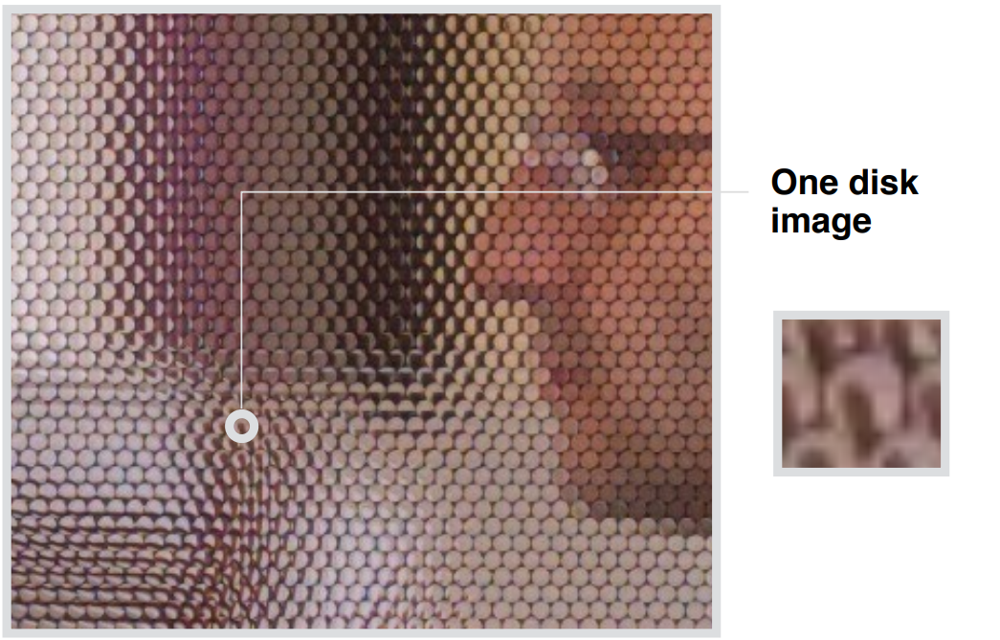

Picture taken by a light field camera

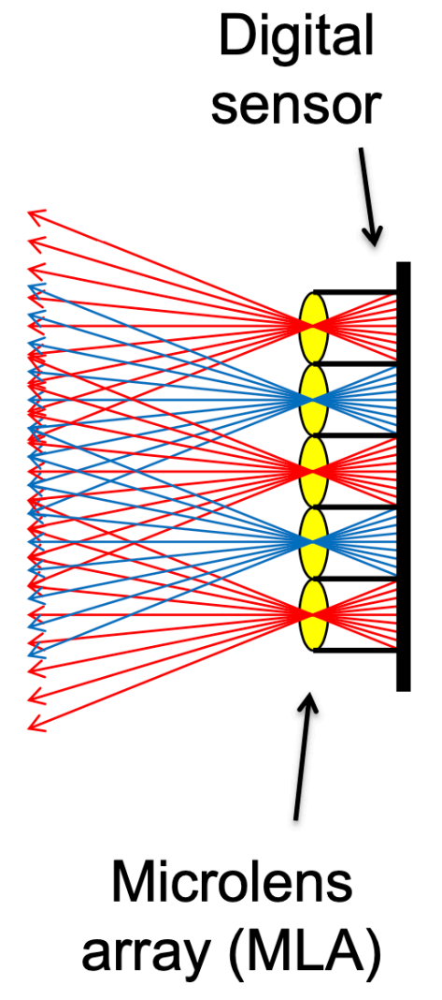

- Each pixel (**irradiance**) is now stored as a block of pixels (**radiance**, or irradiance at different directions)
  - If each disk of "recorded radiance "is averaged as a single pixel, then the resulting picture is the same as what a normal camera would have taken.

#### Getting a Photo from the Light Field Camera

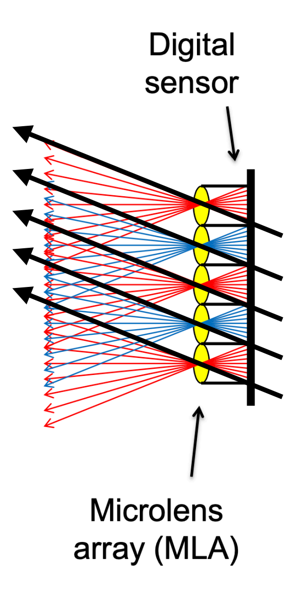

- **Moving the camera around**: Always choose the pixel at a fixed position in each disk
- **Computational/Digital Refocusing**: Changing focal length, and pick the refocused rays accordingly

**Why does it have these functions?**

- The light field contains everything

**Pros & Cons**

- Insufficient **spatial** resolution: Same film used for both spatial and directional information
- High cost

