# GAMES101 Lecture 20 - Color and Perception

[GAMES101_Lecture_20.pdf](https://sites.cs.ucsb.edu/~lingqi/teaching/resources/GAMES101_Lecture_20.pdf)

## I. Light Field/Lumigraph

*Refer to* `Lecture19.md`.

## II. Color and Perception

### Physical Basis of Color

#### The Fundamental Components of Light

Sunlight can be **subdivided** into a rainbow with a prism.

- The resulting light cannot be further divided.

  

#### The Spectrum

<a>https://commons.wikimedia.org/wiki/File:EM_spectrum.svg#/media/File:EM_spectrum.svg</a> under CC BY-SA 3.0 via Commons

##### Spectral Power Distribution (SPD)

- The amount of light present at each wavelength
- Units:
  - Radiometric units/nanometer (e.g., $\text{watts / nm}$)
  - Or unitless
- Often use **relative units** scaled to maximum wavelength for comparison (when absolute magnitude is not important)

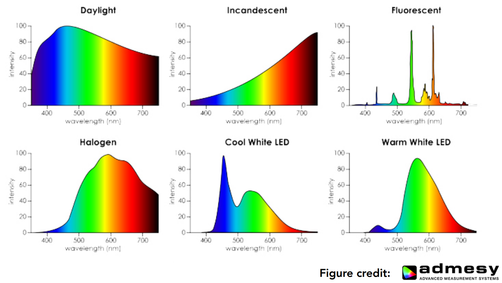

- **Linearity of Spectral Power Distributions**: They can be directly added.

  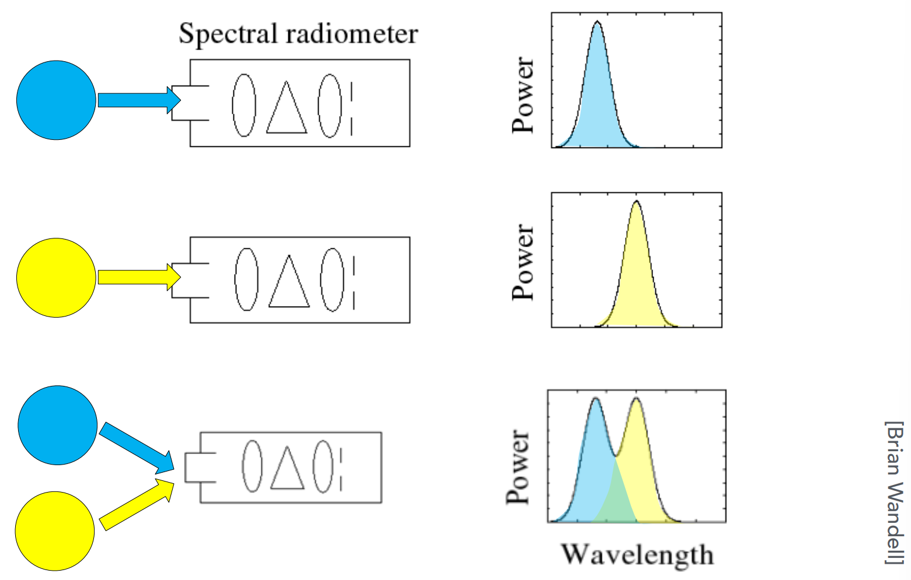

### Biological Basis of Color

Color is a phenomenon of **human perception**, not a property of light.

#### Anatomy of Human Eye

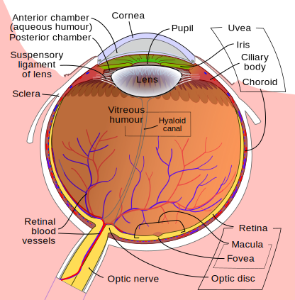

<a>https://en.wikipedia.org/wiki/Human_eye#/media/File:Schematic_diagram_of_the_human_eye_en.svg</a> under CC BY-SA 3.0

Light arrives at the retina and stimulates nerves, causing impulses.

- **Retinal Photoreceptor Cells: Rods and Cones**

  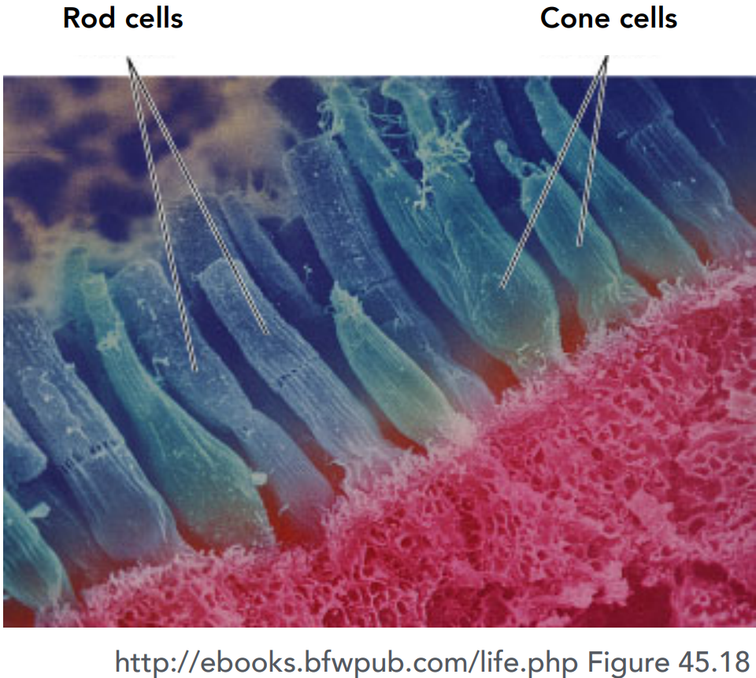

  - **Rod Cells**: Primary receptors in very low light (**scotopic** conditions), perceive only shades of gray, **no color**

    - ~120 million rods in eye

  - **Cone Cells**: Primary receptors in typical light levels (**photopic**), provide sensation of **color**

    - ~6-7 millions cones in eye

    - Three types of cones, each with different spectral sensitivity

      - **S, M and L** type, corresponding to peak response at **short**, **medium** and **long** wavelengths

        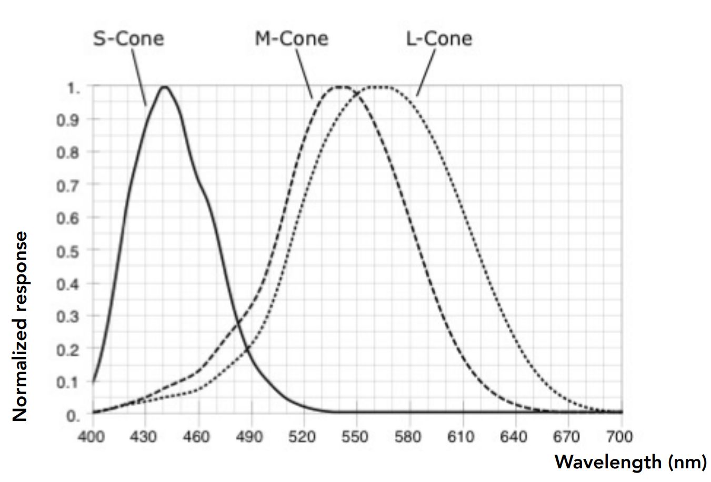

      - Distributions **vary significantly** among individuals:

        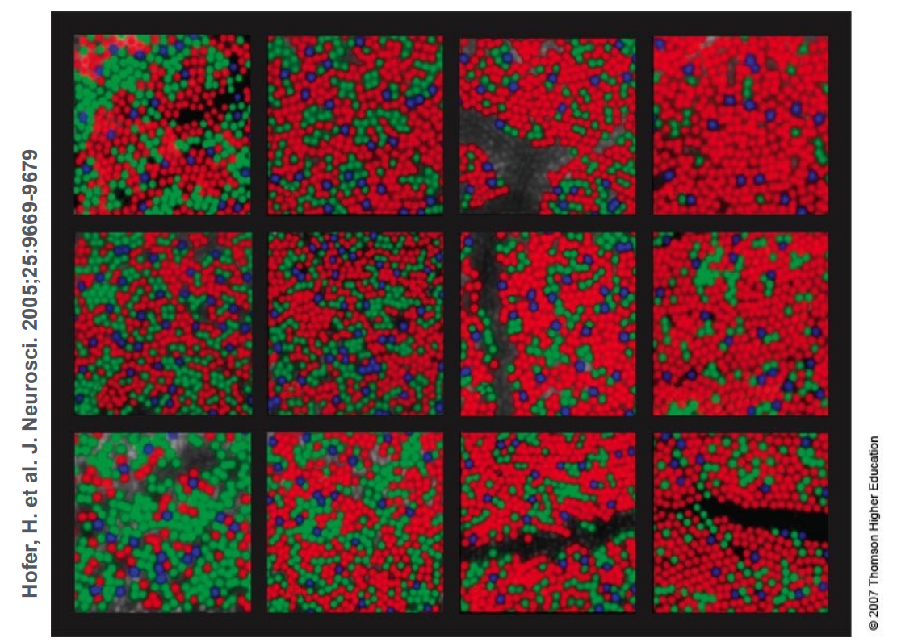

        
Distribution of cone cells at edge of fovea in 12 different humans with normal color vision

#### Metamerism

##### Spectral Response of Human Cone Cells

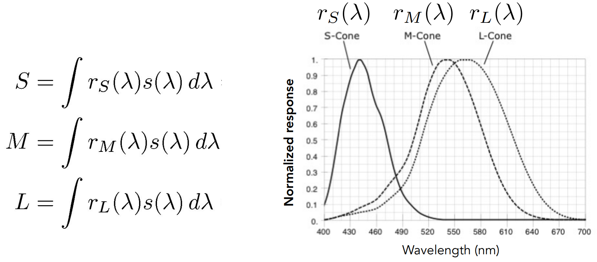

Integrate with respect to lambda on SPD

- **Humans perceive only 3 numbers, from SML receptors**

##### Metamerism

**Definition**: **Metamers** are two different spectra ($\infty$-dim) that project to the same $(S, M, L)$ ($3$-dim) response.

- These will appear to have the same color to a human

- **Critical to color reproduction**: No need to reproduce the full spectrum of a real-world scene in order to reproduce color

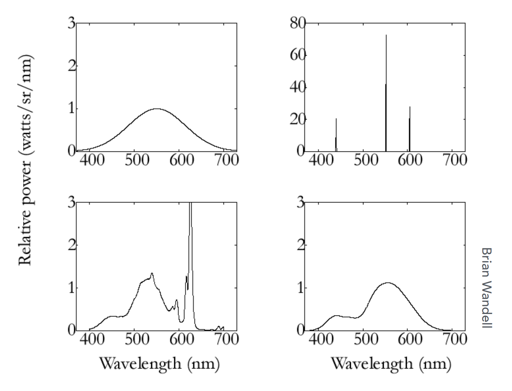

#### Tristimulus Theory of Color: Color Reproduction & Matching

##### Additive Color

- Given a set of primary lights, each with its own spectral distribution (e.g. **RGB**):
  
  $$
  s_R(\lambda), s_G(\lambda), s_B(\lambda)
  $$

- Adjust the **brightness** of these lights and add them together:
  
  $$
  Rs_R(\lambda) + Gs_G(\lambda) + Bs_B(\lambda)
  $$

##### CIE RGB Color Matching Experiment

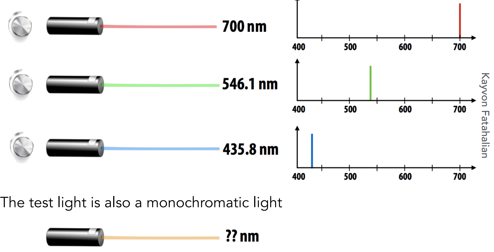

- The target is to find out $R, G, B$ values to reproduce light at a specific wavelength for human perceptors.

  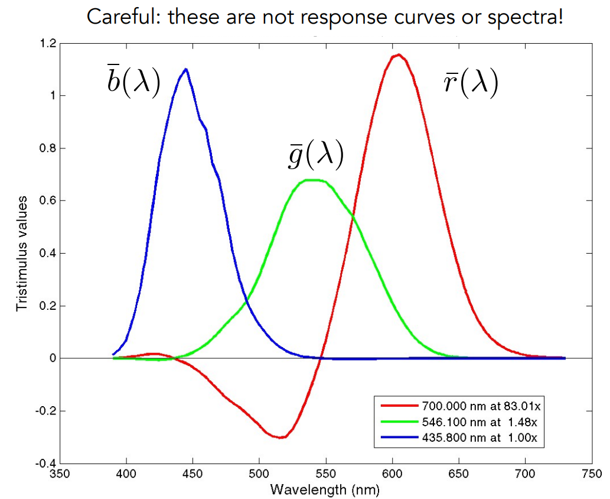

  
How much of each CIE RGB primary light must be combined to match a given monochromatic light?

  Having the above **color-matching function** allows us to compute the $R, G, B$ values:

  $$
  R_{\text{CIE RGB}} = \int_\lambda s(\lambda)\bar{r}(\lambda) \dd{\lambda}
  $$

  $$
  G_{\text{CIE RGB}} = \int_\lambda s(\lambda)\bar{g}(\lambda) \dd{\lambda}
  $$

  $$
  B_{\text{CIE RGB}} = \int_\lambda s(\lambda)\bar{b}(\lambda) \dd{\lambda}
  $$

### Color Spaces

#### Standardized RGB (sRGB)

- Makes a particular monitor RGB standard
- Other color devices simulate that monitor by calibration
- Widely adopted today
- **Gamut is limited**

#### CIE XYZ - A Universal Color Space

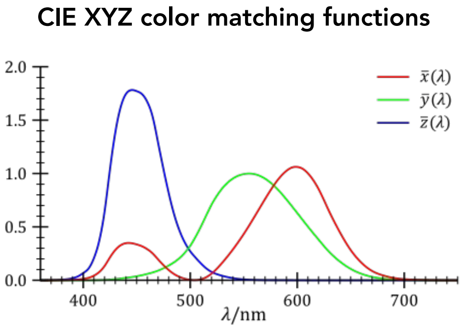

Imaginary set of standard color primaries $X, Y, Z$

- Primary colors with these matching functions do not exist (**i.e., artificial matching functions**)
- Y is luminance (brightness regardless of color)

Designed such that:

- Matching functions are **strictly positive**
- **Span all observable colors**

##### Separating Luminance, Chromaticity

- Luminance: $Y$

- Chromaticity: $x, y, z$, defined as
  
  $$
  x = \frac{X}{X + Y + Z}
  $$

  $$
  y = \frac{Y}{X + Y + Z}
  $$

  $$
  z = \frac{Z}{X + Y + Z}
  $$

  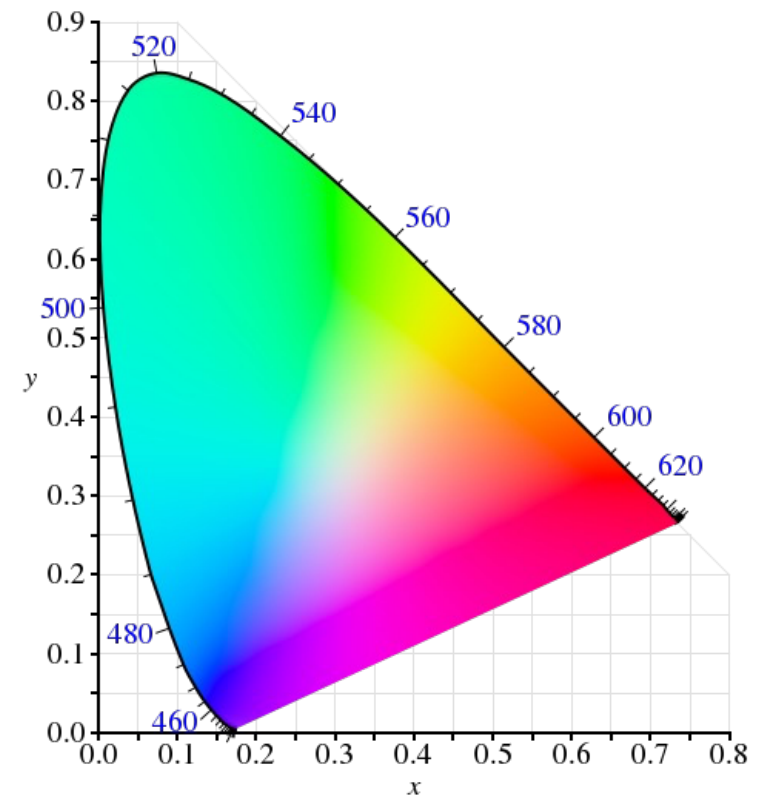

  
CIE Chromaticity Diagram

  - Mapping $x$ and $y$ to a figure at a fixed brightness $Y$
    - Since $x + y + z = 1$, there are two dimensions only.

  - **The Spectral Locus**: The curved boundary

    - Corresponds to monochromatic light (each point represents a pure color of a single wavelength)

    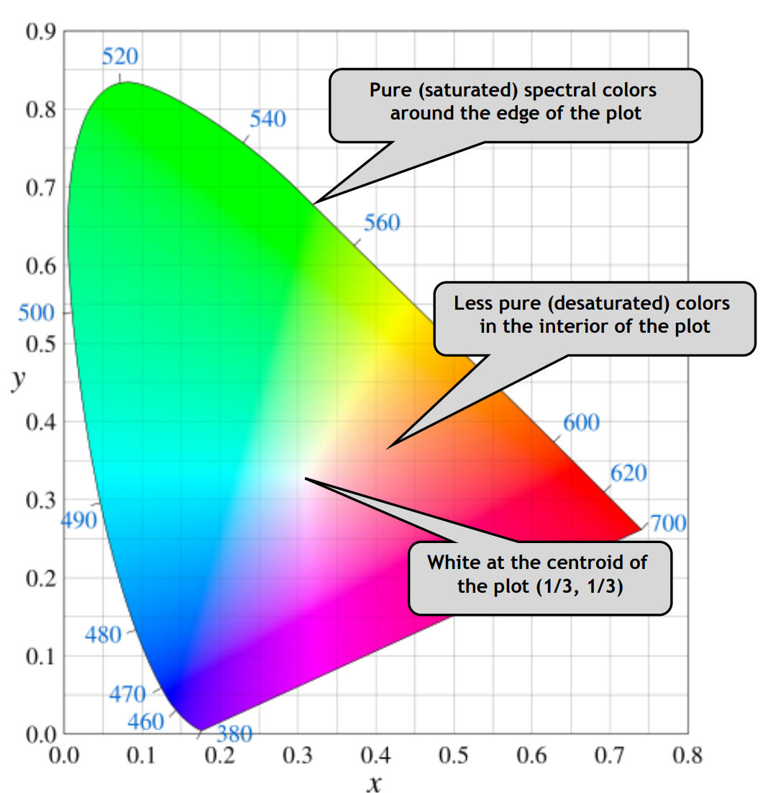

    

#### Gamut

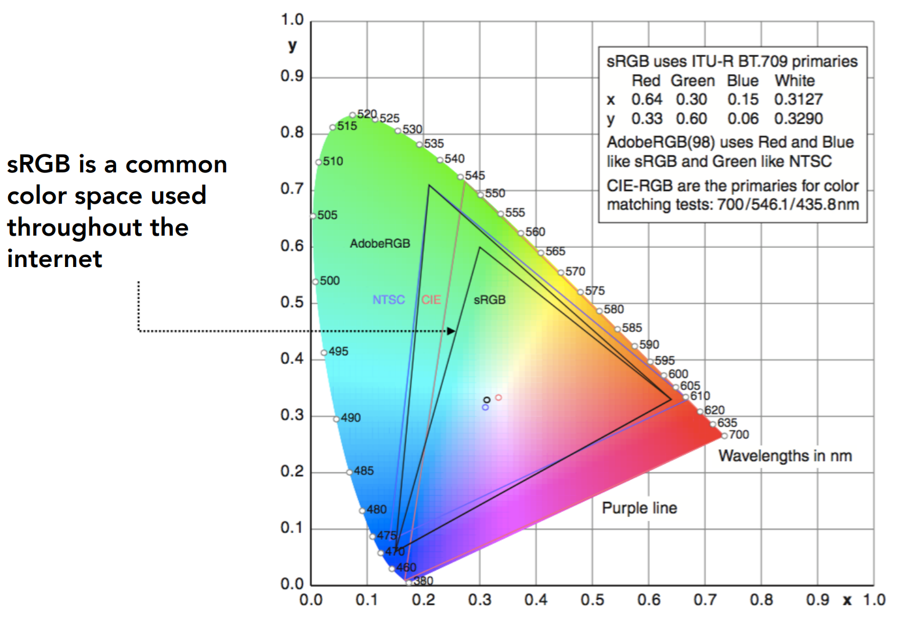

#### Perceptually Organized Color Spaces

##### HSV Color Space (Hue-Saturation-Value)

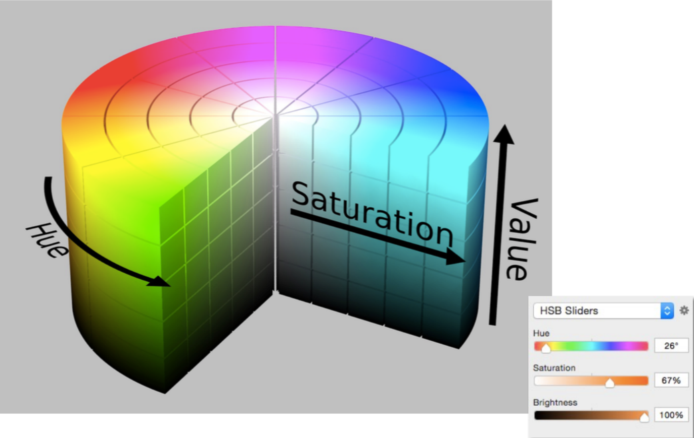

- **Hue**
  - The kind of color, regardless of attributes
  - **Colorimetric** correlate: dominant wavelength
  - **Artist's** correlate: the chosen pigment color
- **Saturation**
  - The colorfulness
  - **Colorimetric** correlate: **purity**
  - **Artist's** correlate: fraction of paint from the colored tube
- **Lightness/Brightness or Value**
  - The overall amount of light
  - **Colorimetric** correlate: luminance
  - **Artist's** correlate: tints are lighter, shades are darker

##### CIELAB Space (A.K.A $L^\ast a^\ast b^\ast$) & Opponent Color Theory

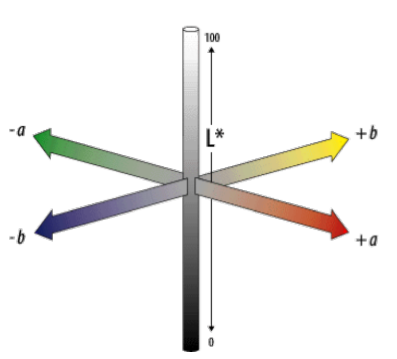

- $L^\ast$: lightness, or brightness
- $a^\ast$ and $b^\ast$ are color-opponent pairs
  - $a^\ast$ is red-green
  - $b^\ast$ is blue-yellow

###### Opponent Color Theory

- The brain seems to encode color using three axes:

  - white - black

  - red - green

  - yellow - blue

- The white-black axis is lightness, the others determine hue and saturation

- **Afterimage**: You may see opponent colors after the sudden disappearance of an image.

###### Everything is Relative

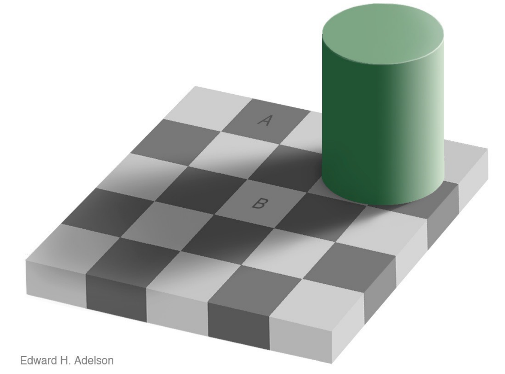

- **A** and **B** has the same color.

#### CMYK: A Subtractive Color Space

*The more you mix, the darker it will be.*

- **Cyan, Magenta, Yellow and Key**

  

- Separate **black for cost-saving purposes**

