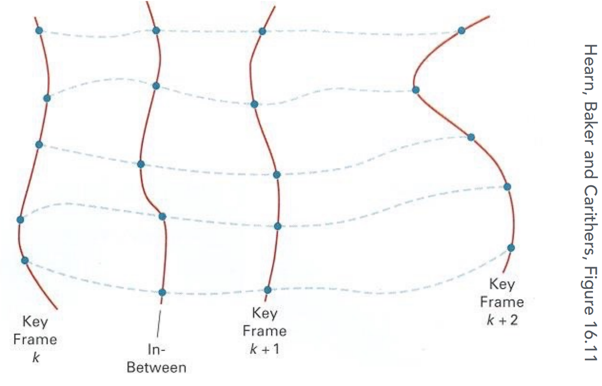
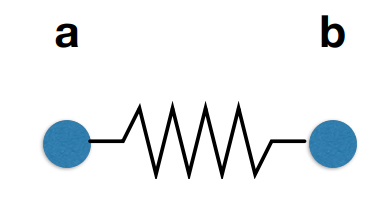
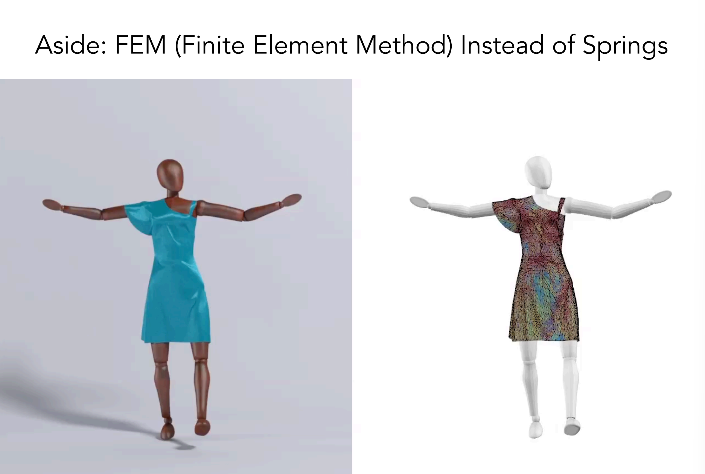
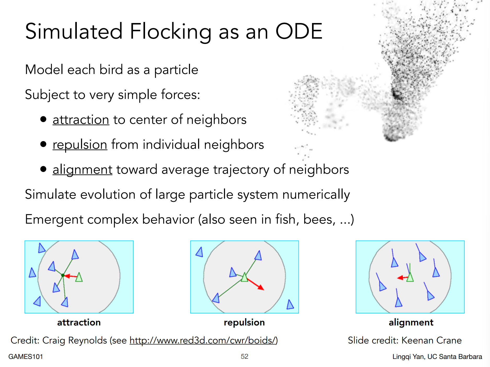
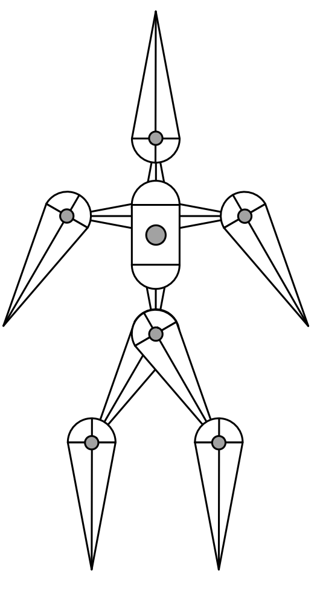
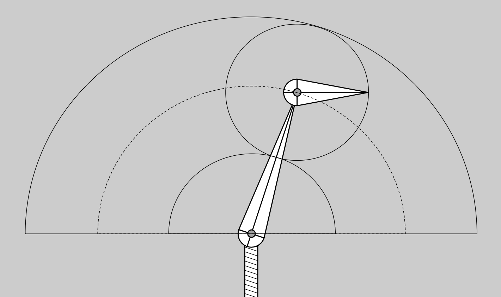
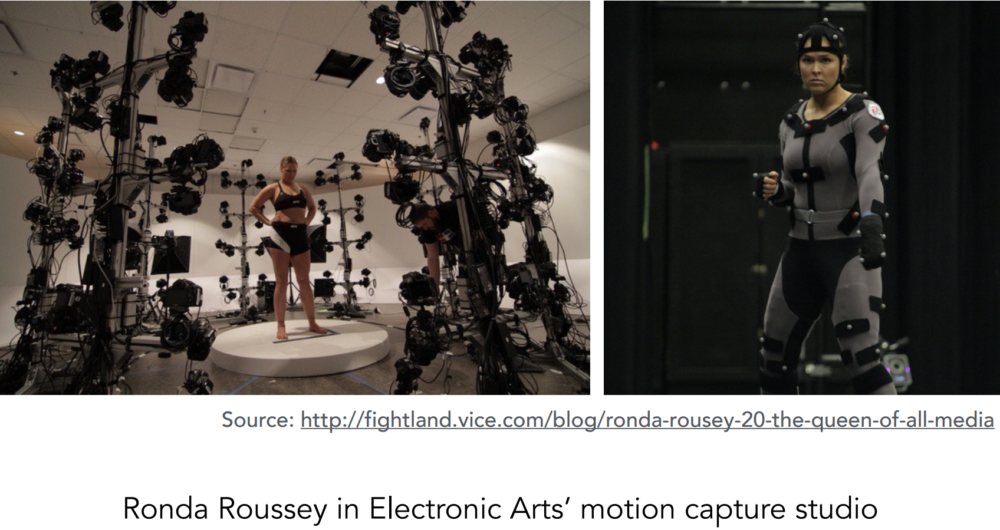
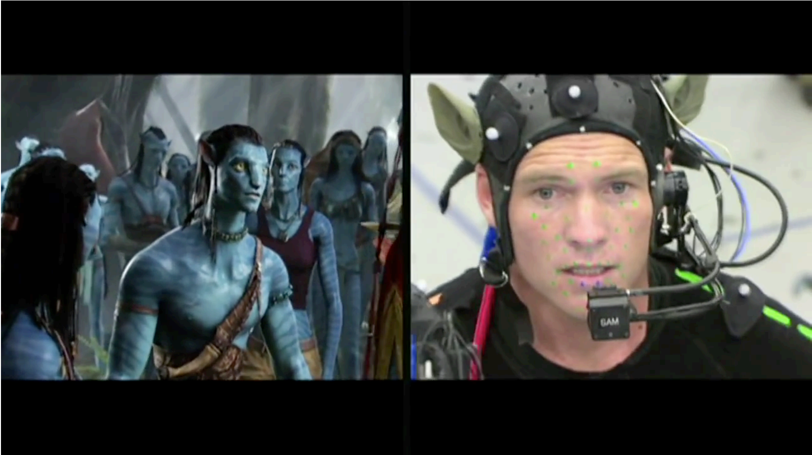

# GAMES101 Lecture 21 - Animation

[GAMES101_Lecture_21.pdf](https://sites.cs.ucsb.edu/~lingqi/teaching/resources/GAMES101_Lecture_21.pdf)

## Outline

- History
- Keyframe Animation
- Physical Animation
- Kinematics
-  Rigging

### Animation

*Bring things to life.*

- Communication tool
- Aesthetic issues often dominate technical issues

*An extension of modeling*

- Represent models as a function of time

*Output: A sequence of images that when viewed sequentially provides a sense of motion.*

- Film: 24 frames per second (usually with motion blur)
- Video (in general): 30 fps (usually with motion blur)
- Virtual reality: 90 fps

## I. History

- First Animation (Shahr-e Sukhteh, Iran 3200 BCE) 

- **Phenakistoscope** (1831): By showing part of a rotating disk:

  

- **First Film** (Edward Muybrdige, *"Sallie Gardner"*, 1878): Used as scientific tool rater than for entertainment

- **First Hand-Drawn Feature-Length** (>40 mins) Animation (Disney, "Snow White and the Seven Dwarfs", 1937)

- **First Digital-Computer-Generated Animation** (Ivan Sutherland, "Sketchpad", 1963): Light pen, vector display

  

- **Early Computer Animation** (Ed Catmull & Frederick Parke, "Computer Animated Faces", 1972)

- **Digital Dinasours** ("Jurassic Park", 1993)

- **First CG Feature-Length Film** (Pixar, "Toy Story", 1995)

  

  - *Milestone*
  - *Rasterization only*

- Computer Animation - **10 Years Ago**  (Sony Pictures Animation, "Cloudy With a Chance of Meatballs")

  

- Computer Animation - **2019** (Walt Disney Animation Studios, "Frozen 2", 2019)

  

  - Plants, after effects, ...

## II. Keyframe Animation

- **Animator** (e.g. lead animator) creates keyframes
- **Assistant (person or computer)** creates in-between frames
  - ***tweening***

### Keyframe Interpolation

- Each frame is seen as a **vector of parameter values**
  - Linear interpolation is usually not good enough
  - **Splines** for smooth/controllable interpolation

## III. Physical Simulation

$$
F = ma
$$

### Introduction

$$
\Delta\boldsymbol{x} = \boldsymbol{v}\Delta t + \frac{1}{2}(\Delta t)^2 \boldsymbol{a}
$$

- Building the correct physical model leads to correct physical simulation.

Macklin and Müller, Position Based Fluids

### Mass Spring System: Example of Modeling a Dynamic System

- Mass Spring Rope,

- Hair,

- **Mass Spring Mesh** (Cloth)

  

#### Spring with Internal Damping

*One type of spring-mass system with damping:*

$$
\boldsymbol{f}_{a \to b} = k_s\frac{(\boldsymbol{b} - \boldsymbol{a})}{\norm{\boldsymbol{b} - \boldsymbol{a}}}(\norm{\boldsymbol{b} - \boldsymbol{a}} - l)
$$

$$
\underbrace{\boldsymbol{f}_\boldsymbol{b}}_{\substack{\text{Damping force} \\ \text{applied on $\boldsymbol{b}$}}}
=
-k_d 
\underbrace{\frac{\boldsymbol{b} - \boldsymbol{a}}{\norm{\boldsymbol{b} - \boldsymbol{a}}} \cdot(\dot{\boldsymbol{b}} - \dot{\boldsymbol{a}})}_{\substack{\text{Relative speed projected}\\ \text{to the direction from $\boldsymbol{a}$ to $\boldsymbol{b}$}}}
\cdot 
\underbrace{\frac{\boldsymbol{b} - \boldsymbol{a}}{\norm{\boldsymbol{b} - \boldsymbol{a}}}}_{\substack{\text{Direction from} \\ \text{$\boldsymbol{a}$ to $\boldsymbol{b}$}}}
$$

Here we assume that $\boldsymbol{a}$ is a static vector (by subtracting the (projected) velocity of $\boldsymbol{b}$ to that of $\boldsymbol{a}$).

In this type of damping, the resistance is **proportional to the relative velocity on projected direction**.

- $k_s$ - **stiffness**
- $l$ - **rest length**
- $\dot{\boldsymbol{b}}$, $\dot{\boldsymbol{a}}$ - **velocity**
- $k_d$ - **damping coefficient**

#### Structures from Springs

- **Behavior** is determined by **structure linkages**

- 

  Resistance to **shearing** and **out-of-plane bending**.

  - *Red springs should be much weaker.*

#### Finite Element Method

### Particle Systems

Model dynamical systems as collections of large numbers of particles

- **Dynamical** - involving modeling particles described by differential equations.
- Each particle's motion is defined by a set of physical (or non-physical) forces
- **Easy** to understand and implement
- Scalable: fewer particles for speed, more for higher complexity

**Challenges**:

- May need *many* particles (e.g., fluids)
- May need acceleration structures (e.g. to find nearest particles for interactions)

For each frame in animation

- [If needed] Create new particles
- Calculate forces on each particles
- Update each particle's position and velocity
- [If needed] Remove dead particles
- Render particles

**Examples**

- Fluid
- Flocking
- Molecular Dynamics
- ...

#### Particle System Forces

**Attraction and repulsion forces**

- Gravity, eletromagenetism, ...
- Springs, propulsion, ...

**Damping forces**

- Friction, air drag, viscosity, ...

**Collisions**

- Walls, containers, fixed objects, ...
- Dynamic objects, character body parts, ...

##### Gravitational Attraction

$$
F_g = G \frac{m_1}{m_2}{d^2} \tag{Newton's Universal Law of Gravitation}
$$

- Gravitational pull between particles
- $G = 6.67428 \times 10^{-11} \text{Nm}^2\text{kg}^{-2}$

#### Simulated Flocking as an ODE

### Forward Kinematics

**Forward Kinematics**: Obtain position and velocity of **end effector **$p$, given the known joint angles and angular velocities.

**Articulated Skeleton**

- Topology (what's connected to what)
- Geometric relations from joints
- Tree structure (in absence of loops)

**Joint Types**

- Pin (1D rotation)
- Ball (2D rotation)
- **Prismatic joint** (translation)

#### 

**Pros**

- Direct control is convenient
- Implementation is straightforward

**Cons**

- Animation may be inconsistent with physics
- Time consuming for artists

### Inverse Kinematics

**Inverse Kinematics**: Given **the position of the end effector** $p$, calculate the variable joint parameters needed to place the end of a kinematic chain, such as a robot manipulator or animation character's skeleton, in a given position and orientation relative to the start of the chain. (Wikipedia)

- **Multiple solutions** in configuration space

  

- Solutions **may not** always exist

  

#### Numerical Solution to general N-Link IK Problem

- Choose an **initial configuration**
- Define an **error metric** (e.g. square of distance between goal and current position)
- Compute gradient of error as function of configuration
- Apply **gradient descent** or other optimization procedure

### Rigging

**Rigging**: A set of higher level controls on a character that allow mroe rapid & intuitive modification of pose, deformations, expressions, etc.

- Captures all meaningful character changes
- Varies from character to character

Expensive to create

- Manual effort
- Requires bth artistic and technical training

### Blend Shapes

Courtesy: Félix Ferrand

Instead of skeleton, **interpolate directly between surfaces**

- Interpolate vertex positions
- Splines used to control choice of weights over time

### Motion Capture

Motion capture room for ShaqFu

Record real-world performances, extract pose as a functin of time from data collected and apply them to a model.

- **Optics**
- **Magnetic**: Infer position/orientation by sensing magnetic fields
- **Mechanical**: Measure motion directly

**Strengths**

- Can capture large amounts of real data quickly
- Realism can be high

**Weaknesses**

- Complex and costly set-ups
- Captrued animation may not meet artistic needs, requiring alterations

#### Facial Motion Capture

Discovery, "Avatar: Motion Capture Mirrors Emotions", <a>https://youtu.be/1wK1Ixr-UmM</a>

##### Challenge of Facial Animation

- **Uncanny Valley**

### The Production Pipeline

