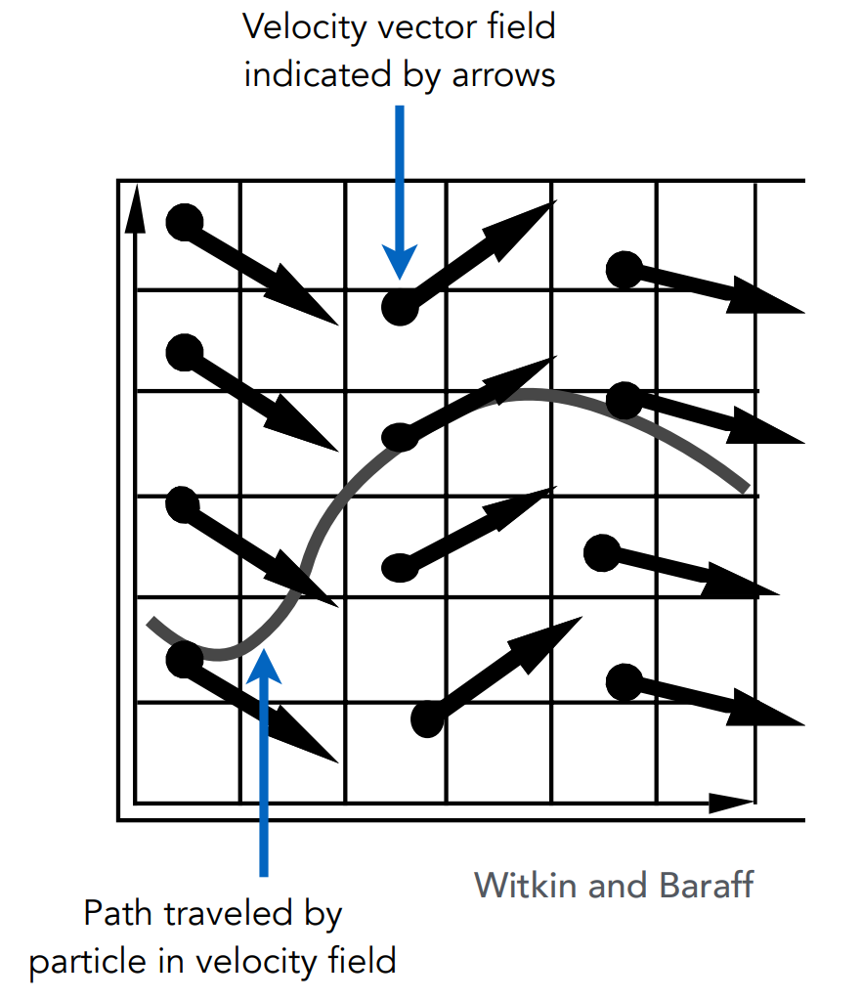
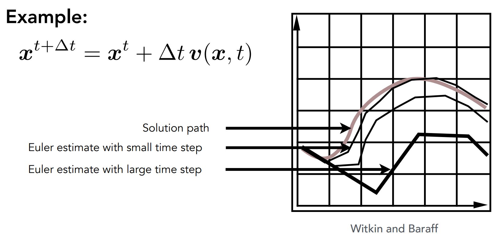
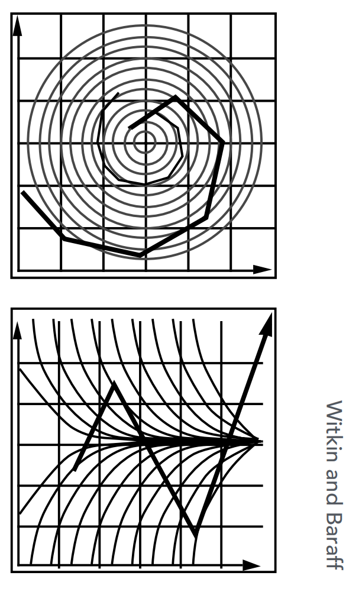
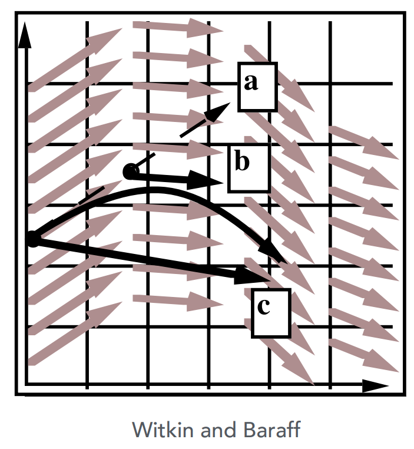
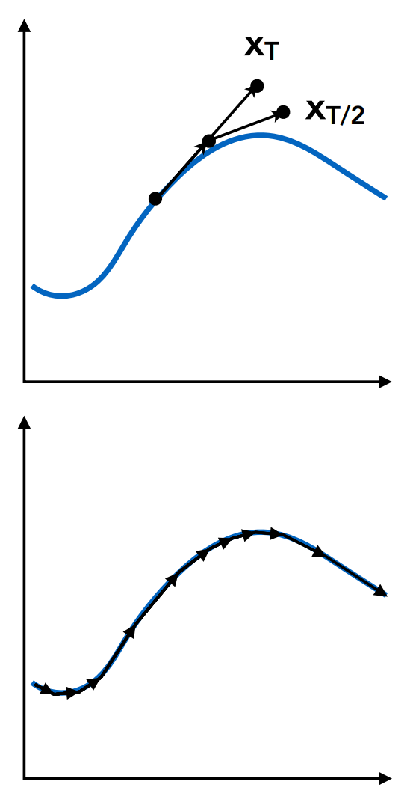
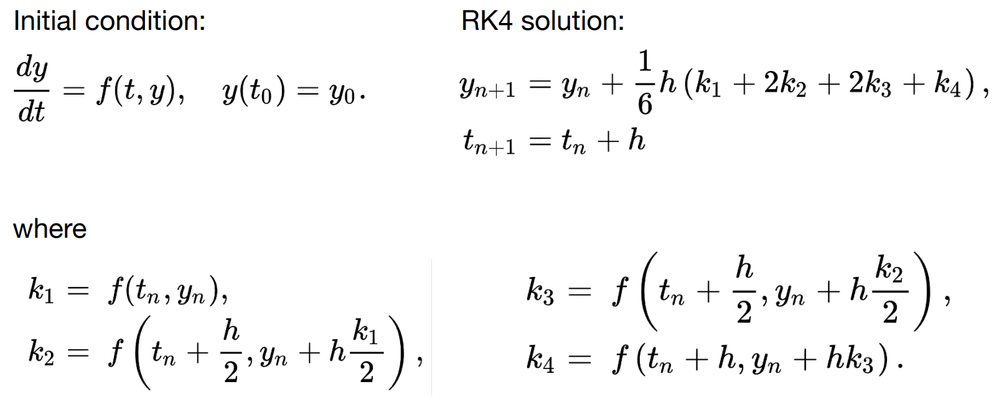
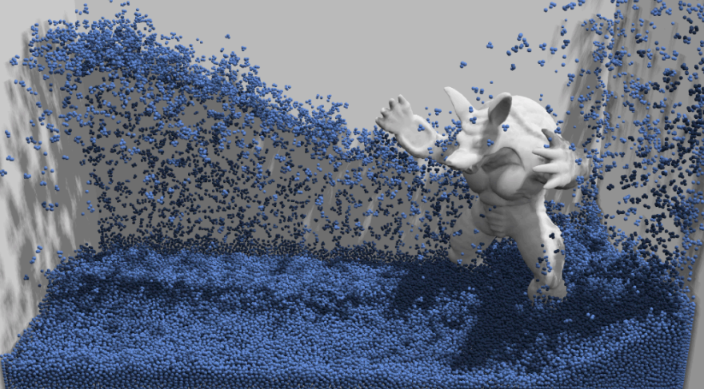
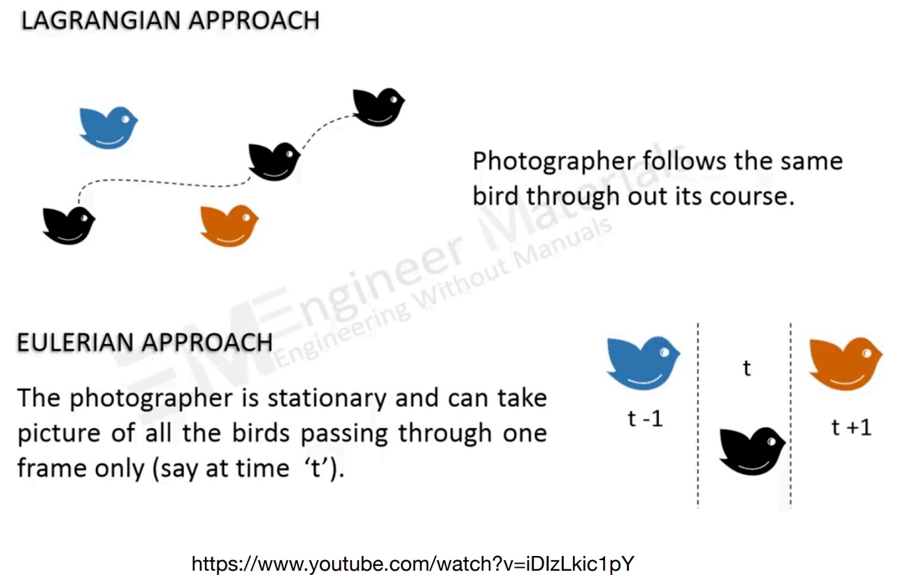

# GAMES101 Lecture 22 - Animation Cont.

[GAMES101_Lecture_22.pdf](https://sites.cs.ucsb.edu/~lingqi/teaching/resources/GAMES101_Lecture_22.pdf)

## Outline

- Single Particle Simulation
  - Explicit Euler Method
  - Instability and Improvements
- Rigid Body Simulation
- Fluid Simulation

## I. Single Particle Simulation

*For similicity we may write vectors in the same way as scalars.*

### Vector Field and Ordinary Differential Equation (ODE)

Assume the motion of a particle is determined by a **velocity vector field** that is a function of position and time:

$$
v(x, t)
$$

Computing the position of that particle over time requires solving a **first-order ordinary differential equation (ODE)**:

$$
\dv{x}{t} = \dot{x} = v(x, t)
$$

Solve the ODE subject to a given **initial particle position** $x_0$ by using forward numerical integration.

### Euler's Method 

Euler's Method, a.k.a. **Forward Euler**, **Explicit Euler**, is

- a simple **iterative** method,
- commonly used,
- very **inaccurate**, and
- most often goes **unstable**.

$$
\boldsymbol{x}_{t + \Delta t} = \boldsymbol{x}_t + \Delta t \dot{\boldsymbol{x}}_t
$$

$$
\dot{\boldsymbol{x}}_{t + \Delta t} = \dot{\boldsymbol{x}}_t + \Delta t \ddot{\boldsymbol{x}}_t
$$

*The rightside of the equation consists of only values at present.*

#### Errors

Errors accmulate as the integration goes, and euler integration is *particularly bad*.

#### Instability

- **Inaccuracy** increases as step $\Delta t$ increases
- **Instability** is a **common, serious** problem that can cause simulaton to diverge.

### Resolving Errors and Instability

Solving by numerical integration with finite differences leads to two problems:

- **Errors**:
  - Errors at each time step accmulate. Accuracy descrease as simualtion proceeds.
  - *Accuracy may not be critical in graphics applications.*
- **Instability**:
  - Errors can **compound**, causing the simualtion to **diverge** even when the underlying system does not.
  - Lack of stability is a fundamental problem in simulation, and cannot be ignored.

- Midpoint Method/Modified Euler
  - *Average velocities at start and endpoint.*
- Adaptive Step Size
  - *Compare one step and two half-steps recursively until the error is acceptable*.

- Implicit Methods
  - *Use the velocity at the next time step (**hard**)*

- Position-Based/Verlet Integration
  - *Constraint positions and velocities of particles after step $\Delta t$*

### Midpoint Method/Modified Euler

1. Compute Euler step $(a)$
2. Compute derivative at the midpoint of Euler step $(b)$
3. Update position using midpoint derivative $(c)$

$$
x_{\text{mid}} = x_t + \frac{1}{2} v(x_t, t)\Delta t
$$

$$
x_{t + \Delta t} = x(t) + \Delta t \cdot v(x_{\text{mid}}, t)
$$

- Averaging velocity at start and end of step gets better results. (Applying **second derivatives**)

$$
x_{t + \Delta t} = x_t + \frac{1}{2} \Delta t \cdot (\dot{x}_t + \dot{x}_{t + \Delta t})
$$

$$
\dot{x}_{t + \Delta t} = \dot{x}_t + \Delta t \cdot \ddot{x}_t
$$

$$
x_{t + \Delta t} = x_t + \Delta t \cdot \dot{x}_t + \frac{1}{2} (\Delta t)^2 \ddot{x}_t
$$

### Adaptive Step Size

- Technique for choosing step size based on error estimation
- **Practical**
- May need very small steps

**Repeat until error is below threshold**:

1. Compute $x_T$ an **Euler step**, size $T$

2. Compute $x_{T/2}$ two Euler steps, size $T/2$
3. Compute error $\epsilon = \norm{x_T - x_{T / 2}}$
4. If $\epsilon > C$, a predefined **threshold**, then reduce step size $T$ and try again.

### Implicit Euler Method

- Informally called **Backward Methods**.
- Use **derviatives in the future** for the current step

$$
x_{t + \Delta t} = x_t + \Delta t \cdot \dot{x}_{t + \Delta t}
$$

$$
\dot{x}_{t + \Delta t} = \dot{x}_t + \Delta t \cdot \ddot{x}_{t + \Delta t}
$$

- Solve nonlinear problem for $x_{t + \Delta t}$ and $\dot{x}_{t + \Delta t}$
  - However, we likely do not know $\ddot{x}_{t + \Delta t}$ if the position is unknown
  - And we need to compute a numerical solution

- Use root-finding algorithm, e.g. **Newton's method**
- Much better **stability**:
  - Measured by **local truncation error** (for each step) and **total accumulated error** (overall)
  - **Order** of error w.r.t. step matters more than the **absolute value**
  - Implicit Euler has order 1, which means that
    - Local truncation error: $O(h^2)$, and
    - Global trucnation error: $O(h)$, where $h$ corresponds to the size of step
  - $O(h)$ - halving $h$ leads to halving the error.

### Runge-Kutta Families

A family of advanced methods for solving ODEs.

- Especially good at dealing with **non-linearity**
- **RK4**, or the order-four version, is the most widely used

### Position-Based/Verlet Integration

- After modified Euler forward-step, **constrain positions of particles** to prevent divergent, unstable behavior
- Use constrainted positions to calculate velocity
- Both of these ideas will dissipate energy, stablize

**Pros/Cons**

- Fast and simple
- Not physically based, **violates conservation of energy**

## II. Rigid Body Simulation

**Simple case**:

- Since the rigid body has all its components fixed, simulation is similar to that of a particle, but with a bit more properties:
  
  $$
  \dv{t}
  \begin{bmatrix}
  x \\
  \theta \\
  \dot{x} \\
  \omega
  \end{bmatrix}
   = 
  \begin{bmatrix}
  \dot{x} \\
  \omega \\
  f / m \\
  \tau / I
  \end{bmatrix}
  $$
  
  where

  - $x$ is the position,
  - $\theta$ is the angle of rotation,
  - $\omega$ is the angular velocity,
  - $f$ is the forces,
  - $\tau$ is the torque, and
  - $I$ is the moment of inertia.

## III. Fluid Simulation

### A Simple Position-Based Method

**Key idea**:

- Assumptions:
  - Water is composed of *small rigid-body spheres*
  - Water cannot be compressed
    - As long as the density changes somewhere, it should be corrected via changing the position of particles
- Need to know the gradient of the density anywhere w.r.t each particle's position
- **Do gradient descent**.

#### Eulerian vs. Lagrangian

- Lagrangian: explictly compute the position of each particles
- Eulerian: Separate the space into a grid, compute the change happened inside the grid

#### Material Point Method (MPM)

**Hybrid**, combining Eulerian and Lagrangian views:

- **Lagrangian**: consider particles carrying material properties
- **Eulerian**: use a grid to do numerical integration
- **Interaction**: particles transfer properties to the grid, grid performs update, then interpolate back to particles

