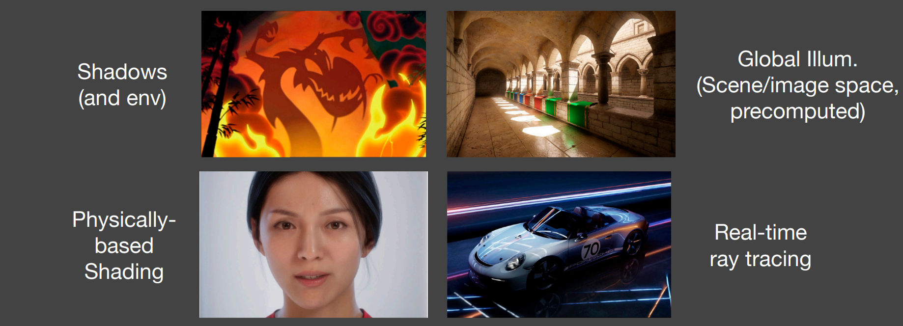
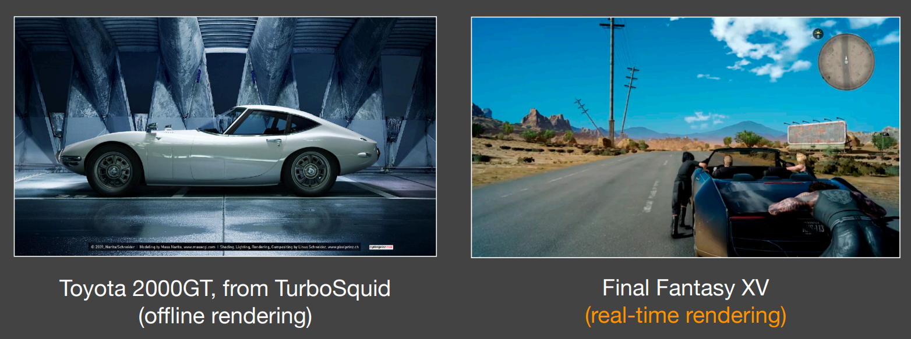
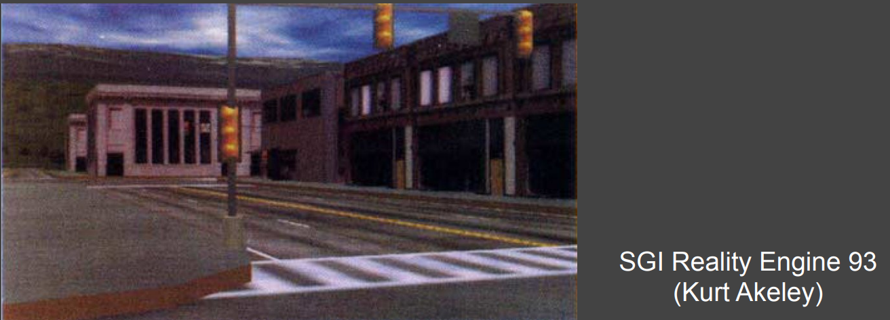
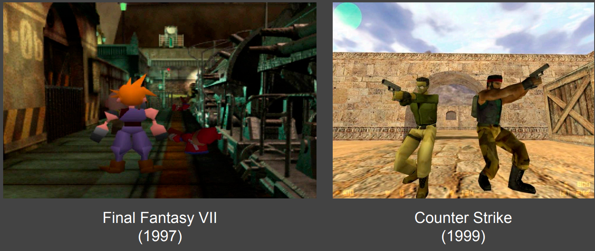
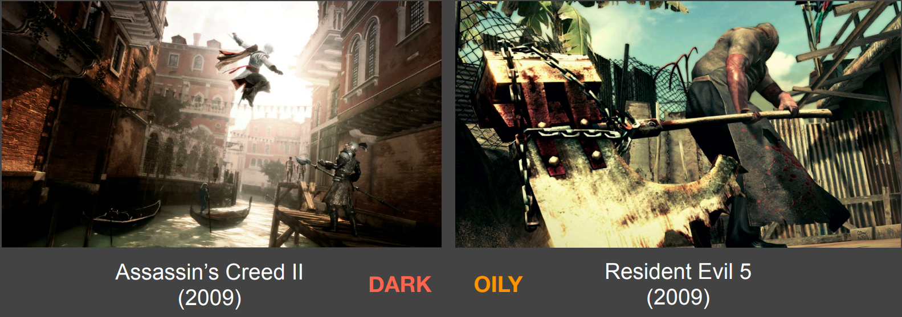
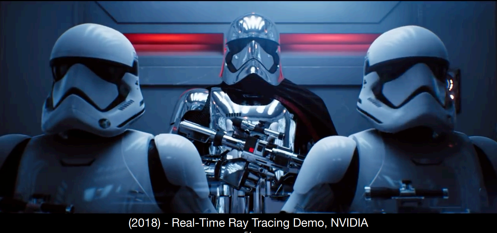
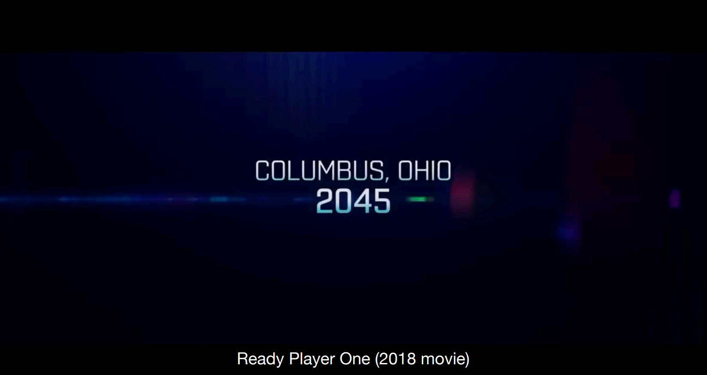
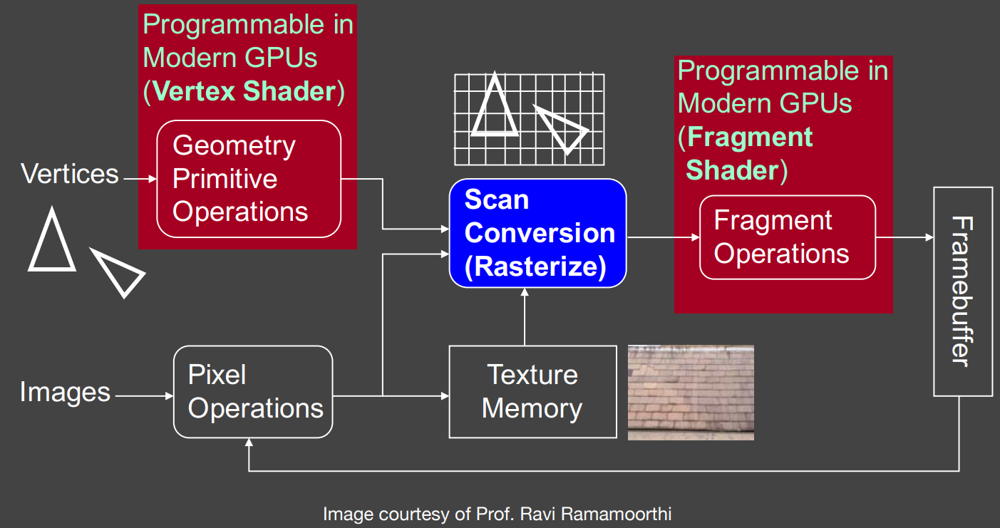
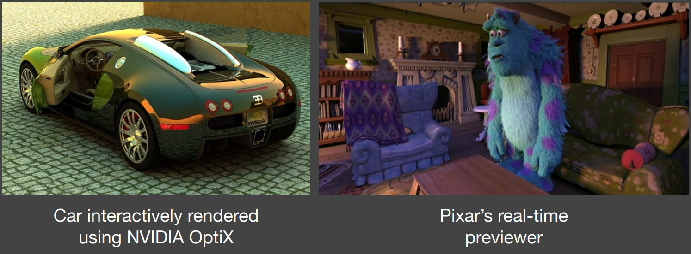

# GAMES202 Lecture 01 - Introduction and Overview

[GAMES202 Lecture 01 (ucsb.edu)](https://sites.cs.ucsb.edu/~lingqi/teaching/resources/GAMES202_Lecture_01.pdf)

## I. Overview

### What is GAMES202 about?

- A course at **intermediate level**: connecting basic knowledge and research
- **Real-Time** High Quality Rendering
  - **Speed**: More than *30 FPS*, for VR/AR *90 FPS* or above
  - **Interactivity**: Each frame generated on the fly
- Real-Time **High Quality** Rendering
  - **Realism**: Advanced approaches to make rendering more realistic
  - **Dependability**: All-time *correctness (exact or approximate)*, no tolerance to (uncontrollable) failures
    - Requirement: No artifacts.
- Real-Time High Quality **Rendering**
  - What is rendering? Calculating light which human eyes perceive
    - 3D Scene -> Image

The topics are diverse: The course will be organized by topics.

#### Course Topics

**4 Different Parts on Real-Time Rendering**:

- Shadow and Environment Mapping
- Interactive Global Illumination Techniques
- Physically Based Shading
- Real-Time Ray Tracing

**Topics**:

- Shadow and Environment Mapping
- Interactive Global Illumination Techniques
- Precomputed Radiance Transfer
- Real-Time Ray Tracing
- Participating Media Rendering, Image Space Effects, etc.
  - Single scattering, image space reflection

- Non-Photorealistic Rendering
  - ~~Genshin Impact~~, the Legend of Zelda

- Antialiasing and Supersampling
  - TAA, DLSS

- *Chatting about tech and games*

### What is GAMES202 NOT about?

Generally speaking, not about a specific engine or API, and not *quite* about offline rendering.

- 3D modeling or game development, or specific API
  - Using OpenGL
    - But when finishing assignments, basic knowledge of OpenGL is **required**.
    - **Shader Language** is important! GLSL, for example.

- Expensive light transport techniques
- Neural Rendering (*Why?*)
  - Not high-quality: cannot do cheery-picking (as of when the course is being conducted)
  - Cannot be real-time: computational cost too high

- Specific optimization and high performance computing
  - Purely technical.

### How to study GAMES202?

- Understand the different between **science** and **technology**
  - Science: knowledge
  - Technology: Implementing & Engineering. Requires skills that turn science knowledge into products

- Real-time rendering: 
  - **fast** & **approximate** offline rendering + **systematic** engineering
- Fact: 
  - in real-time rendering technologies, the industry is *way ahead of the academia*.
- Practice makes perfect.

## II. Motivation, Evolution and Milestones

### Motivation - Why Study GAMES202?

Computer Graphics is AWESOME!

- As of now, current CG algorithms are able to generate **photorealistic** images
  - Complex geometry, lighting, materials, shadows, ...
  - Computer-generated movies/special effects (*difficult or impossible to tell real from rendered*)
- But **accurate algorithms** (esp. ray tracing) are **very slow**:
  - Therefore, the phrase **offline rendering**
    - Rendering 1 frame in Zootopia can take up to 10,000 CPU core hours
- Proper approximations can lead to **plausible** results but run much faster

### Evolution of Real-Time Rendering

- Interactive 3D graphics pipeline as in OpenGL

  

  - Earliest SGI machines (Clark 82) to today
  - Most of focus on more geometry, texture mapping
  - Some tweaks for realism (shadow mapping, accum. buffer)

- 20 years ago - Into the Game Industry

  

  - Interactive 3D geometry with simple texture mapping, fake shadows (OpenGL, DirectX)

- 10~20 years ago - **Programmable Shaders**

  

  - A giant leap since the emergence of programmable shaders
  - Complex environment lighting, real materials (velvet, satin, paints), soft shadows

- **Today**

  

  - Stunning graphics, extended to VR and even movies

- *In the future*

  - 

### Technological and Algorithmic Milestones

- **Programmable** graphics hardware (shader) (**20 years ago**)

  

  - Compute Shader

- **Precomputation-based** methods (**15 years ago**)

  - Complex visual effects are (partially) pre-computed

  - Minimum rendering cost at runtime

  - **Relighting**

    - Fix geometry
    - Fix viewpoint
    - Dynamically change lighting

  - **Interactive Ray Tracing** (**8~10 years ago**: CUDA + OptiX)

    - Hardware development allows ray tracing on GPUs at low sampling rates (~1 samples per pixel (SPP))
    - Followed by post-processing to denoise

    

