# GAMES202 Lecture 03 - Real-Time Shadows 1

[GAMES202_Lecture_03 (ucsb.edu)](https://sites.cs.ucsb.edu/~lingqi/teaching/resources/GAMES202_Lecture_03.pdf)

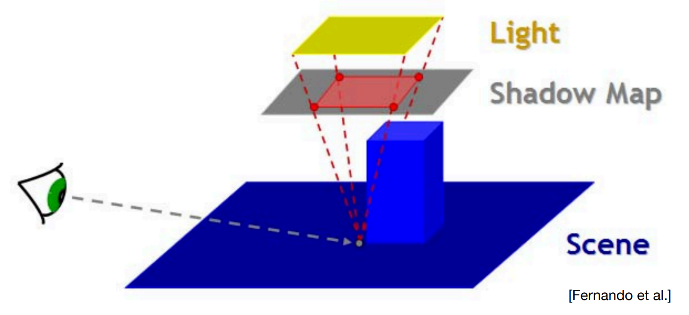

## I. Shadow Mapping

Reference: Real-Time Rendering, 4th Edition

The idea of shadow mapping is to render the scene, using the $z$-buffer, from the position of the light source that is to cast shadows. Whatever the light *sees* is illuminated, and the rest is in shadow.

To use the shadow mapping, the scene is rendered a second time (Pass 2), but this time with respect to the viewer. As each drawing primitive is rendered, its location at each pixel is compared to the shadow mapping. If a rendered point is farther away from the light source than the corresponding value in the shadow mapping, that point is in shadow. Otherwise, it is not.

### Recap

Shadow Mapping is:

- A **2-Pass** Algorithm
  - The light pass generates the shadow mapping, or SM
  - The camera pass uses the SM
    - Check if each fragment can be illuminated by the light source (using the shadow map)
- An **Image-Space** Algorithm
  - Pro: No required knowledge of scene's geometry
  - Con: Causing self-occlusion and aliasing issues
- A well-known shadow rendering technique
  - Basic shadowing technique even for early offline renderings, e.g., Toy Story

| Pass 1                                                       | Pass 2A                                                   | Pass 2B                                                   |
| ------------------------------------------------------------ | --------------------------------------------------------- | --------------------------------------------------------- |
| 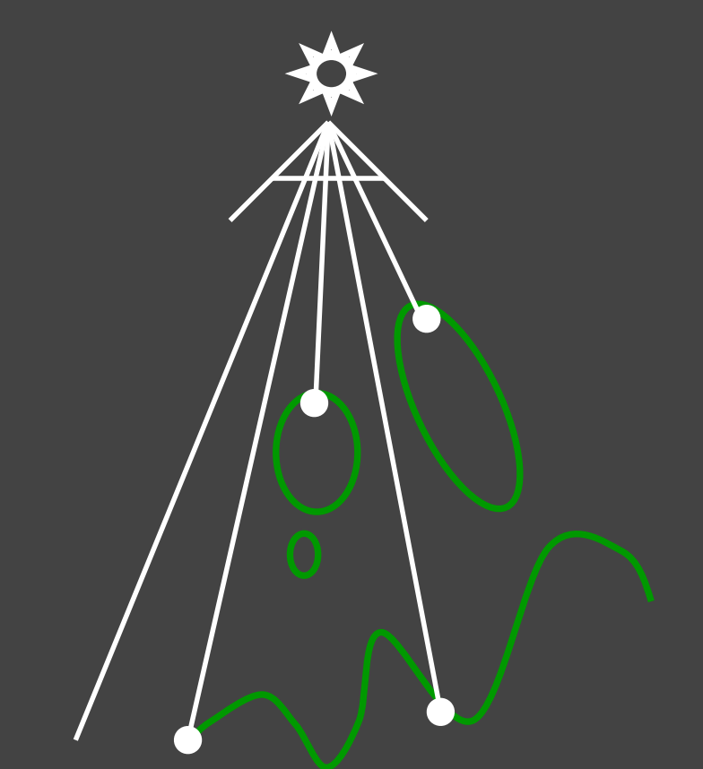 | 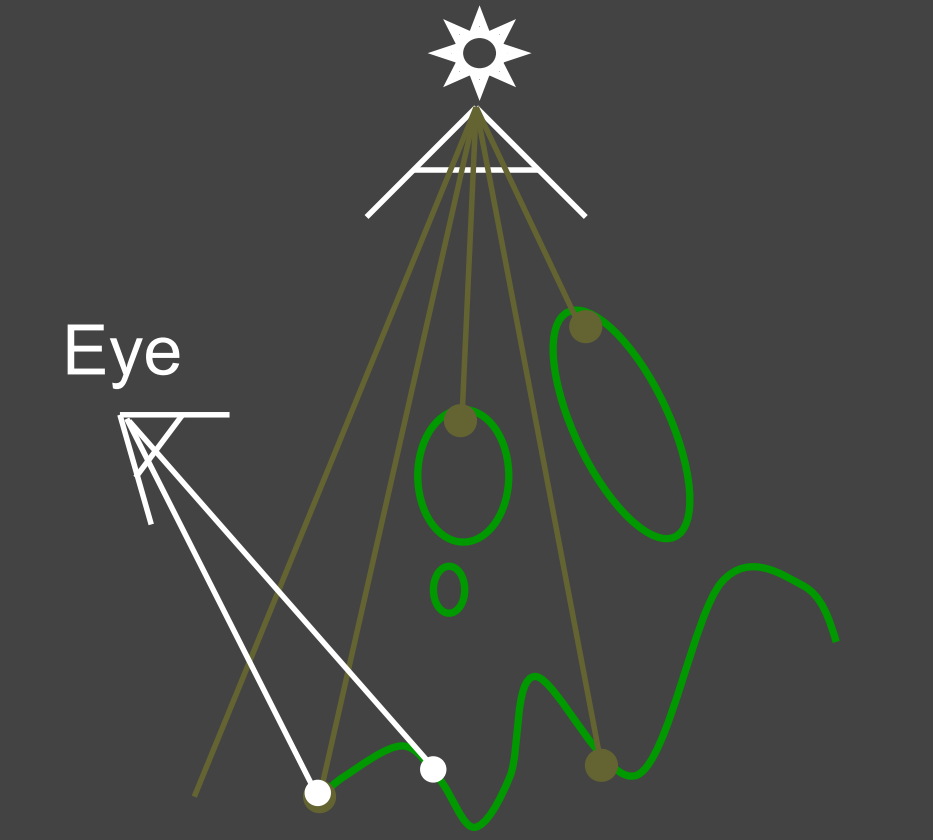 | 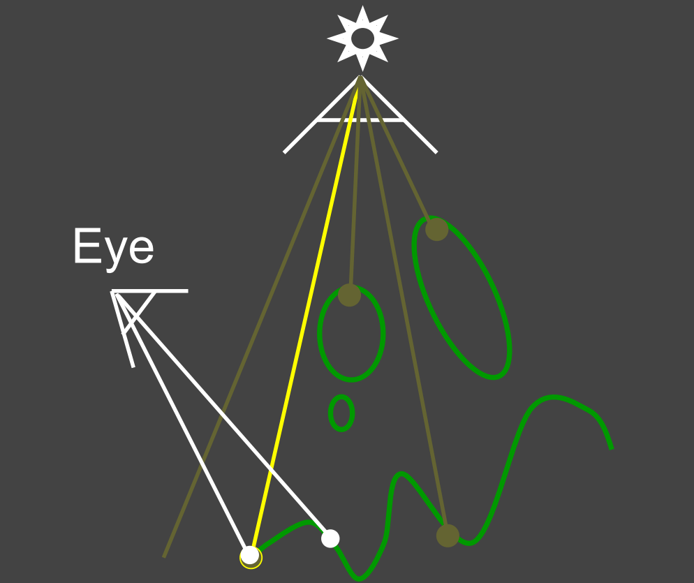 |

- Pass 1
  - Output a "depth texture" from the light source
    - For each fragment on that depth texture, record the minimum depth seen from the light source
- Pass 2
  - Pass **2A**: Render a standard image from the eye
  - Pass **2B**: Project visible points in eye view back to light source. Test the depth.
    - If the depth does not match the previous one, then the point being rendered is *blocked* from the light source.

| Depth View                                                   | Eye's View (Depth)                                           |
| ------------------------------------------------------------ | ------------------------------------------------------------ |
| 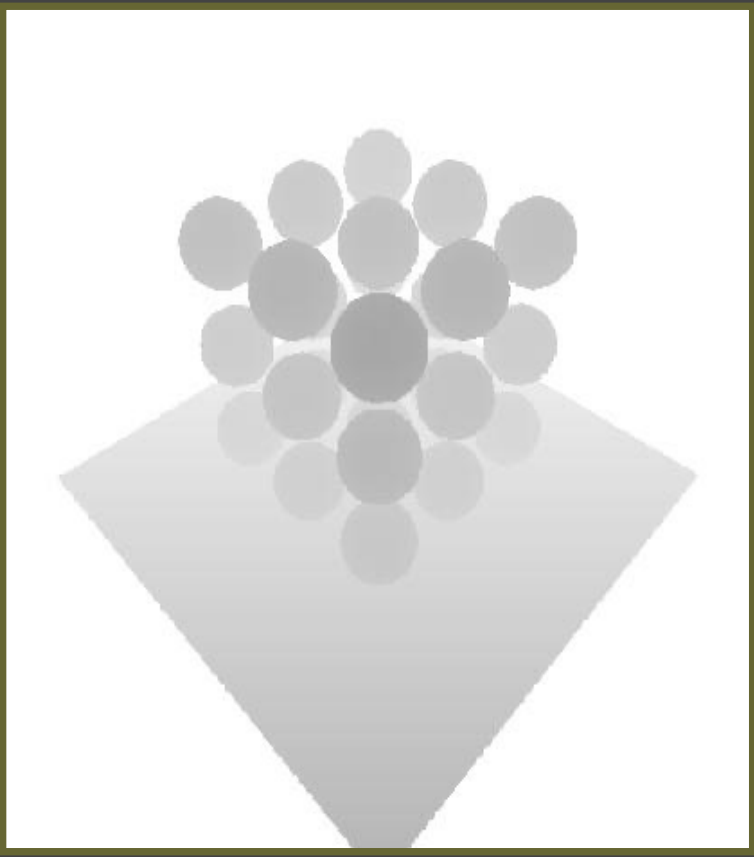 | 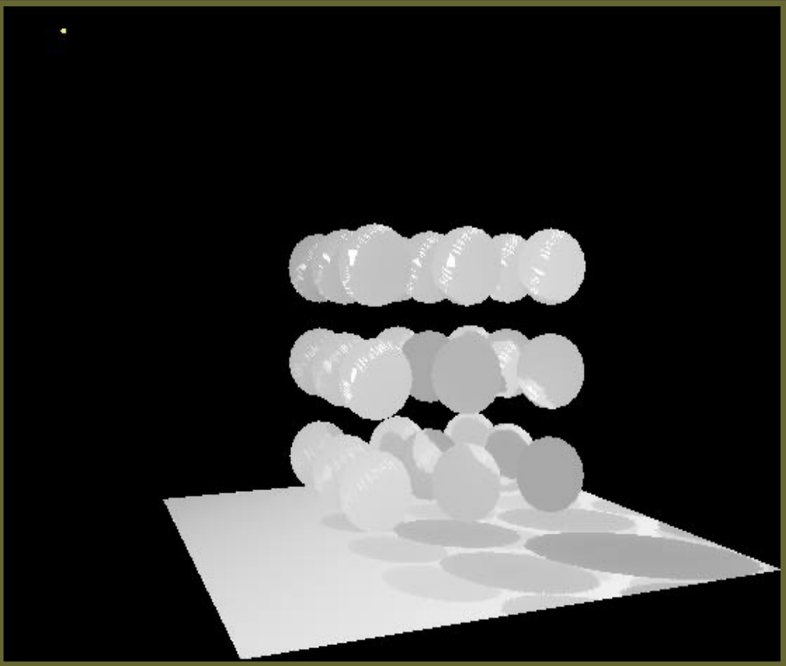 |

- Depth View - Viewed from light source
  - In this figure: the darker the fragment is, the closer the corresponding point on that object is to the light source

- Eye's View - Viewed from camera, projecting the depth map onto the eye's view.

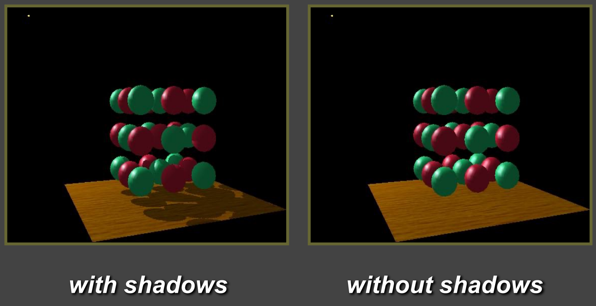

- *Notice how specular highlights never appear in shadows*
- *Notice how curved surfaces cast shadows on each other*

### Cautions

The definitions of $z$ value used in shadow mapping and in depth-test must be consistent.

- If you are to use the actual *distance*, then use that distance at both 2 passes.

### Common Issues and Solutions

#### Self Occlusion

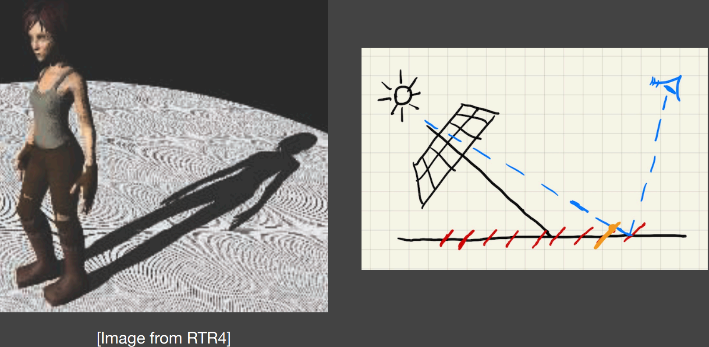

- **Resolution and floating-point precision count**. Notice the red slashes on the right figure.
  - Each pixel covers an area of the surface, in which **the depth is constant** (because it is within a single fragment).
    - The actual depth differs from that recorded in the shadow mapping
  - The effect is most severe at **grazing angle**. 
  - The effect is mitigated when the plane used for shadow mapping is parallel to the surface being illuminated.
- The bias is too low, so self-shadowing occurs. Notice the weird pattern on the ground - they are produced because *triangles (that are used to model the ground) shadow themselves*.

##### Adding a (variable) bias to reduce self occlusion

Now the shadow occurs **only if** the difference exceeds certain threshold:
$$
\Delta d \geq \text{Threshold}
$$

- May be related to viewing angle. If perpendicular to the surface, then little bias. Else, high bias.

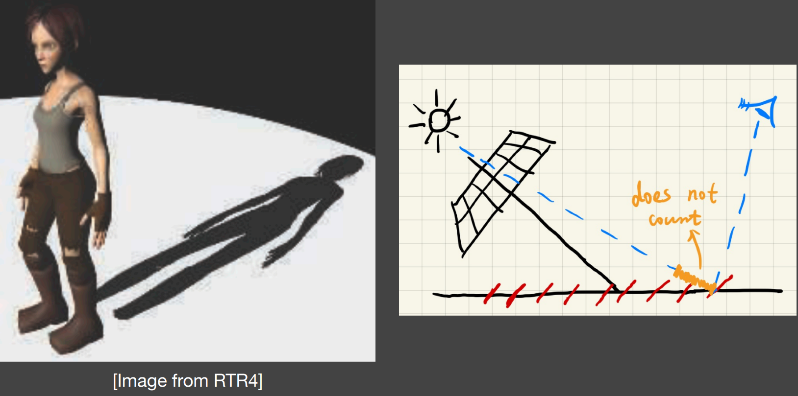

- **Bias is too high**: Introducing detached shadow.
  - Small object causes the difference between depths to be lied within the bias interval.
    - Notice the detached shadow on Laura's shoes.

##### Second-Depth Shadow Mapping

Store the second-minimum depth when generating the shadow map.

- Using the midpoint between first and second depths in the SM.

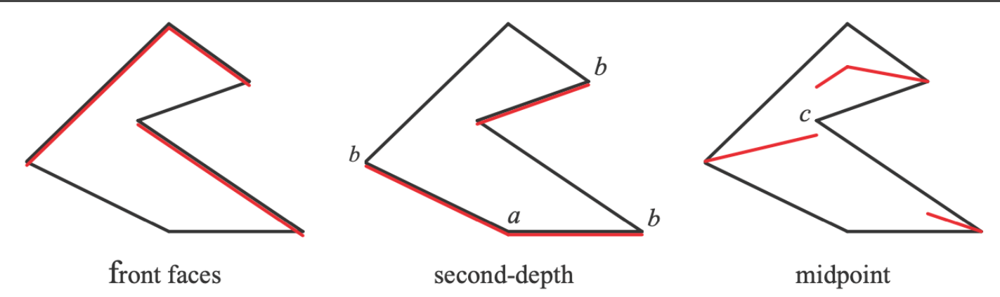

*Assume the light source is directly above.*

- Requires objects to be **watertight**:
  - Cannot describe planes without volume. (Can be solved with some tricks)
- The **overhead** may not worth it:
  - RTR does not trust in **complexity**: The actual time may be doubled or tripled or even more.

#### Aliasing

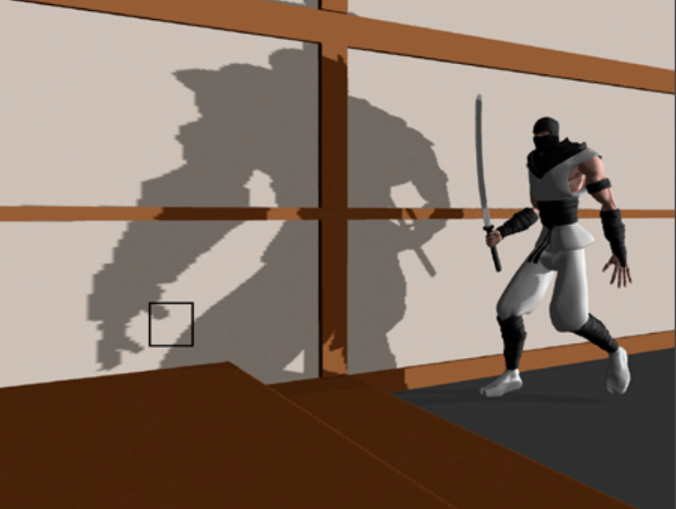

- **The resolution still counts**: The area covered by a single fragment inside the shadow maps has a **constant depth**. Solution: change the resolution of shadow maps:
  - Shadow Maps with Dynamic Resolution
  - Cascaded Shadow Maps
  - Convolutional Shadow Maps

## II. The Math behind Shadow Mapping

### Approximating the Rendering Equation

In real-time rendering, we care about fast and accurate **approximation**. (Approximately equal)

An important approximation throughout RTR:
$$
\int_\Omega f(x) g(x) \dd{x} \approx 
\underbrace{\frac{\int_\Omega f(x) \dd{x}}{\int_\Omega \dd{x}}}_{\substack{\text{The average value} \\ \text{of $f(x)$ over the interval}}}
\cdot \int_\Omega g(x) \dd{x}
$$

- Approximate the result of integration by averaging $f(x)$ over the interval of integration
- When is it (more) accurate?
  - When the **support** of $g(x)$ is small:
    - The support of a real-valued function $f$ is the subset of the function domain containing the elements which are not mapped to zero.
  
  - When $g(x)$ is **smooth**.
  - When $f(x)$/$g(x)$ does not fluctuate too much over the interval.
  

The rendering equation with term $V(\text{p}, \omega_i)$ for explicit visibility
$$
\begin{equation} \label{rendeq} \tag{1}

L_o (\text{p}, \omega_o) = 

L_e (\text{p}, \omega_o) + 

\int_{\Omega_{+}} L_i (\text{p}, \omega_i) f_r(\text{p}, \omega_i, \omega_o)

(\textbf{n} \cdot \omega_i) V(\text{p}, \omega_i) \dd{\omega_i}

\end{equation}
$$
can be approximated as, if not considering term regarding to self-emittance,
$$
L_o(\text{p}, \omega_o)
\approx
\frac{
	\int_{\Omega+} V(\text{p}, \omega_i) \dd{\omega_i}
} {
	\int_{\Omega+} \dd{\omega_i}
}
\cdot
\underbrace{\int_{\Omega+} L_i (\text{p}, \omega_i) f_r(\text{p}, \omega_i, \omega_o) \cos \theta_i \dd{\omega_i}}
_{\text{Do shading directly without considering visibility}}
$$

- **Separate visibility from the integration**. The right part now remains only the direct shading.
- This is the basic concept behind shadow mapping.
- When is it accurate?
  - Small **support**: Point/directional lighting
    - $L_i$ has small support.
  - Smooth **integrand**: Diffuse BSDF/Constant radiance area lighting.
    - $f_r$ is smooth, or $L_i$ is smooth.

Will be reviewed again when discussing Ambient Occlusions.

## III. Percentage Closer Filtering (PCF) and Percentage Closer Soft Shadows (PCSS)

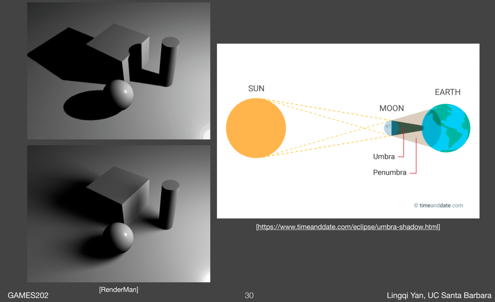

- Upper: Point Light, **umbra** only
  - Inside the umbra of a light source, the viewer cannot see that light source.

- Lower: Area Light, with **penumbra**
  - Inside the penumbra of a light source, the viewer can see only part of that light source.

### Percentage Closer Filtering

- Provides **anti-aliasing** at shadows' edges
  - **Not for soft shadows** (PCSS, which is for soft shadows, will be introduced later)
  - **Filtering the results of shadow comparisons**
    - Averaging the results of shadow comparisons
- Why not filter the shadow map?
  - Texture filtering just averages color components:
    - You'll get **blurred** shadow map first
  - Averaging depth values and comparing then will still lead to a binary visibility.

#### The Algorithm

Compute the **visibility term** in the rendering equation:

1. Instead of performing a single query, perform multiple (e.g., $7 \times 7$) depth comparisons for each **fragment**:

   - **Method**: In the shadow map (figure below), query the **neighboring region** of point $P$ on the shadow map

   - **Querying the fragment**: the farther the fragment is to the light source, the blurrier its corresponding shadow will be.

2. Then, averages the **results of** comparisons.

For example:
- For point $P$ on the floor,
  1. Compare its depth $D$ with all texels in the red box, e.g., $3 \times 3$.
  2. Get the compared results, e.g., $\begin{bmatrix} 1 & 0 & 1 \\ 1 & 0 & 1 \\ 1 & 1 & 0 \end{bmatrix}$
  3. Take the average to get visibility, e.g., $0.667$

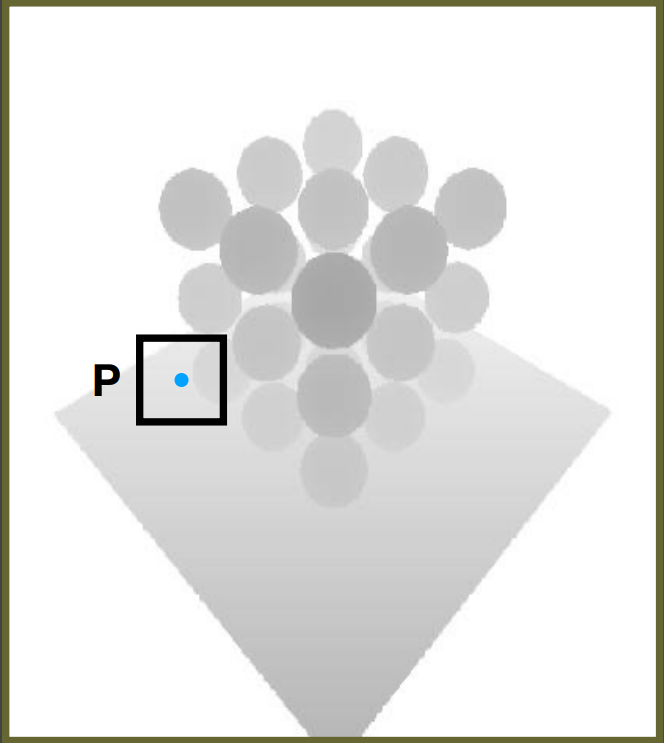

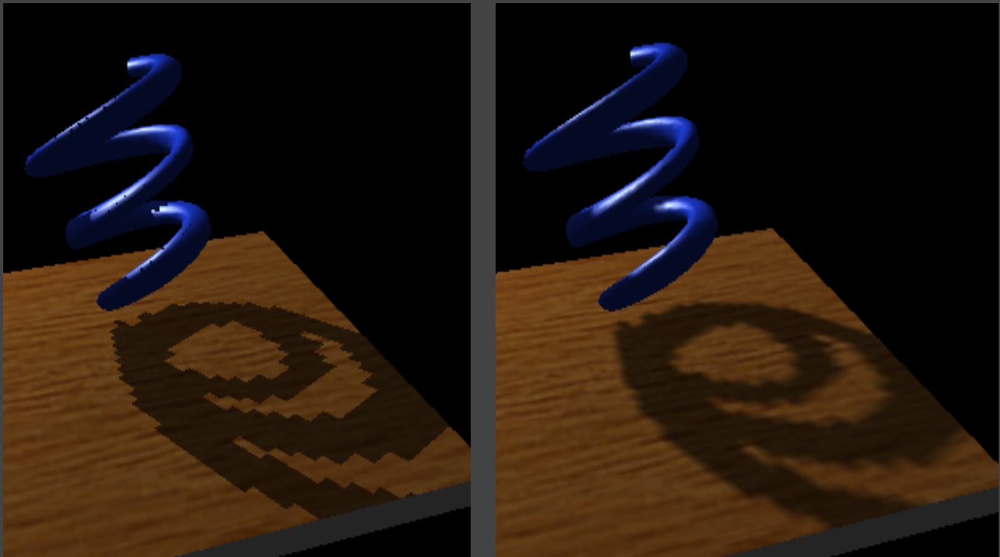

Wrong example: filtering on the result

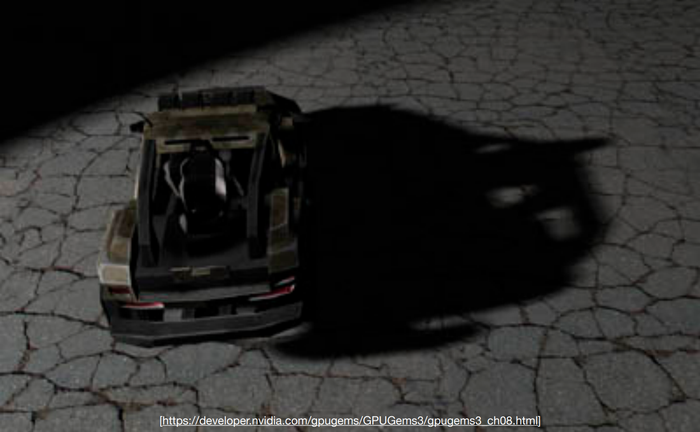

#### Problems

- Does filtering size matter?
  - Smaller -> Sharper
  - Larger -> Softer

- Can we use PCF to achieve soft shadow effects?
  - Using a larger filter size leads to visual **approximation** of soft shadows
- **Key thoughts**:
  - From hard shadows to soft shadows
  - What's the **correct size** to filter?
  - Is the produced shadow uniform?
    - No. The closer the object is to the projecting surface, the sharper the projected shadow will be.

### Percentage Closer Soft Shadows

- The shadow becomes sharper as the tip gets closer to the plane. Softer in the other direction.

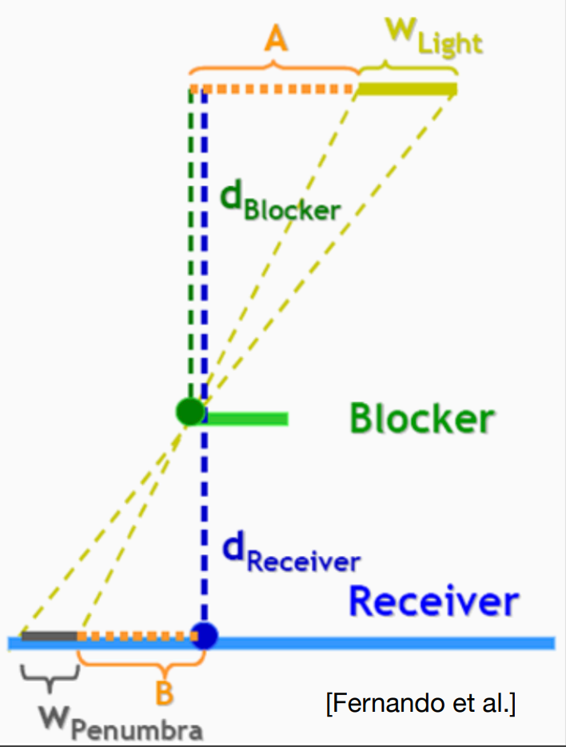

- $ \text{Filter Size} \leftrightarrow \text{Blocker Distance}$

  - Blocker distance: Averaged *projected* blocker depth.
    - **Average** samples of depth in an area
    - **Projected** so as to get the perpendicular distance

  $$
  w_{\text{Penumbra}} = (d_{\text{Receiver}} - d_{\text{Blocker}}) \cdot w_{\text{Light}} / d_{\text{Blocker}}
  $$

- $w_\text{Light}$: the width (dimension) of light
  - Shadow map cannot be produced with an **area light**.
  - The soft shadow created by the area light, is simulated by:
    1. First using a point light to generate the shadow map, 
    2. Then specify the dimension of that light when doing calculation, i.e. **post-processing**
- The ratio in the formula corresponds to word *percentage* in its name

#### PCSS - The Complete Algorithm

1. Blocker Search:
   - Get the **average** blocker depth in a certain region inside the shadow map:
     - In a region, what is the average depth of the area that covers the shading point?
2. Penumbra Estimation:
   - Use the average blocker depth to determine **filter size**
3. Percentage Closer Filtering

#### Problems

- Which region to perform blocker search? What **size**?

  - Can be set constant (e.g., $5 \times 5$), but can be **better with heuristics**

  - Depends on the size of light, and distance between receiver and the light:
  
    
  
    When estimating the blocker depth, create a cone as the figure shows, and use the projected area on the shadow map covered by the cone.

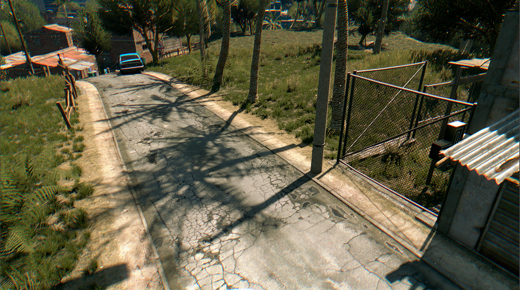

Video Game: Dying Light

