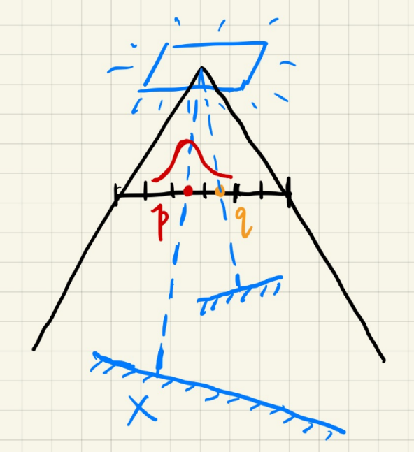
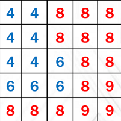
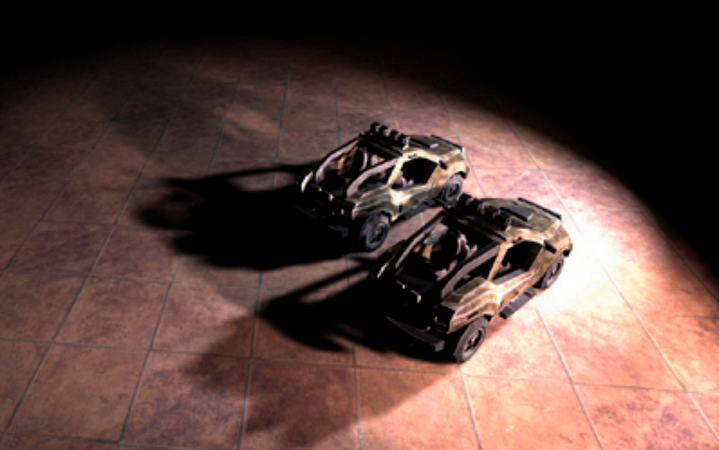
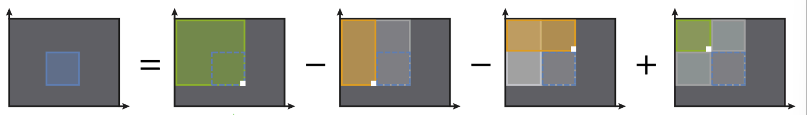
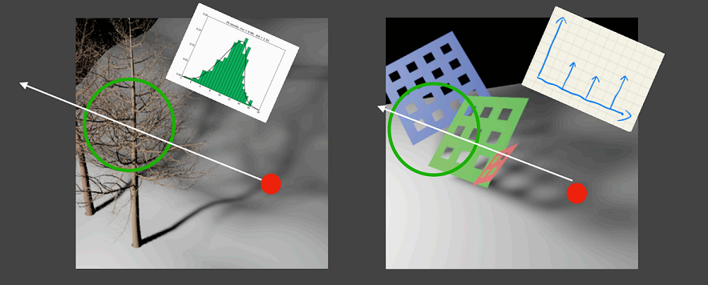
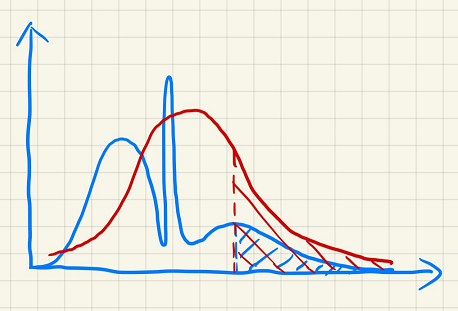
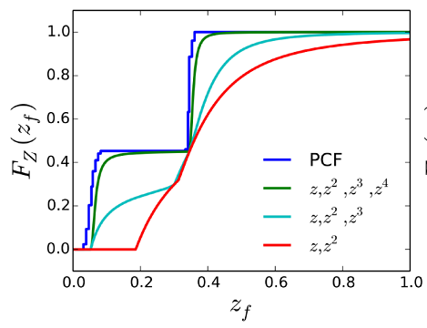
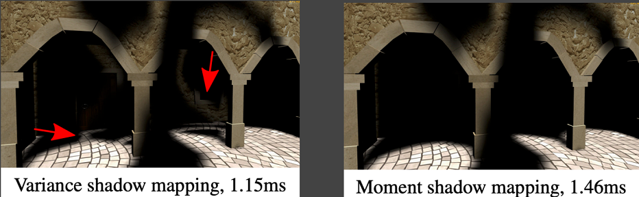

# GAMES202 Lecture 04 - Real-Time Shadows 2

[GAMES202_Lecture_04 (ucsb.edu)](https://sites.cs.ucsb.edu/~lingqi/teaching/resources/GAMES202_Lecture_04.pdf)

## I. More on PCF and PCSS

### The Principle behind PCF/PCSS

- **Consider the Neighboring Region**: For any point $x$ being rendered, we consider the neighboring region of the corresponding texel $p$ on the shadow map.

  - **Weighted Consideration**: When we average the entire region with all weights set to $1$, then it is the traditional PCF/PCSS. We may also assign higher weights to texels closer to $p$, resulting in a weighted consideration.

  - **Filter/Convolution**: Averaging w.r.t. to a specific distribution is essentially filtering/convolution.
    $$
    [w \ast f](p) = \sum_{q \in \mathcal{N}(p)} w(p, q) f(q)
    $$
  
    represents the filtering done on fragment $p$, and:
  
    - $w(p, q)$ represents relative weight when considering texel $q$ in terms of $p$, or **the distribution**, 
    - $\mathcal{N}(p)$ represents the neighboring region of point $p$,
    - $f(x)$ is the function the convolution is done on, and
    - $[w \ast f]$ is the result of convolution.
  

**In PCSS:**
$$
V(x) = \sum_{q \in \mathcal{N}(p)} w(p, q) \cdot \chi^{+}[D_\text{SM}(q) - D_\text{scene}(x)]
$$

For any shading point $x$ which have its corresponding texel $p$ on the shadow map, we consider the neighboring region of $p$.

- For any texel $q$ inside $\mathcal{N}(p)$, we consider whether $x$ will be blocked by $q$.
- $V(x)$: the visibility of point $x$
- $D(x)$: the visibility of point (or texel) $x$
- $\chi^+$: the sign function. If $t > 0$, then $\chi^+(t) = 1$. Else, $\chi^+(t) = 0$.

**Explanation**:

- If depth of the current texel $q$ is greater than that of point $x$, then apparently $q$ does not block $x$ from the light source. Since we are computing the visibility, we use $\chi^+$ to formularize the condition.

Thus, we have the following conclusions:

- **PCF is not filtering the shadow map and then comparing**:
  $$
  V(x) \neq \chi^+ \{[w \ast D_\text{SM}](q) - D_\text{Scene}(x)\}
  $$

  - The RHS still leads to binary visibilities.

- **PCF is not filtering the resulting image with binary visibilities**:
  $$
  V(x) \neq \sum_{y \in \mathcal{N}(x)} w(x, y)V(y)
  $$

  - In other words, PCF is not filtering the resultant shadow, as the RHS does.

### Performance Issue in PCSS

Given the PCSS algorithm:

1. Blocker Search:
   - Get the average blocker depth **in a certain region** inside the shadow map
2. Penumbra Estimation:
   - Use the average blocker depth to determine filter size
3. Percentage Closer Filtering

**Which steps can be slow in PCSS?**

- Examining every texel in a certain region (steps 1 and 3)
  - **Sample solutions**:
    - May use sparse sampling, and then apply image-space denoising.
      - Introducing noise.

  - **MIPMAP**

- Softer -> Larger Filtering Region -> Slower

## II. Variance (Soft) Shadow Mapping (VSM/VSMM)

What is new in VSM/VSMM:

- Fast blocker search (step 1) and filtering (step 3) [Yang et al.]

### Speeding up PCF

Predict the percentage of texels that are **in front of** the shading point:

- Using a **normal distribution** to approximate the answer
- Or, we may directly apply **Chebyshev's inequality** without assuming the distribution

#### Key Idea

Using probability theories to approximate the answer. To apply these theories, we need to know key features of the target distribution.

- Quickly compute the **mean** and **variance** of depths in an area

  - How? See next chapter.

- **Mean** (Average):

  - Hardware MIPMAP (Range-Average Query)
  - Summed Area Tables (**SAT**)
    - How to? See **Section III**.

- **Variance**:
  $$
  \text{Var}(X) = E(X^2) - E^2(X)
  $$

  - **Quick Computation**: Use depth squared.

  - Generate a **square-depth map** along with the shadow map.
    - Utilize multiple channels of a texture map

We may now directly compute the CDF, using the **error function** (assuming **normal distribution**):

- `std::erf` defined in C++, which essentially computes the CDF of a Gaussian distribution using numerical approximations.

We may also apply the following rule:

**Chebyshev's Inequality**: When $t > \mu$, we have:
$$
P(x > t) \leq \frac{\sigma^2}{\sigma^2 + (t - \mu)^2}
$$
where $\sigma^2$ is variance and $\mu$ is mean, regardless of the actual distribution.

- Hence we acquire the **percentage of texels that has a depth larger than given threshold**.

#### Performance

- Shadow Map Generation:
  - Squared Depth Map: Parallel, along with shadow map, #pixels
- Run time:
  - Mean of depth in a range: $O(1)$
  - Mean of depth squared in a range: $O(1)$
  - Chebyshev: $O(1)$
  - *No samples/loops needed!*

### Speeding up Blocker Search

#### Key Idea

- Blocker ($z < t$), average $z_\text{occ}$, representing the average depth of occluding objects
- Non-blocker ($z > t$), avg. $z_\text{unocc}$, representing the average depth of objects that does not occlude the target

$$
\frac{N_1}{N}z_\text{unocc} + \frac{N_2}{N}z_\text{occ} = z_\text{avg}
$$

- How to compute? We have such **rough approximations**:
  - $N_1 / N \approx P(x > t)$ by **Chebyshev's inequality**.
  - $N_2 / N \approx 1 - P(x > t)$
  - $z_\text{unocc} = t$
    - i.e., shadow receiver is a plane.

#### Performance

- With negligible cost.

### Issues

- Approximation failure leads to significant artifacts.

## III. MIPMAP and Summed-Area Variance Shadow Maps

Querying $\mu$ and $\sigma$ of an arbitrary rectangular range in $O(1)$:
$$
P(x \geq t) \leq p_\max (t) \equiv \frac{\sigma^2}{\sigma^2 + (t - \mu)^2}
$$

#### MIPMAP for Range Query

Allowing fast, **approx.**, **square** range queries.

- However, still approximate even with trilinear **interpolation**.

#### Summed-Area Table (SAT) for Range Query

Essentially doing prefix sum.

- In $(x, y)$, store the sum of all elements contained inside the rectangle $(0,0) \to (x, y)$
- $O(mn)$ time and storage to build, where $m, n$ are width and height, respectively
  - But how to build SAT faster?

[Gamboa et al.]

## IV. Moment Shadow Mapping

### Motivation

- **Approximations fail** when scene violates the assumption.

  

  - Overly dark: May be acceptable
  - Overly bright: Light **leaking**/**bleeding** (the latter is a industrial term)

**Goal of Moment Shadow Mapping**:

- Represent the distribution more **accurately**
  - But still not too costly to store
- **Use higher order moments** to represent a distribution

### Moments

*Partial Reference: [John A. Rice - Mathematical Statistics and Data Analysis 3ed (Duxbury Advanced) (2006, Duxbury Press)]*

**Definition**: The $r$-th moment of a random variable is $E(X^r)$, i.e. the expectation of random variable $X$ to $r$.

- VSSM is essentially using the **first two** orders of moments

#### What can moments do?

Approximating a distribution more **accurately**.

[Peters et al., Moment Shadow Mapping]

- **Conclusion**: first $m$ orders of moments can represent a function with $m/2$ steps

  - Usually, $4$ is good enough to approximate the actual CDF of depth distribution.

- We may restore a CDF given the **moment-generating function**:

  - The moment-generating function (**MGF**) of a random variable $X$ is $M(t) = E(e^{tX})$ if the expectation is defined.

  - Properties of MGF:

    - If the moment-generating function exists for $t$ in an open interval containing zero, it **uniquely determines** the probability distribution.

      The proof depends on Laplace transform. If two random variables have the **same MGF** in an open interval containing zero, then they have the **same distribution**.

### Moment Shadow Mapping

- Extremely similar to VSSM
- When generating the shadow map, record $z$, $z^2$, $z^3$, $z^4$
  - Packing: Store two 32-bit floating-point into a single one by sacrificing precision.
- Restore the CDF during blocker search & PCF.

#### Pros

- Very nice results

#### Cons

- Costly storage (might be fine)
- Costly performance (during construction)
