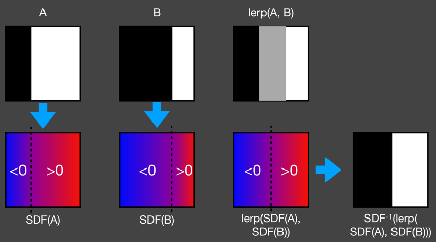
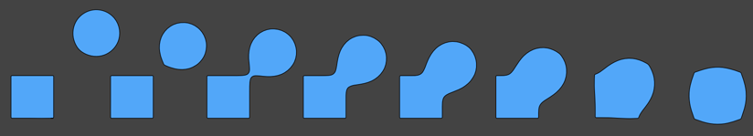
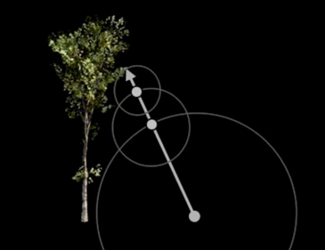
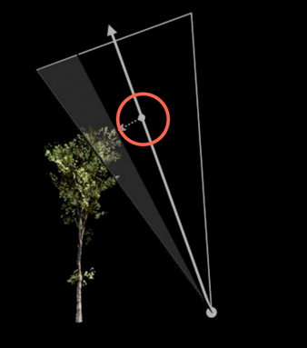
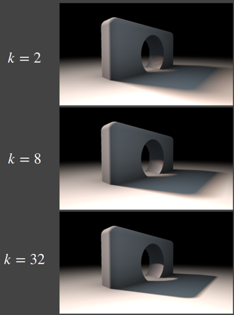
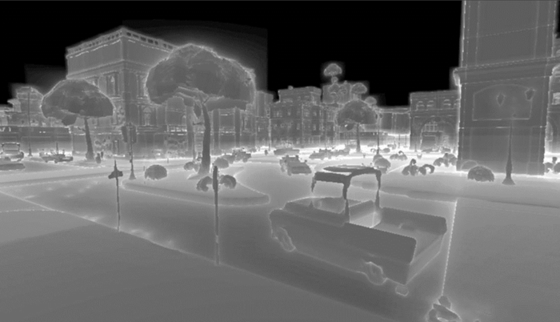
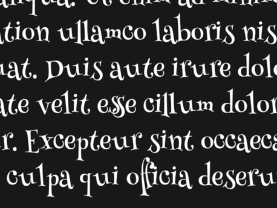

# GAMES202 Lecture 05 - Real-Time Environment Mapping

[GAMES202_Lecture_05 (ucsb.edu)](https://sites.cs.ucsb.edu/~lingqi/teaching/resources/GAMES202_Lecture_05.pdf)

## I. Distance Field Soft Shadows

### (Signed) Distance Function

**Input**: Coordinate

**Output**: The *minimum distance* from that coordinate to the object being described

**Characteristics**:

- **Preserving Boundary**: Blending two SDF results in a moving boundary (rather than a blurred one)

  

- **Combing Distance Functions**:

  

#### Usages

#### Ray Marching (Sphere Tracing)

Used in ray marching to perform ray-SDF intersections.

Each time at a given point $p$, travel $\text{SDF}(p)$ distance.

#### Computing Occlusions (SDF Soft Shadow)

The value of $\text{SDF}$ can be used to determine a "safe" angle seen from the eye:

- The smaller the "safe" angle, the less the visibility

To compute the angle, use $\min\left\{\frac{k \cdot \text{SDF} (p)}{p - o}, 1.0\right\} $:

- Larger $k$ leads to earlier cutting off of **penumbra**, resulting in **harder** shadows

#### Anti-Aliased Characters in RTR

[Troika-Three-Text from GitHub](https://github.com/protectwise/troika/tree/master/packages/troika-three-text)

### Pros and Cons

**Pros**:

- Fast
- High quality

**Cons**:

- Needs precomputation
- Needs **heavy** storage:
  - 
- Artifacts:
  - 

## II. Shading from Environment Lightning

### The Split Sum Approximation

