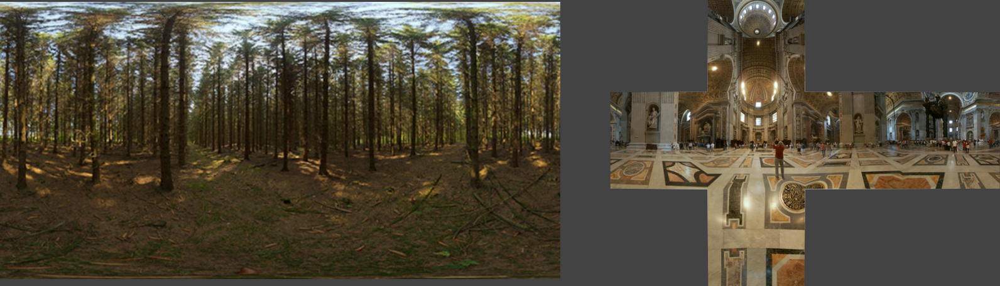
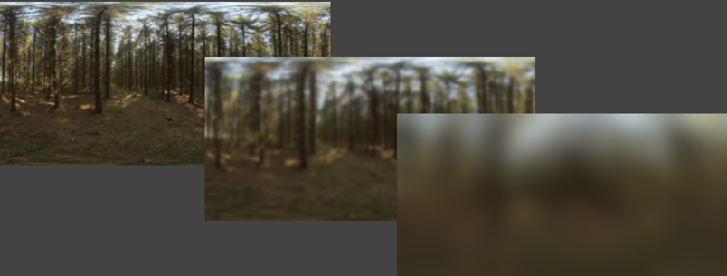
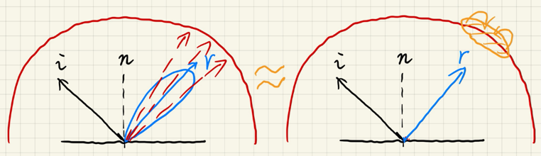
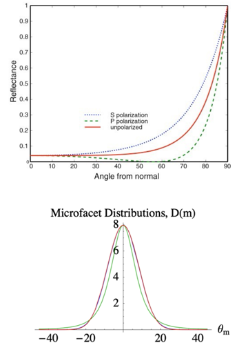
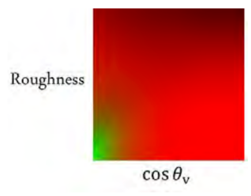
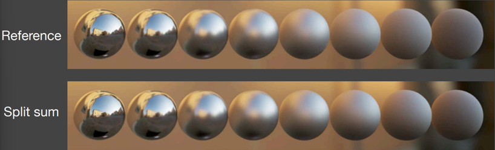

# GAMES202 Lecture 05 - Real-Time Environment Mapping

[GAMES202_Lecture_05 (ucsb.edu)](https://sites.cs.ucsb.edu/~lingqi/teaching/resources/GAMES202_Lecture_05.pdf)

## I. Distance Field Soft Shadows

### (Signed) Distance Function

**Input**: Coordinate

**Output**: The *minimum distance* from that coordinate to the object being described

**Characteristics**:

- **Preserving Boundary**: Blending two SDF results in a moving boundary (rather than a blurred one)

  

- **Combing Distance Functions**:

  

#### Usages

#### Ray Marching (Sphere Tracing)

Used in ray marching to perform ray-SDF intersections.

Each time at a given point $p$, travel $\text{SDF}(p)$ distance.

#### Computing Occlusions (SDF Soft Shadow)

The value of $\text{SDF}$ can be used to determine a "safe" angle seen from the eye:

- The smaller the "safe" angle, the less the visibility

To compute the angle, use $\min\left\{\frac{k \cdot \text{SDF} (p)}{p - o}, 1.0\right\} $:

- Larger $k$ leads to earlier cutting off of **penumbra**, resulting in **harder** shadows

#### Anti-Aliased Characters in RTR

[Troika-Three-Text from GitHub](https://github.com/protectwise/troika/tree/master/packages/troika-three-text)

### Pros and Cons

**Pros**:

- Fast
- High quality

**Cons**:

- Needs precomputation
- Needs **heavy** storage:
  - 
- Artifacts:
  - 

## II. Shading from Environment Lighting

Environment lighting: Simulate lighting coming from the surroundings of a scene.

There are **spherical** maps and **cube** maps.

The environment lighting is used when solving the rendering equation. Environment maps provide **info of incoming radiance** on a specific shading point.

- **General Solution**: Monte Carlo Integration
  - Numerical
  - Large amount of samples required
  - Can be **slow**
    - Sampling is not preferred in shaders\* in general: High time complexity.

### The Split Sum Approximation

In the industry, the resulting integral is computed using sampling and summing, thus it is called **split sum** rather than split **integral**.

#### Principle

The split sum approximation **avoids sampling** by approximating the given integral in a way described in Lecture 4:
$$
\int_{\Omega} f(x) g(x) \dd{x} \approx 
\underbrace{\frac{\int_{\Omega_G} f(x) \dd{x}}{\int_{\Omega_G} \dd{x}}}_{\substack{\text{The average value} \\ \text{of $f(x)$ over the} \\ \text{effective interval of }g(x)}}
\cdot \int_\Omega g(x) \dd{x}
$$

- **General BRDFs satisfy the requirements for accuracy in all cases**:
  - If the BRDF is **glossy**, then $g(x)$ or $f_r(x)$ in the formula, has small support.
  - If the BRDF is **diffuse**, then $g(x)$ or $f_r(x)$ in the formula, is smooth.

- *Note the slight edit on* $\Omega_G$.

#### 1st Stage

We approximate the rendering equation as follows:

$$
\begin{equation} \tag{1} \label{eq1}
L_o(\text{p}, \omega_o)
\approx
\frac{
	\int_{f_r} L_i (\text{p}, \omega_i) \dd{\omega_i}
} {
	\int_{f_r} \dd{\omega_i}
}
\cdot
\underbrace{\int_{\Omega+} f_r(\text{p}, \omega_i, \omega_o) \cos \theta_i \dd{\omega_i}}
_{\text{Do shading without considering lighting}}
\end{equation}
$$

- **Prefiltering** of the environment lighting: Computing the first term $\frac{
  	\int_{f_r} L_i (\text{p}, \omega_i) \dd{\omega_i}}{\int_{f_r} \dd{\omega_i}}$
  - Pre-generating a set of differently filtered environment lighting
  - Filter size in-between can be approximated via (trilinear) interpolation.

- And then **querying** the pre-filtered environment lighting at $\omega_i$:

  

#### 2nd Stage

Compute the latter part of equation $\ref{eq1}$ by **approximating the surface as a microfacet**, and extract the Fresnel term using the **Schlick's Approximation**:
$$
\begin{equation} \tag{The Microfacet Model}
f(\omega_i, \omega_o) =
\frac{
	\text{F}(\omega_i, \textbf{h})
	\textbf{G}(\omega_i, \omega_o, \textbf{h}) 
	\textbf{D}(\textbf{h})
}{
	4 (\textbf{n}, \omega_i) (\textbf{n}, \omega_o)
}
\end{equation}
$$

$$
\begin{equation} \tag{The Schlick's Approximation}
R(\theta) = R_0 + (1 - R_0)(1 - \cos \theta)^5
\end{equation}
$$

where
$$
R_0 = \left(\frac{n_1 - n_2}{n_1 + n_2}\right)^2.
$$

$$
\begin{equation} \tag{The NDF, Normal Distribution Function}
D(h) = \frac{\exp(\tan^2\theta_h)}{\pi \alpha^2 \cos^4 \theta_h}
\end{equation}
$$

**The base color $R_0$ is now extracted**:
$$
\begin{aligned}
\int_{\Omega+} f_r(\text{p}, \omega_i, \omega_o) \cos \theta_i \dd{\omega_i} \approx{} & R_0 \int_{\Omega_+}
\frac{f_r}{F} (1 - (1 - \cos \theta_i)^5) \cos \theta_i \dd{\omega_i} + \\
& \int_{\Omega_+} \frac{f_r}{F} (1 - \cos \theta_i)^5 \cos \theta_i \dd{\omega_i}
\end{aligned}
$$
and both integrals can be **precomputed**:

- **Precomputed texture**: Each integral produces one value for each $(roughness, \cos\theta_o)$ angle pair.

#### Results

Very fast and almost identical:

