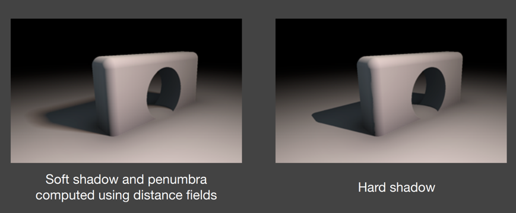
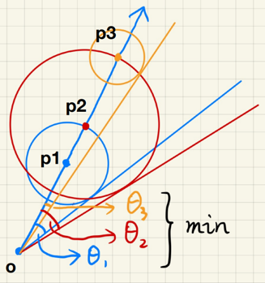
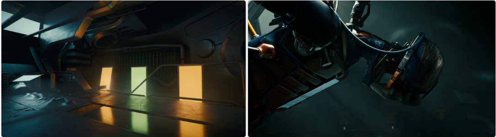

# GAMES202 Lecture 05 - Real-Time Environment Mapping

[GAMES202_Lecture_05 (ucsb.edu)](https://sites.cs.ucsb.edu/~lingqi/teaching/resources/GAMES202_Lecture_05.pdf)

## I. Distance Field Soft Shadows

**Pros**: Faster than shadow maps, and looks way better.

**Cons**: Memory cost.

### (Signed) Distance Function

**Input**: Coordinate

**Output**: The *minimum distance* from that coordinate to the object being described

- May use **signs** to represent whether the point is **inside/outside** the object

*Related to **optimal transport***.

#### Characteristics

- **Preserving Boundary**: Blending two SDF results in a moving boundary (rather than a blurred object)

  

- **Combining Geometric Shapes**: Combining SDFs results in a blended shape.

  - Therefore, it is easy to compute SDF for moving objects that are interacting with the scene.
  
  
  
- **Hard to apply textures to SDF objects**: Hard to do $uv$ parameterization.

### Ray Marching (Sphere Tracing)

Used in ray marching to perform ray-SDF intersections.

- **Safe distance**: Assume there is a **distance field** for the entire scene, and assume at point $p$, we have $\text{SDF}(p) = d$.
  - The ray will not intersect any object if it travels $d$ distance (regardless of the direction of traveling).

Therefore, each time at a given point $p$, just travel $\text{SDF}(p)$ distance.

### Computing Occlusions (SDF Soft Shadow)

The value of $\text{SDF}$ can be used to determine a "safe" angle seen from the eye:

- The smaller the "safe" angle, the less the visibility

During ray marching

- Calculate the "safe" angle from the eye at every step
- Keep the minimum $\theta$

To compute the visibility (related to the safe angle) during ray marching:

- Use $V = \min\left\{\frac{k \cdot \text{SDF} (p)}{p - o}, 1.0\right\} $:
  - Larger $k$ <=> smaller safe angle <=> **earlier** cutting off of penumbra <=> **harder** shadows.
    - If the $k$ is small, then the visibility would be significantly higher for regions that can see *partly* the light source.

- Why not use $\arcsin$?
  - To avoid expensive computations.

### Anti-Aliased Characters in RTR

[Troika-Three-Text from GitHub](https://github.com/protectwise/troika/tree/master/packages/troika-three-text)

- Interpolating the SDF to achieve smooth boundary on fonts.

### Pros and Cons of Distance Field Soft Shadows

**Pros**:

- **Fast***:

  - When compared with hard shadow generating by ray marching: Almost no additional cost (regardless of distance field generation)

  - When compared with traditional shadow mapping: faster precomputation, approximately the same time for querying
- High quality

**Cons**:

- Needs precomputation:
  - When deformation of objects occurred, re-computation is required

- Needs **heavy** storage:
  - 3D texture storage
- Artifacts:
  - For example, around connections between objects

### Acceleration

- Hiearchies:
  - Trees (KD Trees, ...)
- Compression by deep learning

## II. Shading from Environment Lighting

Environment lighting: Simulate lighting coming from the surroundings of a scene.

There are **spherical** maps and **cube** maps. In the following context we may assume we have already obtained the lighting information regardless of the underlying structure.

The environment lighting is used when solving the rendering equation. In this chapter we will discuss shading only - that is, the visibility term will be ignored.

Environment maps provide **information of incoming radiance** on a specific shading point.

- **General Solution**: Monte Carlo Integration
  - Numerical
  - Large amount of samples required
  - Can be slow:
    - Sampling is not preferred in shaders\* in general: High time complexity.
      - Recently, many temporal methods that relies on sampling are used.

### The Split Sum Approximation

In the industry, the resulting integral is computed using sampling and summing, thus it is called **split sum** rather than split **integral**.
$$
\frac{1}{N} \sum_{k=1}^{N} \frac{L_i(\mathbf{l}_k) f(\mathbf{l}_k, \mathbf{v}) \cos \theta_{\mathbf{l}_k}}{p(\mathbf{l}_k, \mathbf{v})}
\approx
\left(
\frac{1}{N} \sum_{k=1}^{N} L_i(\mathbf{l}_k)
\right)
\left(
\frac{1}{N} \sum_{k=1}^{N} \frac{\mathbf{l}_K, \mathbf{v} \cos \theta_{\mathbf{l}_k} \cos \theta_{\mathbf{l}_k}}{p(\mathbf{l}_k, \mathbf{v})}
\right)
$$

- Used in Unreal Engine.
- **State of Art**

#### Principle

The split sum approximation **avoids sampling** by approximating the given integral in a way described in Lecture 4:
$$
\int_{\Omega} f(x) g(x) \dd{x} \approx 
\underbrace{\frac{\int_{\Omega_G} f(x) \dd{x}}{\int_{\Omega_G} \dd{x}}}_{\substack{\text{The \textbf{average} value} \\ \text{of $f(x)$ over the} \\ \text{effective interval of }g(x)}}
\cdot \int_\Omega g(x) \dd{x}
$$

- **General BRDFs satisfy the requirements for accuracy in all cases**:
  - If the BRDF is **glossy**, then $g(x)$ or $f_r(x)$ in the formula, has small support.
  - If the BRDF is **diffuse**, then $g(x)$ or $f_r(x)$ in the formula, is smooth.

- *Note the slight edit on* $\Omega_G$: We integrate $f(x)$ only in the support of $g$.

#### 1st Stage

We approximate the rendering equation as follows:

$$
\begin{equation} \tag{1} \label{eq1}
L_o(\text{p}, \omega_o)
\approx
\frac{
	\int_{f_r} L_i (\text{p}, \omega_i) \dd{\omega_i}
} {
	\int_{f_r} \dd{\omega_i}
}
\cdot
\underbrace{\int_{\Omega+} f_r(\text{p}, \omega_i, \omega_o) \cos \theta_i \dd{\omega_i}}
_{\text{Do shading without considering lighting}}
\end{equation}
$$

- **Prefiltering** of the environment lighting: Computing the first term $\frac{
  	\int_{f_r} L_i (\text{p}, \omega_i) \dd{\omega_i}}{\int_{f_r} \dd{\omega_i}}$, the average value of $L_i(p, \omega_i)$ over regions of various size.
  - Pre-generating a set of differently filtered environment lighting.
  - Filter size in-between can be approximated via (trilinear) interpolation.
    - Size of the filter should correspond to solid angle (but not a fixed size on the resultant texture)

- And then **querying** the pre-filtered environment lighting at $\omega_i$ (corresponding to $\vec{r}$ in the following figure):

  - For diffusions you may follow the direction of $n$
  
  

#### 2nd Stage

*Note that there is a another solution as of the time writing this note.*

- Linearly Transformed Cosines: [Eric Heitz's Research Page (wordpress.com)](https://eheitzresearch.wordpress.com/415-2/)

  

The idea is to:

- **Precompute** the value of the integration left in equation $\ref{eq1}$ for all possible combinations of variables:
  - Too many dimensions: roughness $\alpha$, color (Fresnel term) (triple terms, incident angle), etc

Compute the latter part of equation $\ref{eq1}$ by **approximating the surface as a microfacet**, and extract the Fresnel term using the **Schlick's Approximation**:
$$
\begin{equation} \tag{The Microfacet Model}
f(\omega_i, \omega_o) =
\frac{
	\text{F}(\omega_i, \textbf{h})
	\textbf{G}(\omega_i, \omega_o, \textbf{h}) 
	\textbf{D}(\textbf{h})
}{
	4 (\textbf{n}, \omega_i) (\textbf{n}, \omega_o)
}
\end{equation}
$$

$$
\begin{equation} \tag{The Schlick's Approximation}
R(\theta) = R_0 + (1 - R_0)(1 - \cos \theta)^5
\end{equation}
$$

where
$$
\begin{equation} \tag{Basic reflection rate}
R_0 = \left(\frac{n_1 - n_2}{n_1 + n_2}\right)^2
\end{equation}
$$

$$
\begin{equation} \tag{The NDF, Normal Distribution Function}
D(h) = \frac{\exp(\tan^2\theta_h /\alpha^2)}{\pi \alpha^2 \cos^4 \theta_h}
\end{equation}
$$

**The "base color $R_0$" is now extracted**:
$$
\begin{aligned}
\int_{\Omega+} f_r(\text{p}, \omega_i, \omega_o) \cos \theta_i \dd{\omega_i} \approx{} & R_0 \int_{\Omega_+}
\frac{f_r}{F} (1 - (1 - \cos \theta_i)^5) \cos \theta_i \dd{\omega_i} + \\
& \int_{\Omega_+} \frac{f_r}{F} (1 - \cos \theta_i)^5 \cos \theta_i \dd{\omega_i}
\end{aligned}
$$
and both integrals can be **precomputed** with only 2 parameters, as now there are only roughness $\alpha$ and incident angle of light $\omega_i$ left:

- **Precomputed texture**: Each integral produces one value for each $(\alpha, \cos\theta_o)$ angle pair.

#### Results

Completely avoided sampling!

Very fast and almost identical:

