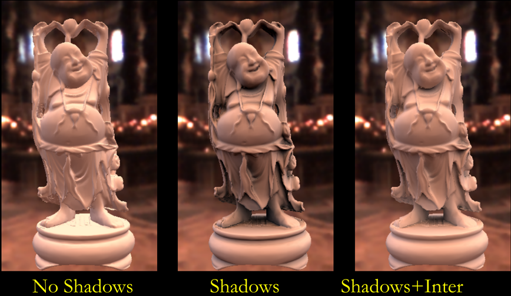
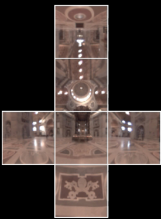

# GAMES202 Lecture 06 - Real-Time Environment Mapping (Precomputed Radiance Transfer, PRT)

## I. Shadow from Environment Lighting

In general, shadow from environment lighting is very **difficult** for real-time rendering.

Different perspectives:

- As a **many-light** problem: Cost of SM (Shadow Mapping) is linearly to **number of lights**
- As a **sampling** problem: 
  - **Complexity of** $V$: The visibility term $V$ can be arbitrarily complex
  - $V$ **is highly related to the environment**: $V$ cannot be easily separated from the environment.

- **Industrial** solution: generate one (or a few more) shadows from those brightest light sources
- Related research:
  - **Imperfect shadow maps**: Approximating visibility for indirect illumination by querying shadow maps that [can be low-resolution and generated from a rough representation of the scene](https://resources.mpi-inf.mpg.de/ImperfectShadowMaps/ISM.pdf).
  - **Light cuts**: Approximating visibility at a *sublinear* cost by [grouping lights and producing a representative](https://www.graphics.cornell.edu/~bjw/lightcuts.pdf).
  - **RTRT**
  - ***Precomputed Radiance Transfer***: To be discussed in this lecture.

## II. Background Knowledge

### Frequency and Filtering

Functions can be decomposed into a linear combination of base functions (*basis*). By filtering (that is, to discard the contribution of some particular basis functions) the target function, we may **get rid of contents in a certain frequency range**.

Below shows an example of filtering a particular image. The image on the right is the visualization of the result produced by Fourier transform.

The **Convolution theorem** states that **doing convolution** on a function in spatial/frequency domain is essentially doing **filtering** (subtracting certain components) in frequency/spatial domain.

Any **integral of products of functions** can be considered as a kind of **filtering**:
$$
\int_\Omega f(x) g(x) \dd{x}
$$

- Low frequency:  The function exhibits **smoothness**, or its derivative features relatively **small magnitudes**.
- The frequency of the integral equals to the lowest of any individual's

### Basis Functions

Basis functions are a set of functions that when linearly combined, can be used to represent other functions in general.

- The **Fourier series** is a set of basis functions
- The **polynomial series** can also be a set of basis functions

### Spherical Harmonics

Spherical Harmonics, abbreviated in the following context as SH, are a set of 2D basis functions $B_i(\omega)$ defined on the sphere. It is analogous to Fourier series in 1D.

Each SH basis function $B_i(\omega)$ is associated with a **Legendre polynomial**.

- **Projection on** $B_i(\omega)$: Obtain the coefficient of each component. Similar as projection in a vector space.
  $$
  c_i = \int_{\Omega} f(\omega) B_i(\omega) \dd{\omega}
  $$
  
- **Reconstruction from coefficients**: Restore the original function using (possibly *truncated*) coefficients and basis functions.

**Characteristics**

- Orthonormal:
  $$
  \int_{\Omega} B_i (\omega_i) \cdot B_j(\omega_i) \dd{\omega_i} = 1 \hspace{1cm} (i=j)
  $$

  $$
  \int_{\Omega} B_i (\omega_i) \cdot B_j(\omega_i) \dd{\omega_i} = 0 \hspace{1cm} (i \neq j)
  $$

- Simple Projection/Reconstruction

- Simple Rotation

- Simple Convolution

- Few basis functions: low frequencies

## III. Real-Time Environment Lighting

### Prefiltered Environment Lighting

- Prefiltering + Single Query = No Filtering + Multiple Queries

### Analytic Irradiance Formula

- Diffuse BRDF acts like a low-pass filter
  $$
  E_{lm} = A_l L_{lm}
  $$
  where

  - $E_{lm}$

  - $$
    A_{l} = 2\pi \frac{(-1)^{\frac{l}{2} - 1}}{(l + 2) (l - 1)} \left[\frac{l!}{2^{l} \left(\frac{l}{2}!\right)^2} \right]
    $$

    where $l$ is even

  - $L_{lm}$

### 9 Parameter Approximation

Approximating the lighting using Spherical Harmonics.

|           | Exact Image                                               | Order 0 - 1 Term                                          | Order 1 - 4 Terms                                         | Order 2 - 9 Terms                                          |
| --------- | --------------------------------------------------------- | --------------------------------------------------------- | --------------------------------------------------------- | ---------------------------------------------------------- |
|           |  |  |  |  |
| RMS Error | /                                                         | 25%                                                       | 8%                                                        | 1%                                                         |

For any illumination, average error is less than $3\%$.

### In Real-Time Rendering

$$
E(n) = n^t M n
$$

Simple procedural rendering method (no textures)

- Involves **only** matrix-vector multiplication and dot-product
- In software or NVIDIA vertex programming hardware

Widely used in

- **Games**: AMPED for Microsoft Xbox,
- **Movies**: Pixar, Framestore CFC, ...

## III. Precomputed Radiance Transfer

Rendering under environment lighting:

- Brute-force computation: 
  - Assuming a resolution of $6 \times 64 \times 64$: Needs $6 \times 64 \times 64$ times for each point!

### Precomputed Radiance Transfer (PRT)

Introduced by Sloan in SIGGRAPH 2002:

- [Precomputed Radiance Transfer for Real-Time Rendering in Dynamic, Low-Frequency Lighting Environments [Sloan 02]](https://dl.acm.org/doi/10.1145/566654.566612)

#### Basic Idea

$$
L(\omega_o) = \int_{\Omega} 
\underbrace{L(\omega_i)}_{\text{lighting}\; L}
\underbrace{V(\omega_i) f_r(\omega_i, \omega_o) \max(0, \textbf{n} \cdot \omega_i) \dd{\omega_i}}_{\text{light transport}\; T}
$$

- Approximate **lighting** using **basis functions**:
  $$
  L(\omega_i) \approx \sum c_{j} B_j(\omega_i)
  $$
  where:

  - $c_j$ is the lighting coefficient, and
  - $B_j$ are basis functions.

  To **obtain the coefficients**, by the properties of the Spherical Harmonics we have:
  $$
  l_j = \int_{\Omega} L(\omega_i) \cdot B_j (\omega_i) \dd{\omega_i}
  $$
  To **reconstruct the original lighting condition**, we have
  $$
  L(\omega_i) \approx \sum l_j B_j (\omega_i)
  $$

- Approximate **light transport** using basis functions:
  $$
  T(\omega_i) \approx \sum c_j B_j (\omega_i)
  $$
  where $T$ denotes light transport.

- **Precomputation** stage:

  - Compute light transport, and project the result to the basis function space:
    $$
    T_j \approx \int_{\Omega} B_j (\omega_i) V(\omega_i) \max (0, \textbf{n} \cdot \omega_i) \dd{\omega_i} 
    $$
    

    No **shadow** or inter-reflection involved in this process.

- **Runtime** stage:

  - **dot product** (diffuse)
    - First,**project** the lighting to the basis to obtain $l_j$, the coefficients for SH basis functions
    - Or **rotate** the lighting instead of re-projection
    - Then compute the dot product
  - **matrix-vector** multiplication (glossy)

#### Diffuse Case

For diffuse materials, we have $\forall \omega_i \forall\ \omega_j  \forall \omega_m \forall\ \omega_n \; f_r(\omega_i, \omega_j) = f_r(\omega_m, \omega_n)$. That is, $f_r$ has the same value regardless of the incoming/outcoming directions. 

Therefore, we may transform the equation and precompute light transport and lighting regardless of the input parameter $\omega_o$.
$$
\begin{aligned}
L(\omega_o) 
&= \int_{\Omega} 
\underbrace{L(p, \omega_i)}_{\text{lighting}\; L}
\underbrace{V(\omega_i) f_r(p, \omega_i, \omega_o) \cos \theta_i \dd{\omega_i}}_{\text{light transport}\; T} \\

& \approx
\sum_j \sum_k c_j c_k \int_{\Omega} B_j (\omega_i) B_k (\omega_i) \dd{\omega_i}

\end{aligned}
$$

The above transformation relies on precomputing the light component and the light transport component on basis functions:
$$
\begin{equation} \tag{Lighting}
L(\omega_i) \approx \sum_j c_j B_j(\omega_i)
\end{equation}
$$

$$
\begin{equation} \tag{Light transport}
T(\omega_i) \approx \sum_k c_k B_k (\omega_i)
\end{equation}
$$

where:

- $c_j$ is lighting coefficient, 
- $c_k$ is light transport coefficient, and
- $B_j$, $B_k$ are basis functions.

By the orthogonality of SH basis functions, the above double sum can be reduced to a dot product:

- **Orthogonality**: If $B_j$ does not equal to $B_k$, then by definition $\int_{\Omega} B_j(\omega_i) B_k(\omega_i) \dd{\omega_i} = 0$.

**Advantages**:

- Reduce rendering computation to **dot product computation**.

**Result**:

#### Glossy Case

Opposed to what we have discussed in diffuse case, $f_r$ in this case varies significantly as $(\omega_o, \omega_i)$ changes.

$$
\begin{aligned}
L(\omega_o) 
&= \int_{\Omega} 
\underbrace{L(p, \omega_i)}_{\text{lighting}\; L}
\underbrace{V(\omega_i) f_r(p, \omega_i, \omega_o) \cos \theta_i \dd{\omega_i}}_{\text{light transport}\; T}
\\

& \approx
\sum_j c_j \int_{\Omega} B_j (\omega_i) T_j (\omega_o, \omega_i) \dd{\omega_i}
&&\text{Extract lighting}
\\

& = \sum_k  \left(\sum_j c_j \left(\underbrace{\int_{\Omega} B_j(\omega_i) M_{jk} \dd{\omega_i}}_{\text{Precomputation}} \right) B_k (\omega_o) \right)

&&T_j(\omega_o, \omega_i) = \sum_k M_{jk} B_k (\omega_o)
\\

\end{aligned}
$$
Instead of precomputing light transport $T$ disregarding $\omega_o$, we create a **transport matrix** $M$, precomputing the components of $T$ at different pairs of basis functions $(B_m, B_n)$, therefore making querying different $\omega_o$ possible through **matrix-vector multiplication**.

**Result**:

- Glossy object, 50K mesh:
- Running at 3.6 fps on a 2.2 GHz Pentium 4 CPU with graphics card ATI Radeon 8500

#### Interreflections and Caustics

*TODO*

#### Results on Arbitrary BRDFs

#### Time Complexity

Depending on **number of SH basis functions** used:

- $n=9, 16, 25$

And **types** of rendering:

- **Diffuse** rendering: At each point, dot-product of size $n$
- **Glossy** rendering: At each point, vector of size $n$ multiplied with matrix of size $n^2$

#### Limitations

- **Low-Frequency**: Due to number of SH used.
- Dynamic Lighting, but **static scene/material**: Changing scene/material requires new precomputations.
- Large precomputation data.

#### Extensions

- More basis functions:

  - **Wavelet**

    

    - [Ng 03] 2D Haar Wavelet

    - Projection:

      - Wavelet Transformation
      - Retain a small number of non-zero coefficients

    - A **non-linear** approximation: 

      | Before                                                     | After                                                      |
      | ---------------------------------------------------------- | ---------------------------------------------------------- |
      |  |  |

    - Representation covering **all frequencies**:

      

- Dot product => Triple products

- Static scene => **Dynamic scene**

- Fixed materials => **Dynamic materials**

- Other effects: translucent, hair, ...
- Precomputation => **Analytic** Computation: 
- ...

