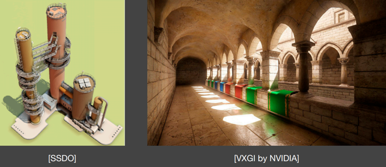

# GAMES202 Lecture 07 - Real-Time Global Illumination (in 3D)

[GAMES202_Lecture_07 (ucsb.edu)](https://sites.cs.ucsb.edu/~lingqi/teaching/resources/GAMES202_Lecture_07.pdf)

## I. Other Basis Functions for Environment Mapping

### Spherical Harmonics for Glossy Materials & Wavelet

Refer to `Lecture06.md`.

## II. Real-Time Global Illumination (in 3D)

[Ritschel et al., The State of the Art in Interactive Global Illumination]

GI is **Important but complex**.

People seek simple and fast solution to **one-bounce indirect illumination** in RTR.

### Reflective Shadow Maps (RSM)

Original paper: [rsm.pdf (klayge.org)](http://www.klayge.org/material/3_12/GI/rsm.pdf)

#### Key Observations & Assumptions

What are needed to illuminate any point $p$ with one-bounce indirect illumination?

- Surface patches that are **directly lit**:

  - Using a classic shadow map.
  - Each pixel on the shadow map is a small surface patch.
  - The **exact outgoing radiance** is still **unknown** except for direction to the camera:
    - Assuming **any reflector is diffuse**: Outgoing radiance is uniform toward all directions.

- Contribution from each surface patch to $p$: 

  - Summing up all contributions, treating each as an **area light**.

    - In the rendering, integration over the solid angle covered by the patch

    - Can be converted to the integration on the area of the patch. Used in path tracing.

      

#### Principle

$$
\begin{aligned}
L_o (p, \omega_o)
&=
\int_{\Omega_{\text{patch}}} L_i (p, \omega_i) V(p, \omega_i) f_r(p, \omega_i, \omega_o) \cos \theta_i \dd{\omega_i}
\\
&=
\int_{A_{\text{visible patch}}} L_i (q \to p) V(p, q \to p) f_r (p, q \to p, \omega_o) \frac{\cos \theta_p \cos \theta_q}{\norm{q - p}^2} \dd{A}
&&\text{Only the visible part should be integrated with}

\end{aligned}
$$

For a diffuse reflective patch, we have

- $f_r = \rho / \pi$
- $L_i = f_r \cdot \frac{\Phi}{\dd{A}}$, where $\Phi$ is the incident flux

The irradiance at a surface point $p$ with normal $n$ due to pixel light $q$ is thus

$$
\begin{equation} \tag{Irradiance contribution at point $p$ from light $q$}
E_q (p) = \Phi_q \frac{\max\{0, \cos \theta_p\} \max\{0, \cos \theta_q\}}{\norm{p - q} ^4}
\end{equation}
$$
Storing radiant flux $\Phi_q$ instead of radiosity or radiance is intentional. By this, we don't have to care about the representative area of the light, which makes the generation and the evaluation simpler.

Not all pixels in the RSM can contribute

- **Visibility**: difficult to deal with
- **Orientation**
- **Distance**

#### Implementation and Acceleration

Acceleration:

- Theoretically, all pixels in the shadow map can contribute to a point $p$ being rendered

- To decrease the number of pixels being queried, we may apply the same sampling technique used in PCSS (Step 1 and 3)

  

What is needed to record in an RSM?

- Depth, World Coordinate, Normal, Flux, ...

#### Usages

- Often used for **flashlights** in video games

  - Gears of War 4, Uncharted 4, The Last of US, ...

    

#### Pros and Cons

**Pros**:

- Easy to implement

**Cons**:

- Linear time complexity in terms of number of lights
- No visibility check for indirect illumination
- **Many assumptions**: 
  - Diffuse reflectors, depth as distance, etc.
- Sampling rate/quality tradeoff

### Light Propagation Volumes (LPV) & Voxel Global Illumination (VXGI)

Please refer to `Lecture08.md`.

