# GAMES202 Lecture 08 - Real-Time Global Illumination (Screen Space)

## I. Real-Time Global Illumination (in 3D) Cont.

### Light Propagation Volumes (LPV)

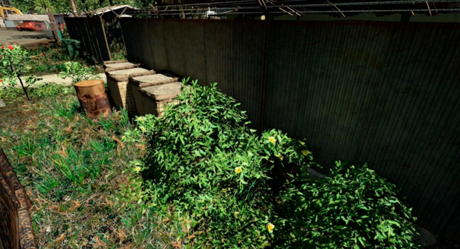

First introduced in CryEngine 3

- Fast performance and good quality

#### Key Observations

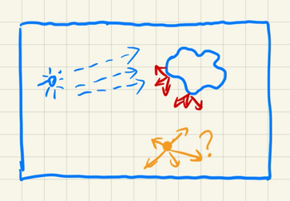

- Key Problem
  - Query the radiance from any direction at any shading point
- Key Idea
  - Radiance travels in a straight line and does not change
- Solution
  - Use a 3D **grid** to propagate radiance from directly illuminated surfaces to anywhere else

#### The Algorithm

Steps:

1. Generation of radiance point set scene representation:

   - Find surfaces that are **directly lit**

     - Applying RSM would suffice
     - May use a reduced set of diffuse surface patches

     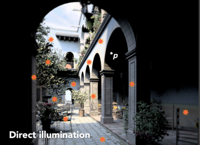

2. Injection of **point cloud** of virtual light sources into radiance volume:

   - Subdivide the scene into a 3D grid in advance
   - For each grid cell, find enclosed virtual light sources within
   - Sum their directional radiance distribution
   - Project to first 2 orders of SHs ($n=4$)

   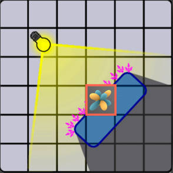

3. Volumetric radiance **propagation**:

   - For each grid cell, collect the radiance received from each of its 6 faces
   - Sum up the radiance received, and use SHs to represent
   - Repeat propagation until the volume becomes stable (or certain criterion are met)

   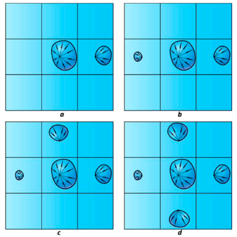

4. Scene lighting with final light propagation value:

   - For any shading point, find the grid cell it is located in
   - Get the incident radiance in the grid cell (from all directions)
   - Shade

#### Pros and Cons

**Cons**:

- **Light Leaking**: Incorrect when the underlying geometry is too small

  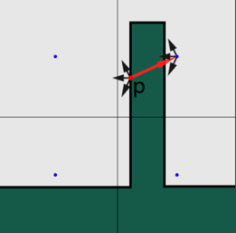

  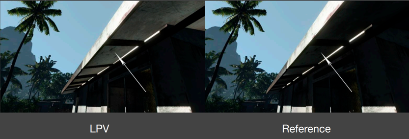

### Voxel Global Illumination (VXGI) - Brief Introduction

A **two-pass** algorithm with two main difference with RSM:

- Directly illuminated pixels => Hierarchical **voxels**
- Sampling on RSM => **Tracing reflected cones** in 3D
  - Note the inaccuracy in sampling RSM

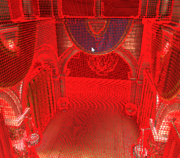

#### The Algorithm

##### Preparation

- **Voxelize** the entire scene
- Build a hierarchy

##### Shading

There are two passes:

- **Pass 1**: From the light:

  - Store the incident and normal distributions in each voxel
  - Update on the hiearchy

  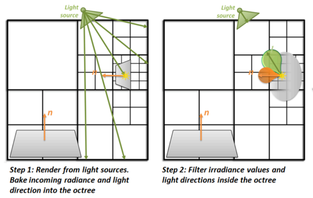

- **Pass 2**: From the camera:

  - For **glossy** surfaces, trace 1 cone toward the reflected direction
    - Query the hierarchy based on the (growing) size of the cone

  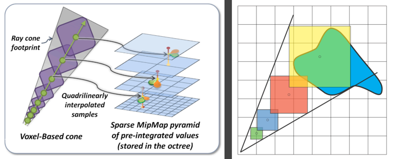

  - For **diffuse** surfaces, trave several cones (e.g., 8)

    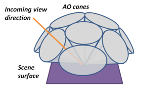

#### Results

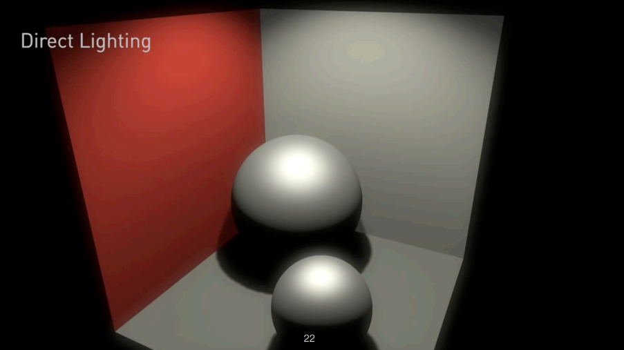

*Very close to results from ray-tracing.*

## II. Real-Time Global Illumination (Screen Space)

GI in **screen space**:

- Using information only from the *screen*.
- **Post-processing** on existing rendered results.

### Screen Space Ambient Occlusion (SSAO)

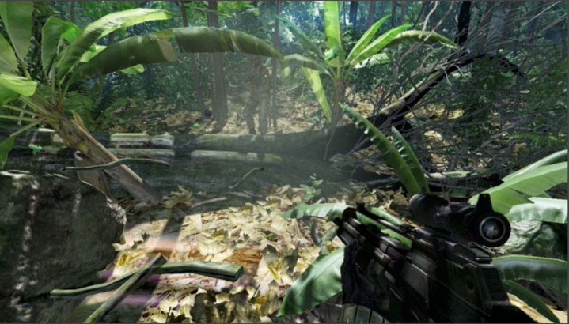

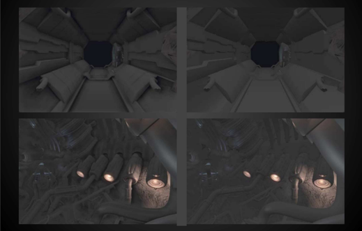

Why choose **AO**?

- Cheap to implement
- Enhances the sense of **relative** positions

What is SSAO?

- An **approximation** of global illumination in **screen space**

#### Key Observations

Key Ideas:

1. In **Phong shading**:
   - The incident indirect lighting is *unknown*:
     - Assume the lighting is **constant** from all shading points and from all directions

2. Considering **different visibility** (toward all directions) at different shading points

   - *TODO*
   - Assume **diffuse** materials

   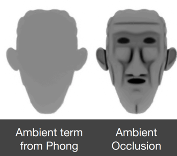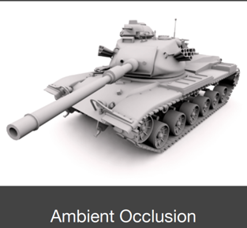

#### Theory

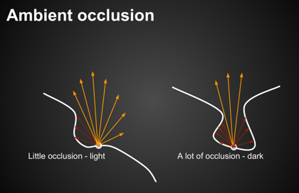

We start by computing the **ambient occlusion term**:
$$
\begin{aligned}
L_o^{\text{indir}} (p, \omega_o)
=&
\int_{\Omega^+} L_i (p, \omega_i) f_r (p, \omega_i, \omega_o) V(p, \omega_i) \cos \theta_i \dd{\omega_i} \\

\approx &
\underbrace{\frac{\int_{\Omega^+} V(p, \omega_i) \cos \theta_i \dd{\omega_i}}{\int_{\Omega^+} \cos \theta_i \dd{\omega_i}}}_{\substack{\text{$(1)$ The weight-averaged} \\ \text{visbility $\overline{V}$ from all directions}}}

\cdot
\underbrace{\int_{\Omega^+} L_i^{\text{indir}} (p, \omega_i) f_r (p, \omega_i, \omega_o) \cos \theta_i \dd{\omega_i}}_{\text{$(2)$ Constant for the AO term, $\omega_i$ does not matter}}

&& \text{(Separating the visibility $V$)} \\

\end{aligned}
$$
where
$$
\begin{equation}
(1) \triangleq \frac{\int_{\Omega^+} V(p, \omega_i) \cos \theta_i \dd{\omega_i}}{\pi},
\end{equation}
$$
and
$$
\begin{equation} \tag{Constant $(2)$ across the integration}
(2) = L_i^{\text{indir}}(p) \cdot {\frac{\rho}{\pi}} \cdot \pi = L_i^{\text{indir}} (p) \cdot p
\end{equation}
$$
Two important points:

1. Approximating the integration by separating the visibility $V$.
2. Taking the $\cos \theta_i \dd{\omega_i}$ into the approximation.

The formula above starts by applying the RTR approximation (estimating the integration of product of two functions).
$$
\begin{aligned} 
\int_{\Omega} f(x) g(x) \dd{x} 
\approx &\frac{\int_{\Omega_G} f(x) \dd{x}}{\int_{\Omega_G} \dd{x}} \cdot \int_{\Omega} g(x) \dd{x}
&& \text{(Approximation)} \\
= &
\overline{f(x)} \cdot \int_{\Omega} g(x) \dd{x} 
&& \text{(The average $f(x)$ in the support of $G$)}
\\
\end{aligned}
$$
In AO, this approximation is **accurate**, considering the fact that $g$ is constant across the integration:
$$
g = L \cdot f_r
$$
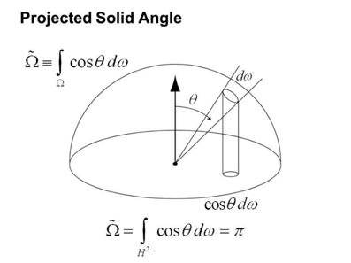

Why can we take the cosine term with $\dd{\omega_i}$?

- Projected solid angle $\dd{x_\perp} = \cos \theta_i \dd{\omega_i}$

- Integration of projected solid angle == the area of unit disk == $\pi$

#### AO: Limited Radius

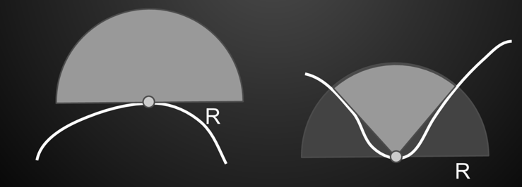

- Result is limited to local occlusion in hemisphere of radius $R$
- More efficient and works better in **enclosed areas** such as indoors, that would be fully occluded otherwise.

#### AO: Using the Z-Buffer

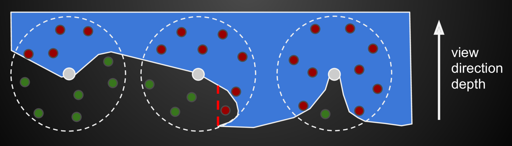

- Use the readily available depth buffer as an approximation of the scene geometry

- **The Algorithm**: Take samples in a sphere around each pixel and test against a buffer:
  - If more than half of the samples are inside, then AO is applied, with amount of AO depending on ratio of samples that pass/fail a depth test.

- Uses **sphere** instead of hemisphere, since normal information isn't available.

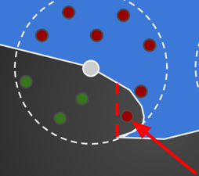

**Incorrectness**:

- **False occlusions** may occur. The one behind the red line, for example.
- **Not physically accurate**: Samples are not weighted by $\cos\theta$, therefore not physically accurate, albeit looks convincing.

**Choosing Samples**:

- More samples => greater accuracy
- Many samples are needed for a good result
  - But for performance only about 16 samples are used
- Positions from randomized texture to avoid banding
- **Noisy result**, blurred with edge preserving blur

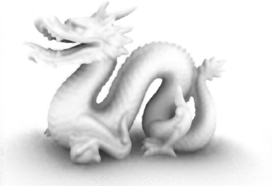

#### Comparison with AO in Object Space

- In **object** space:
  - Raycasting against geometry
  - Slow, requires simplifications and/or spatial data structures
  - Depending on the complexity of the scene
- In **screen** space:
  - Only a post-rendering **pass**
  - No pre-processing required
  - Does not depend on scene complexity
  - **Simple to implement**
  - *Not physically accurate in some cases*

#### Example of False Occlusion

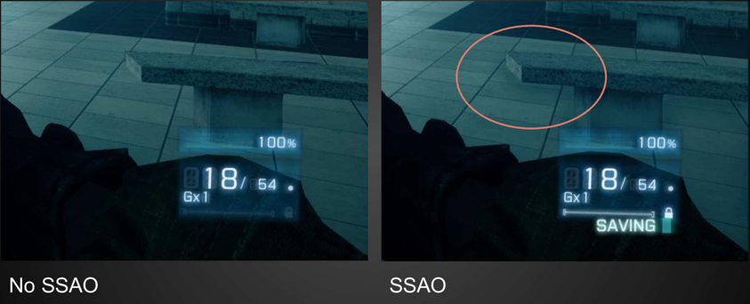

### Horizon Based Ambient Occlusion (HBAO)

- Also done in **screen space**
- Approximates ray-tracing using the depth buffer
- Requires that the normal is known, and only samples in a hemisphere

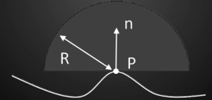

### Comparisons

| No SSAO                                                    | SSAO                                                       | HBAO                                                       |
| ---------------------------------------------------------- | ---------------------------------------------------------- | ---------------------------------------------------------- |
| 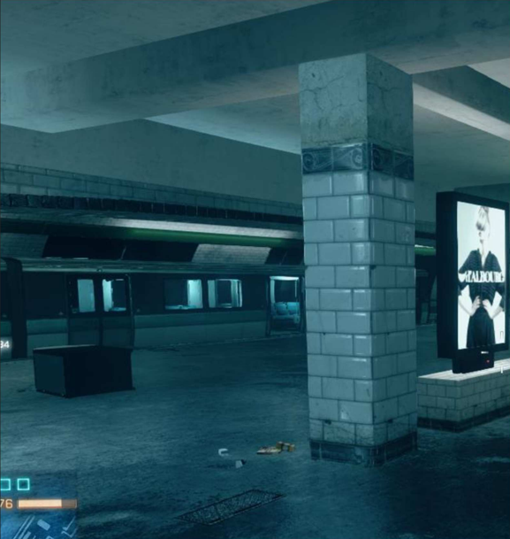 | 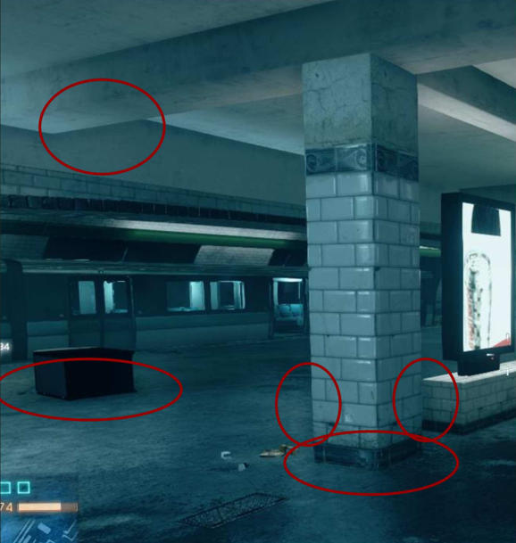 | 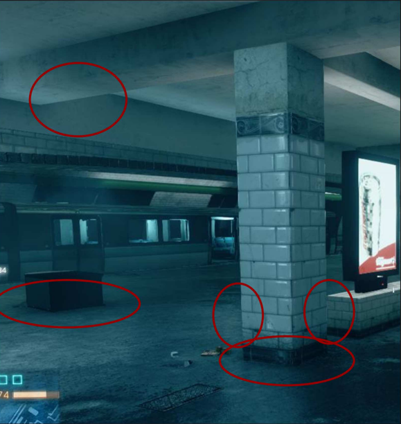 |

### Screen Space Directional Occlusion (SSDO) & Screen Space Reflection (SSR)

*Refer to*`Lecture9.md`.

