# GAMES202 Lecture 09 - Real-Time Global Illumination (Screen Space Cont.)

[GAMES202_Lecture_09 (ucsb.edu)](https://sites.cs.ucsb.edu/~lingqi/teaching/resources/GAMES202_Lecture_09.pdf)

## I. Real-Time Global Illumination (Screen Space Cont.)

### Screen Space Directional Occlusion (SSDO)

- An **improvement over SSAO**
- Considering (more) actual indirect illumination

#### Key Idea

- SSDO exploits the rendered direct illumination

  - Not from an RSM, but from the camera

  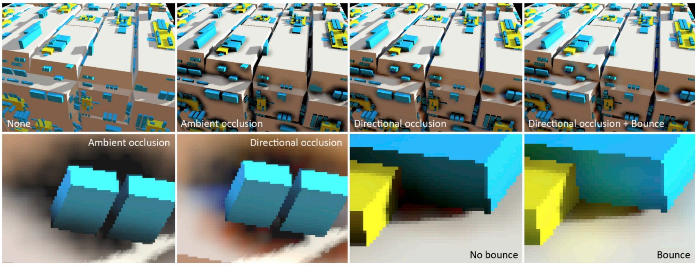

- Similar to **path tracing**:

  - At shading point $p$, cast a random ray:
    - If it does not hit an obstacle, then direct illumination
    - If it hits one, then indirect illumination

  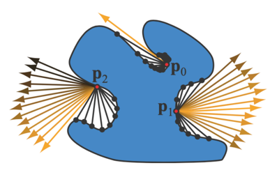

#### Comparison with SSAO

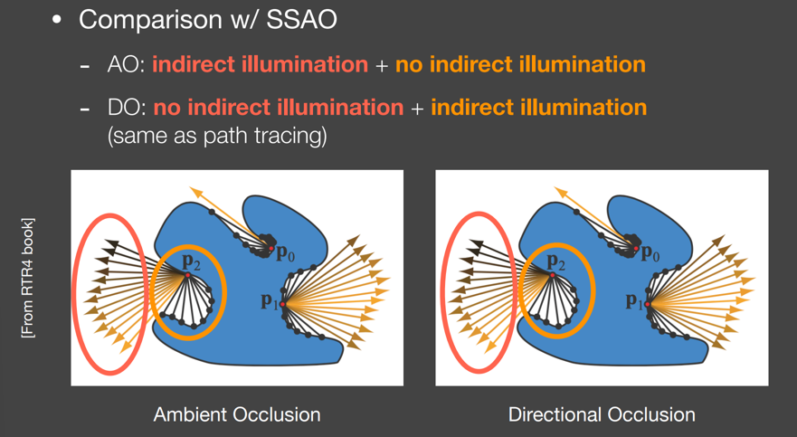

#### Theory

Consider unoccluded and occluded directions **separately**:
$$
\begin{equation} \tag{Direct illumination}
L_o^{\text{dir}} (p, \omega_o)
=
\int_{\Omega^+, V=1} L_i^{\text{dir}} (p, \omega_i) f_r (p, \omega_i, \omega_o) \cos \theta_i \dd{\omega_i}
\end{equation}
$$

$$
\begin{equation} \tag{Indirect illumination}
L_o^{\text{indir}} (p, \omega_o)
=
\int_{\Omega^+, V=0} L_i^{\text{indir}} (p, \omega_i) f_r (p, \omega_i, \omega_o) \cos \theta_i \dd{\omega_i}
\end{equation}
$$

- Indirect illumination from a pixel (patch) is derived in last lecture.

Similar to HBAO, in that they test samples' depths in local **hemispheres**:

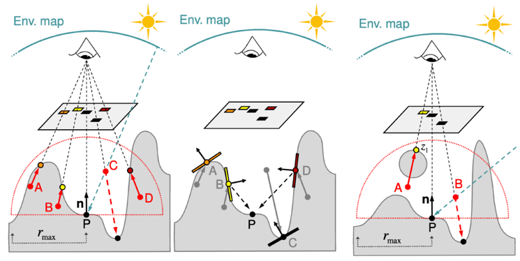

#### Results

Quality closer to offline rendering.

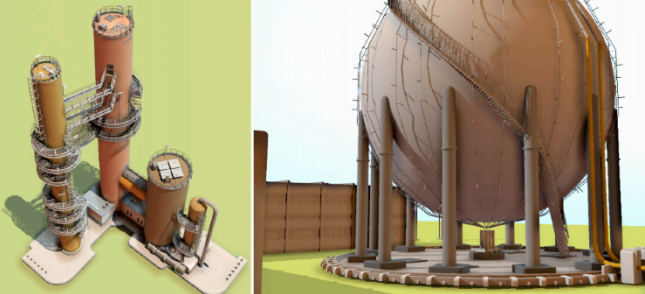

#### Issues

- GI in a **short** range: 

  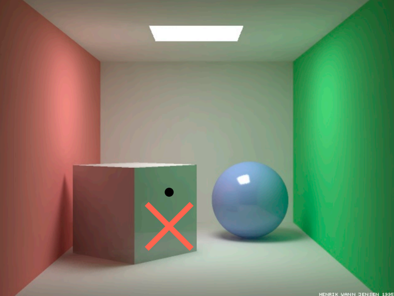

- **Visibility**:

- **Limitation from screen space**: Missing information from **unseen** surfaces

### Screen Space Reflection (SSR)

- What is SSR?
  - One way to introduce Global Illumination in RTR
  - Perform ray tracing
  - Does not require 3D primitives (**Screen Space**)

- Two fundamental tasks of SSR
  - Intersection: between **any** ray and the scene
  - Shading: contribution from intersected pixels to the shading point

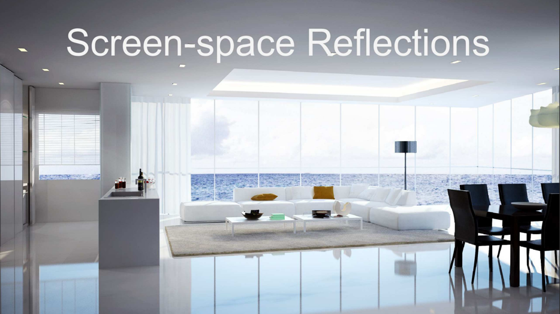

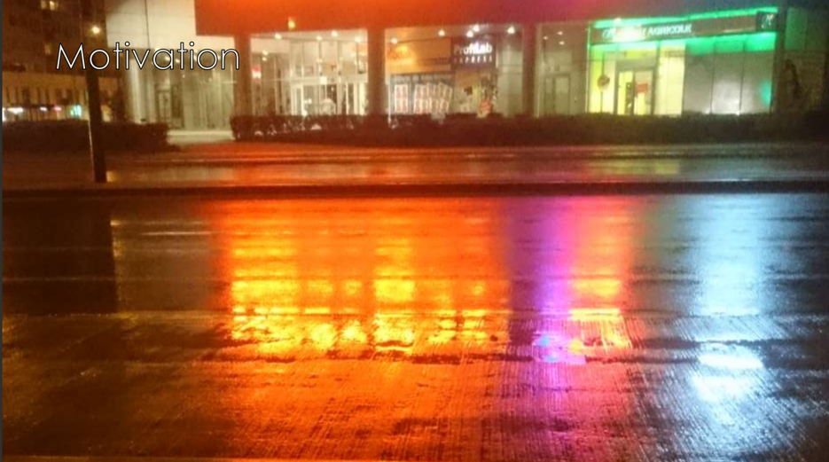

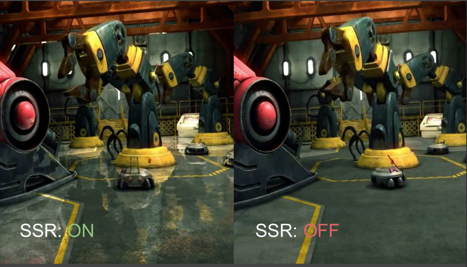

#### Basic Algorithm

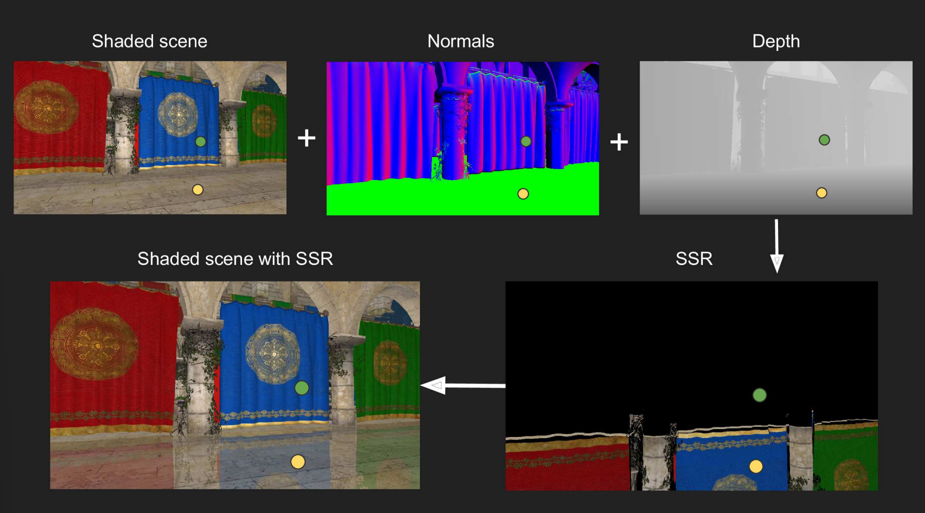

- For each **fragment**:
  - Compute a reflection ray
  - Trace along ray direction (using depth buffer)
  - Use color of intersection point as reflection color

| Parameters                  | Result                                                     |
| --------------------------- | ---------------------------------------------------------- |
| High Smoothness             | 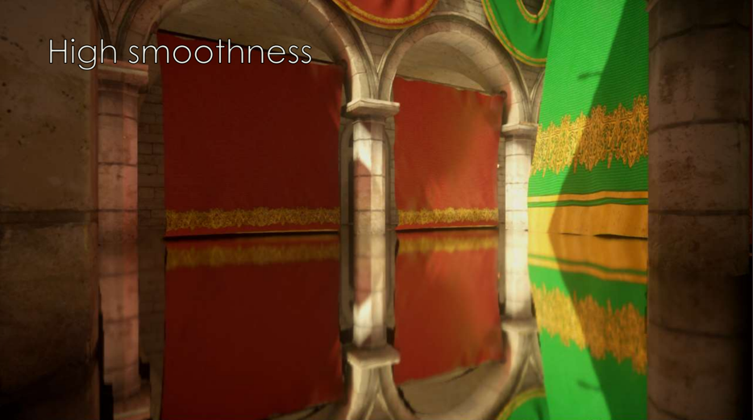                     |
| Medium Smoothness           | 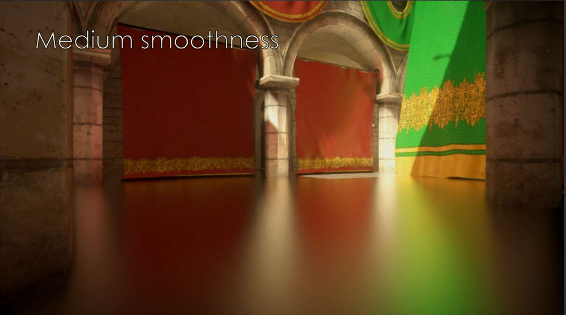                     |
| Medium Smoothness + Normals | 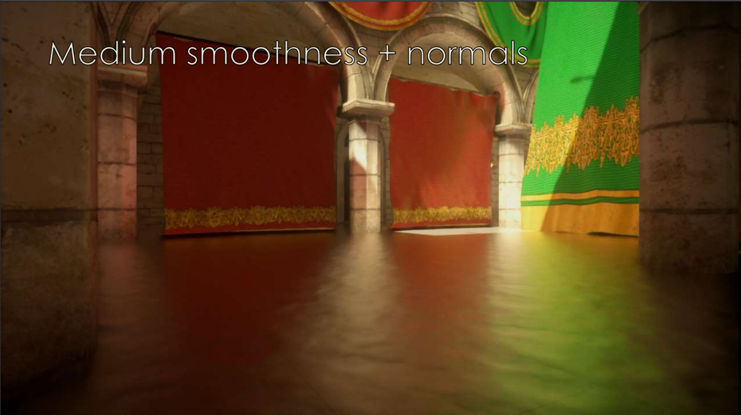                     |
| Variable Smoothness         | 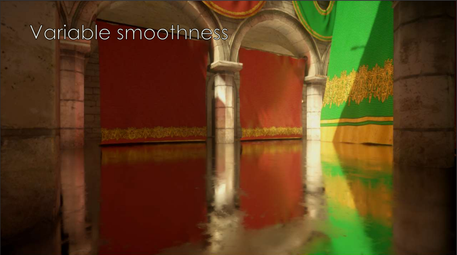 |

#### Linear Raymarch

Goal: Find intersection point

- At each step, check depth value
- Quality depends on step size
- Can be refined

